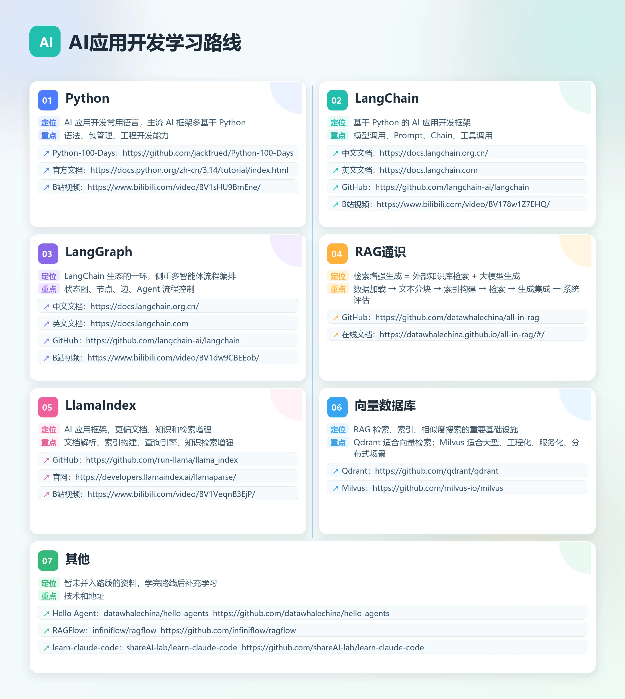

| 版本 | 日期       | 变更人         | 变更说明                          |
| ---- | ---------- | -------------- | --------------------------------- |
| V1.0 | 2026-05-10 | 地球OL初级玩家 | 初始化首版教程                    |
| V1.1 | 2026-05-18 | 地球OL初级玩家 | 添加HelloAgent和Learn-claude-code |

> 附：大家注意看题头的版本修订日期，我会选取截止修订日期时刻最新版本的教程。下文反复提及截止当前，即截止最新版本的修订日期。
>
> AI时代技术迭代极快，很有可能我推荐的技术教程有了新的技术替代，亦或是有了大的版本变更，导致过时，我会不定时汲取市面上的知识勤奋更新。

## 背景：

我在自学AI应用开发过程中，找资料和学习的过程中浪费了很多不必要的时间，为了让朋友们尽可能少走弯路，特意整理这份资料。

首先，我会把我学习的过程中了解到的信息，整理出一份学习路线图。

之后，对于每一项技术，我会进行简单的介绍，另外附上该项技术的学习资料和学习建议，都是本人亲自学习对比得出的结论。

这份内容也会作为长期更新的 `Agent学习资料` 集合，覆盖 AI Agent 入门、AI 应用开发、RAG、工具调用、多智能体编排和大模型工程化实践。

非常欢迎提供意见和建议！我也会根据大家的建议更新文档。

## 路线图

## 1.Python

### 1.1 介绍

当前AI应用开发方面最流行的编程语言，流行的框架大多数是基于Python编写的。

### 1.2 学习资料

#### (1) Python-100-Days

Github地址：https://github.com/jackfrued/Python-100-Days

> 说明：GitHub上大佬整理的Python教程，很详细，排版分章也不错，经常更新，适合喜欢文档学习的伙伴。缺点是夹杂了一些非Python的知识，不过可以择机跳过，无伤大雅。
>

#### (2) 官方文档

官网地址：https://docs.python.org/zh-cn/3.14/tutorial/index.html

> 说明：官网永远最权威权威，但是中文的话类似英文机翻，文字排版审美一般，适合在有学习过程中有歧义的时候上去搜寻官方资料，不太推荐直接用此学习。
>

#### (3) 视频学习

https://www.bilibili.com/video/BV1sHU9BmEne/

> 说明：非常详细，非常适合喜欢视频学习的新手小白，老师吐字清晰，课程内容丰富；唯一的缺点有点过于详细了，连cmd命令行都要花几分钟指点一下，对于有基础的同学来说相对有点耗费时间。
>

> `附：以上学习方式多选一即可，只需要用自己的方式学会Python，也可以自己搜寻适合自己的学习资料！`

## 2.LangChain

### 2.1 介绍

基于Python的AI应用开发框架。

### 2.2 学习资料

#### (1) 官方文档

中文：https://docs.langchain.org.cn/

英文：https://docs.langchain.com

Github地址：https://github.com/langchain-ai/langchain

> 说明：少数结构清晰，详细，排版美观的官方文档，直接啃即可。截止当前，中文官网前端组件有问题，建议使用英文文档配合翻译插件。
>

#### (2) 学习视频

https://www.bilibili.com/video/BV178w1z7EHQ/

> 说明：截止当前更新到langchain入门，基于langchain1.2，讲得很好，非常合新手入门。后续还有langchain进阶，langgraph，RAG高级等系统性的课程，更新了的话我也会继续看。
>

## 3.LangGraph

### 3.1 介绍

基于Python的AI应用开发框架, Langchain生态的一环，注重多智能体流程编排技术。

3.2 学习资料

#### (1) 官方文档

中文：https://docs.langchain.org.cn/

英文：https://docs.langchain.com

Github地址：https://github.com/langchain-ai/langchain

> 说明：少数结构清晰，详细，排版美观的官方文档，直接啃即可。截止当前，中文官网前端组件有问题，建议使用英文文档配合翻译插件。

#### (2) 学习视频

https://www.bilibili.com/video/BV1dw9CBEEob

> 截止当前，langgraph最新版视频教程还没几个人做，本视频是找到的比较新的版本，且横向对比多个视频教程讲的比较好的。

## 4.RAG通识

### 4.1 介绍

RAG（Retrieval-Augmented Generation，检索增强生成）是一种把“大模型生成能力”和“外部知识库检索”结合起来的技术：先从外部知识库找出和问题相关的内容，再把这些内容作为上下文交给大模型回答。

本质上，这不是一个技术，而是一套技术。由“数据加载、文本分块、索引构建、检索技术、向量数据库、生成集成、RAG系统评估” 等技术共同构成。

### 4.2 学习资料

#### (1) all-in-rag

Github地址：https://github.com/datawhalechina/all-in-rag

在线学习地址：https://datawhalechina.github.io/all-in-rag/#/

据此项目可以系统掌握RAG技术的理论基础和实践技能，而里面涉及到的RAG框架、向量数据库、索引和检索则可以另外找资料补充学习。

## 5.LlamaIndex

### 5.1 介绍

类比LangChian这也是一个AI应用框架，区别是Langchain更偏向于Agent编排和执行控制；

`LlamaIndex更偏向文档、知识和检索增强，即RAG；`

因此将这个技术的学习顺序排序在RAG后面，在前面all-in-rag项目中，已经有一些例子可以提前熟悉，之后再来系统的学习可以更快的上手。

### 5.2 学习资料

#### (1) 官方文档

Github地址：https://github.com/run-llama/llama_index

官网地址：https://developers.llamaindex.ai/llamaparse/

#### (2) 视频

https://www.bilibili.com/video/BV1VeqnB3EjP

## 6.向量数据库

### 6.1 介绍

all-in-rag里有提到这块的知识和选型，这里我们直接挑两个进行学习即可。

我选择Qdrant 和Milvus，一个可以用于中小型项目，一个用于大型项目。

### 6.2 学习资料

#### (1) Milvus

Github地址：https://github.com/milvus-io/milvus

#### (2) Qdrant 

Github地址：https://github.com/qdrant/qdrant

## 7. 其他

其他暂未并入路线的资料将在这里补充，学完路线上的知识之后，可以从这里的资料进行学习补充。

### 7.1 Hello Agent

Github地址：https://github.com/datawhalechina/hello-agents

这是 Datawhale 开源的 智能体 Agent 系统学习教程，项目名叫 Hello-Agents 。

适合系统入门Agent，当前我在纠结要不要排进主路线里面，如果排进去，合适的位置是插入在1.Python和2.Langchain之间，基础普通且学Langchain感觉比较吃力的人可以放入路线中学习。

### 7.2 RagFlow

RAGFlow 是一款开源的企业级 RAG 知识库与智能问答平台，核心能力是把 PDF、Word、Excel、网页、图片、扫描件等复杂文档解析成可检索的知识内容。

RAGFlow 是一个“开箱即用的 RAG 平台”，适合希望少写代码、快速落地知识库问答系统的团队。

Github地址：https://github.com/infiniflow/ragflow

### 7.3 learn-claude-code

当前最牛逼的写代码Agent之一claude code的学习项目。

Github地址：https://github.com/shareAI-lab/learn-claude-code

## 8.误区：微调和推理加速

> 很多AI应用开发学习教程，为了丰富内容，经常把微调和推理加速加入到其中，但其实这里是有误区的。

微调和推理加速通常**不是 AI 应用开发工程师的核心技术范畴**，而更偏向于大模型训练工程师工作内容。

AI 应用开发工程师的重点，是**基于现有大模型能力构建业务应用**，而微调和推理加速更偏底层。

**微调**主要涉及：

- 训练数据构造；
- 模型参数更新；
- 训练框架；
- 显存管理；
- 过拟合控制；
- 模型评测。

**推理加速**主要涉及：

- KV Cache；
- vLLM；
- SGLang；
- CUDA Kernel；
- 批处理调度；
- 量化；
- 多卡并行。

AI应用开发工程师主要是调用 OpenAI、通义千问、豆包、DeepSeek 等模型 API，那么这些底层能力通常已经由模型服务商或基础设施团队负责。

应用开发者更应该关注的是：

- 如何选择合适的模型；
- 如何减少上下文 token；
- 如何设计应用层缓存；
- 如何提升 RAG 检索质量；
- 如何控制输出格式；
- 如何编排工具调用；
- 如何把 AI 能力接入真实业务流程。

> 因此，学习 AI 应用开发时，不建议把微调和推理加速作为优先学习重点。否则很容易陷入高成本、低收益的底层技术细节，反而偏离应用落地的主线。
>
> 但是也不排除有一些企业的招聘者将这两点写入到了招聘需求中，是否学习则智者见智了，我这边暂时不做学习资料推荐。

