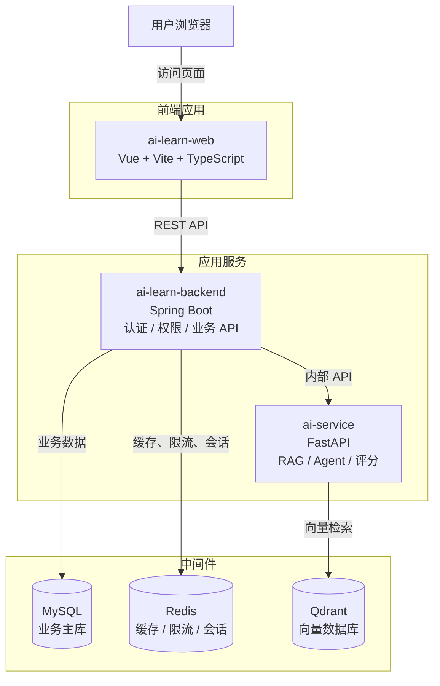

# AI应用开发学习平台架构设计文档

版本：v1.3
日期：2026-05-16
依据文档：`doc/1.需求文档/1.2需求文档.md`  
配套文档：`doc/2.架构设计/2.2开发规范.md`、`doc/2.架构设计/2.3接口规范.md`、`doc/中间件/`

## 1. 设计目标

架构围绕 MVP 落地设计，优先保证边界清楚、能本地跑通、后续能扩展。首期不拆复杂微服务，采用三个工程：前端、业务后端、AI 服务。

本阶段需要满足：

- 支撑学习路线展示、建议评论、面试题占位和AI智能刷题基础流程。
- 建立用户、权限、题库、答题记录和成长体系的数据边界。
- 为 RAG、LangGraph Agent、个人题库、AI 审题评分预留扩展空间。
- 中间件选择以本地开发便利、社区活跃、生产可维护为原则。
- 所有配置和文档只能使用占位符，禁止提交真实密码、Token、密钥和生产连接地址。

## 2. 总体架构



调用关系说明：

- 浏览器只访问前端和后端对外 API。
- 后端是业务唯一入口，负责鉴权、业务规则、数据落库和对外响应。
- AI 服务只处理 RAG、Agent 编排、出题、评分和学习建议，不直接对浏览器开放。
- MySQL 保存业务主数据；Redis 保存短期状态和高频缓存；Qdrant 保存向量索引。
- AI 服务需要用户画像、题库或答题记录时，由后端查询、脱敏、组装后传入。

## 3. 架构约束

以下约束默认生效，除非经过明确评审，不在实现中绕过：

- 前端不得直接调用 `ai-service`、MySQL、Redis 或 Qdrant。
- `ai-learn-backend` 是唯一业务入口，所有权限校验和业务落库都在后端完成。
- `ai-service` 不直接写入核心业务表；AI 返回结果由后端校验后再保存。
- 用户私有数据必须在后端校验资源归属。
- MySQL 表结构变更必须通过 Flyway migration 管理。
- RAG 入库和大模型调用要有超时、重试、失败兜底和日志脱敏。
- 新增中间件、环境变量、配置字段或启动参数时，必须同步更新 `doc/中间件/` 和相关示例配置。

## 4. 工程划分

### 4.1 `ai-learn-web`

定位：Web 前端，提供学习平台界面和交互。

| 类型 | 选型 | 说明 |
| --- | --- | --- |
| 运行时 | Node.js LTS，优先 24 LTS 版本线 | 具体 patch 版本由 `.nvmrc`、Volta 或锁文件固定 |
| 语言 | TypeScript | 开启严格类型检查，减少接口联调问题 |
| 构建 | Vite | 本地开发和构建速度快 |
| 框架 | Vue 3 | 适合内容平台和后台类页面 |
| 路由 | Vue Router 4 | 路由守卫承载基础权限控制 |
| 状态 | Pinia | 管理登录态、用户信息、全局 UI 状态 |
| UI | Element Plus | 提升表单、菜单、布局开发效率 |
| 请求状态 | TanStack Query 或等价方案 | 管理异步请求、缓存和 loading 状态 |

主要模块：

- `layout`：整体布局、顶部横向主导航、右侧用户区。
- `router`：路由配置和登录守卫。
- `pages/learning-roadmap`：路线和资料。
- `pages/practice-agent`：AI智能刷题页面。
- `pages/interview-questions`：面试题占位页。
- `pages/suggestions-comments`：建议评论区。
- `pages/profile`：个人中心。
- `api`：后端接口封装。
- `stores`：登录态和全局状态。

### 4.2 `ai-learn-backend`

定位：业务后端，对前端提供统一 REST API。

默认技术基线：

| 类型 | 选型 | 说明 |
| --- | --- | --- |
| 语言 | Java 21 LTS | 生态稳定、依赖兼容风险低 |
| 框架 | Spring Boot 3.5.x | MVP 推荐基线，优先稳定落地 |
| 安全 | Spring Security | 登录认证、JWT、权限控制 |
| 数据访问 | MyBatis + MyBatis-Plus | 支持常规 CRUD 和复杂 SQL |
| 数据库 | MySQL Connector/J | 连接 MySQL 8.4 LTS |
| 迁移 | Flyway | 管理数据库结构版本 |
| API 文档 | springdoc-openapi | 输出 OpenAPI 文档 |
| 测试 | JUnit 5 / Spring Boot Test | 单元测试和集成测试 |

升级说明：如项目初始化时确认 MyBatis-Plus、springdoc、Flyway、测试插件等依赖均兼容，可选择 Java 25 LTS + Spring Boot 4.x。未完成验证前，不把前沿版本作为默认基线。

后端统一根包：

```text
com.earth.online.player.ailearn
```

代码架构采用 DDD 领域驱动设计，不再以传统 Controller、Service、Mapper 三层作为组织主线。后端仍按业务模块拆包，每个模块内部再按接口层、应用层、领域层、基础设施层分层。这样既能保持当前单体工程开发效率，也便于项目变大后按业务模块拆分为独立微服务。

推荐结构：

```text
com.earth.online.player.ailearn
├── common/                    # 技术通用能力：统一响应、异常、分页、traceId、日志脱敏
├── auth/                      # 认证上下文：注册、登录、退出、JWT
│   ├── interfaces/            # 对外适配：Controller、Request、Response、Assembler
│   ├── application/           # 用例编排：Command、Query、AppService、事务边界
│   ├── domain/                # 领域模型：聚合、实体、值对象、领域服务、仓储接口、领域事件
│   └── infrastructure/        # 技术实现：Persistence Entity、Mapper、RepositoryImpl、外部客户端
├── user/                      # 用户上下文：用户资料、头像、个人中心
├── learning/                  # 学习资料上下文：学习路线资料读取和展示
├── suggestion/                # 建议上下文：建议提交、列表查询、处理状态预留
├── comment/                   # 评论上下文：评论发布、列表查询、回复和点赞预留
├── question/                  # 题库上下文：默认题库、个人题库、标签、知识点
├── answer/                    # 答题上下文：答题记录、评分结果、耗时和知识点关联
├── growth/                    # 成长上下文：经验、等级、段位、徽章计算
└── agent/                     # AI智能刷题上下文：刷题会话、AI 服务调用、结果校验和保存
```

DDD 分层职责：

| 层 | 职责 | 依赖约束 |
| --- | --- | --- |
| `interfaces` | 接收 HTTP 请求、完成入参转换、返回响应对象 | 只调用应用层，不写业务规则，不直接访问 Mapper |
| `application` | 编排业务用例、控制事务边界、协调领域对象和外部端口 | 不沉淀核心业务规则，不直接暴露持久化实体 |
| `domain` | 承载核心业务规则、聚合、实体、值对象、领域服务、仓储接口和领域事件 | 不依赖 Spring MVC、MyBatis、Redis、Qdrant 等技术细节 |
| `infrastructure` | 实现持久化、缓存、外部服务客户端、RepositoryImpl 和技术配置 | 依赖领域层接口，不反向污染领域模型 |
| `common` | 放统一响应、异常、分页、traceId、日志脱敏等技术通用能力 | 不放具体业务规则 |

模块拆分约束：

- 跨业务模块调用优先通过对方 `application` 暴露的用例接口，避免直接访问对方 Mapper、持久化对象或内部领域对象。
- 领域层只表达业务规则，不关心 HTTP、数据库表结构、Redis key、AI 服务地址等技术细节。
- 基础设施层通过 Repository 实现、Client 适配器、防腐层等方式隔离 MySQL、Redis、AI 服务和第三方依赖。
- 后续拆分微服务时，优先以 `auth`、`user`、`question`、`answer`、`growth`、`agent` 等业务模块作为候选边界。

### 4.3 `ai-service`

定位：AI 能力服务，为后端提供内部接口。

| 类型 | 选型 | 说明 |
| --- | --- | --- |
| 语言 | Python 3.12 或经依赖验证后的更高稳定版本 | 优先兼顾 AI 生态兼容性 |
| Web 框架 | FastAPI | 暴露内部 API，类型约束清晰 |
| 运行 | Uvicorn | ASGI 服务运行 |
| Agent 编排 | LangGraph | 管理AI智能刷题工作流 |
| LLM 应用 | LangChain | 模型调用、工具和链式能力 |
| RAG 索引 | LlamaIndex | 文档切分、索引和检索管理 |
| 向量库客户端 | qdrant-client | 访问 Qdrant |
| 配置 | pydantic-settings | 环境变量和配置解析 |

主要模块：

- `api`：内部接口路由。
- `agent_graph`：LangGraph 状态和节点。
- `rag`：文档切分、向量化、检索、重排序。
- `question_generation`：选题和生成题目。
- `answer_grading`：答案审题、评分、结构化反馈。
- `prompts`：提示词模板和版本记录。
- `llm_clients`：模型供应商适配层。
- `schemas`：Pydantic 请求和响应模型。
- `config`：配置加载和校验。

## 5. 中间件选型

| 中间件 | 推荐版本线 | 项目用途 | 配套文档 |
| --- | --- | --- | --- |
| MySQL | 8.4 LTS | 用户、建议、评论、题库、答题记录、成长体系等业务数据 | `doc/中间件/MySQL.md` |
| Redis Open Source | 8.x 稳定版 | 登录态辅助、限流、验证码、热点缓存、排行榜预留 | `doc/中间件/Redis.md` |
| Qdrant | 1.x 稳定版 | 学习资料、题目、答案解析和知识点向量检索 | `doc/中间件/Qdrant.md` |

本地开发推荐应用服务在 IDE 或命令行启动，中间件用 Docker 或 Docker Compose 启动。生产部署可先采用单机，再按访问量迁移到云数据库、云 Redis、对象存储或容器平台。

## 6. 版本管理原则

- 文档只约束版本线，不锁死 patch 版本。
- 精确版本写入 `pom.xml`、`package-lock.json`、`requirements.lock`、`uv.lock` 等工程文件。
- MVP 不使用 RC、Milestone、Snapshot、Beta 作为默认基线。
- 核心大版本升级前必须验证依赖兼容性并记录结论。
- 工程锁文件与文档不一致时，应在同一次变更中修正文档或说明原因。

## 7. 业务能力设计

### 7.1 用户与权限

认证方式：

- 登录成功后后端签发 JWT access token。
- 前端通过 `Authorization: Bearer <access_token占位符>` 调用登录态接口。
- 路由守卫做前端提示，后端做最终权限判断。

权限矩阵：

| 页面 / 操作 | 游客 | 登录用户 |
| --- | --- | --- |
| 路线和资料 | 可访问 | 可访问 |
| 建议评论区列表 | 可查看 | 可查看 |
| 发布建议 | 引导登录 | 可发布 |
| 发布评论 | 引导登录 | 可发布 |
| 热门面经 | 引导登录 | 可访问 |
| AI智能刷题 | 引导登录 | 可访问 |
| 个人中心 | 引导登录 | 可访问 |

### 7.2 学习路线和资料

MVP 资料来源：

```text
doc/学习路线页面
```

落地方式：

- 首期可由前端将 Markdown 转为页面内容。
- 后端预留学习资料 API，便于后续迁移到数据库或后台管理。
- 进入 RAG 阶段后，AI 服务负责切分资料并写入 Qdrant。

### 7.3 建议评论区

建议：游客可查看，登录用户可提交；状态预留 `PENDING`、`ACCEPTED`、`REJECTED`、`DONE`。

评论：游客可查看，登录用户可发布；回复、点赞和审核先保留扩展点。

### 7.4 面试题

MVP 做登录后可访问的占位页。后续扩展分类、标签、难度、搜索、收藏、解析、后台导入和 AI 生成参考答案。

### 7.5 AI智能刷题

MVP 基础流程：

1. 前端请求开始刷题。
2. 后端校验登录态。
3. 后端读取题库和答题记录，生成推荐上下文。
4. 后端调用 AI 服务推荐或生成题目；若 AI 不可用，可降级为默认题库出题。
5. 用户提交答案。
6. 后端调用 AI 服务评分；若 AI 不可用，可返回可解释的兜底提示。
7. 后端校验 AI 返回结构，保存答题记录。
8. 后端计算基础经验和成长反馈。
9. 前端展示评分、参考答案、改进建议和成长信息。

AI 评分结构：

```json
{
  "score": 86,
  "isCorrect": true,
  "hitPoints": ["理解了 RAG 的检索增强思想"],
  "missingPoints": ["没有说明向量检索和重排序"],
  "problems": ["答案对数据入库流程描述较弱"],
  "referenceAnswer": "标准参考答案占位符",
  "improvementAdvice": "建议补充 Embedding、向量库、召回、重排序、生成之间的关系",
  "reviewKnowledgePoints": ["RAG", "Embedding", "Vector Search"]
}
```

## 8. AI Agent 工作流

```text
前端发起刷题
  ↓
后端鉴权、读取题库、读取答题记录、组装上下文
  ↓
AI 服务进行画像分析、RAG 检索、推荐或生成题目、审题评分
  ↓
后端校验 AI 响应、落库、计算成长反馈
  ↓
前端展示题目、评分、参考答案、改进建议和成长结果
```

LangGraph 节点规划：

| 节点 | 输入 | 输出 | 职责 |
| --- | --- | --- | --- |
| 用户画像分析 | 用户历史摘要 | 薄弱知识点、熟练度 | 识别学习短板 |
| 候选题召回 | 知识点、难度、标签 | 候选题和知识片段 | 从题库和向量库召回内容 |
| 推荐决策 | 候选题、历史得分 | 推荐题目 | 按权重选择题目 |
| 出题 | 推荐题或知识片段 | 最终题目 | 选择已有题或生成新题 |
| 答案评审 | 题目、标准答案、用户答案 | 评分结果 | 输出结构化评审 |
| 学习建议 | 评分结果、薄弱点 | 复习建议 | 给出下一步建议 |
| 结果回传 | 评分和建议 | 后端可落库结果 | 返回给业务后端 |

推荐权重初始公式：

```text
题目权重 = 基础权重 + 未刷加权 + 低分加权 + 薄弱知识点加权 + 个人题库加权 - 高频重复惩罚
```

RAG 入库采用异步任务：接口只返回任务 ID，切分、向量化和写入 Qdrant 由后台任务执行，避免长请求阻塞。

## 9. 数据设计概览

核心表：

| 表 | 说明 |
| --- | --- |
| `users` | 用户账号、昵称、头像、经验、等级、段位 |
| `suggestions` | 用户建议 |
| `comments` | 评论和回复 |
| `questions` | 默认题库和个人题库 |
| `answer_records` | 答题记录和 AI 评分 |
| `badges` | 徽章定义 |
| `user_badges` | 用户已获得徽章 |
| `knowledge_points` | 知识点 |
| `question_knowledge_points` | 题目和知识点关系 |
| `agent_sessions` | AI智能刷题会话 |
| `rag_index_tasks` | RAG 入库任务 |

关键规则：

- `questions.owner_user_id` 为空表示平台默认题库，不为空表示用户个人题库。
- `questions.source_type` 区分 `DEFAULT`、`USER_UPLOAD`、`AI_GENERATED`。
- `answer_records.ai_feedback` 可用 MySQL `JSON` 类型保存结构化评分结果。
- 用户私有数据查询必须带 `user_id` 条件。
- 所有业务表包含 `created_at`、`updated_at`；需要逻辑删除时增加 `deleted` 或 `deleted_at`。

## 10. 接口边界

接口细节见 `doc/2.架构设计/2.3接口规范.md`。

对外 API：

- 统一前缀：`/api/v1`。
- 登录态接口使用 `Authorization: Bearer <access_token占位符>`。
- 列表接口默认分页。
- 前端不得调用 `/internal/**`。

内部 API：

- 统一前缀：`/internal/v1`。
- 后端调用 AI 服务时携带 `X-Internal-Token: <AI_SERVICE_TOKEN占位符>`。
- AI 服务返回统一结构，后端负责校验和兜底。

## 11. 安全设计

- 密码使用 BCrypt 或 Argon2 哈希保存。
- JWT 设置合理过期时间，刷新 token 后续扩展。
- 用户私有资源必须校验 `user_id`。
- 建议和评论预留敏感词、审核和举报能力。
- AI 输出标注“仅供学习参考”。
- AI 服务设置超时、重试、限流和失败兜底。
- 文件上传限制类型、大小和扫描策略。
- 防 Prompt Injection：系统提示、用户输入、检索片段必须分层隔离。
- `JWT_SECRET`、`AI_SERVICE_TOKEN`、`OPENAI_API_KEY` 等敏感值只通过环境变量或私有配置注入，不提交仓库，不打印日志。

## 12. 性能、可维护性与可观测性

性能：

- 学习路线页面优先静态化或缓存。
- 建议、评论、题目和答题记录列表必须分页。
- 高频查询字段建立索引，例如 `user_id`、`question_id`、`created_at`、状态字段。
- Redis 用于热点资料、验证码、限流计数和短期会话状态。
- Qdrant 检索使用知识点、难度、题型等 metadata 过滤。

可维护性：

- 经验、等级、段位、徽章和推荐权重集中管理。
- Prompt 模板独立存放并维护版本号。
- AI 响应使用 JSON Schema 或 Pydantic 模型约束。
- 后端统一异常、统一响应、统一 traceId。
- 前端 API 统一封装，页面组件不拼接后端地址。

可观测性：

- 后端提供 `/actuator/health`。
- AI 服务提供 `/health`。
- 请求日志携带 `traceId`。
- 日志必须脱敏，不记录密码、Token、API Key、完整连接串。

## 13. 部署设计

推荐目录：

```text
ai_learn_project/
├── ai-learn-backend/
├── ai-learn-web/
├── ai-service/
├── deploy/
│   └── docker-compose.yml
└── doc/
```

本地端口：

| 服务 | 端口 |
| --- | --- |
| ai-learn-web | `5173` |
| ai-learn-backend | `8080` |
| ai-service | `8000` |
| MySQL | `3306` |
| Redis | `6379` |
| Qdrant | `6333`，gRPC 为 `6334` |

本地启动顺序：

1. 启动 MySQL、Redis、Qdrant。
2. 使用 `local` 或 `dev` Profile 启动 `ai-learn-backend`。
3. 启动 `ai-service`。
4. 启动 `ai-learn-web` 并进行联调。

本地配置示例：

| 配置项 | 示例值 | 说明 |
| --- | --- | --- |
| `DATABASE_URL` | `jdbc:mysql://127.0.0.1:3306/ai_learn` | 后端连接 MySQL |
| `REDIS_URL` | `redis://127.0.0.1:6379` | 后端连接 Redis |
| `QDRANT_URL` | `http://127.0.0.1:6333` | AI 服务连接 Qdrant |
| `AI_SERVICE_BASE_URL` | `http://127.0.0.1:8000` | 后端调用 AI 服务 |

生产部署建议：

- 前端构建为静态资源，由 Nginx 或对象存储 + CDN 提供访问。
- 后端只暴露必要 API 入口，内部服务端口不直接公网开放。
- AI 服务仅允许后端调用。
- MySQL、Redis、Qdrant 初期可同机部署，数据增长后迁移到云数据库、云 Redis 或独立节点。
- 生产配置通过环境变量或服务器私有配置注入，不进入仓库。
- MySQL 和 Qdrant 必须持久化并制定备份策略；Redis 是否持久化按使用场景决定。

## 14. 配置规范

仓库只提交示例配置：

```text
ai-learn-backend/
├── src/main/resources/application.yml
├── src/main/resources/application-local.example.yml
└── src/main/resources/application-prod.example.yml

ai-service/
├── .env.example
└── config.example.yaml

ai-learn-web/
└── .env.example
```

环境变量：

| 变量 | 用途 |
| --- | --- |
| `DATABASE_URL` | MySQL JDBC 地址 |
| `DATABASE_USERNAME` | MySQL 用户名 |
| `DATABASE_PASSWORD` | MySQL 密码 |
| `REDIS_URL` | Redis 地址 |
| `REDIS_PASSWORD` | Redis 密码，本地无密码时可空 |
| `QDRANT_URL` | Qdrant 地址 |
| `QDRANT_API_KEY` | Qdrant API Key，本地未开启鉴权时可空 |
| `JWT_SECRET` | JWT 签名密钥 |
| `AI_SERVICE_BASE_URL` | AI 服务地址 |
| `AI_SERVICE_TOKEN` | 内部服务鉴权 Token |
| `OPENAI_API_KEY` | 大模型供应商 API Key |
| `MODEL_NAME` | 默认大模型名称 |
| `EMBEDDING_MODEL_NAME` | 默认 Embedding 模型名称 |
| `EMBEDDING_DIMENSION` | Embedding 向量维度 |

所有真实值由开发者本地或服务器私有配置提供，示例文件只写占位符。

## 15. 阶段计划

| 阶段 | 目标 | 内容 |
| --- | --- | --- |
| 第一阶段 | MVP 页面与权限 | 前端布局、四个菜单、学习路线、建议评论、注册登录、权限引导 |
| 第二阶段 | 题库与刷题基础能力 | 默认题库、答题提交、答题记录、基础评分展示 |
| 第三阶段 | AI 服务与 RAG | FastAPI、Qdrant、异步入库、题目推荐、AI 出题、AI 评分 |
| 第四阶段 | 成长体系 | 经验、等级、段位、徽章和个人中心展示 |
| 第五阶段 | 内容和社区增强 | 热门面经、评论互动、收藏、后台管理、学习统计 |

## 16. 技术结论

- 前端：`ai-learn-web`，Vue 3 + Vite + TypeScript + Vue Router + Pinia + Element Plus。
- 后端：`ai-learn-backend`，默认 Java 21 LTS + Spring Boot 3.5.x + Spring Security + MyBatis/MyBatis-Plus + MySQL 8.4 LTS；验证通过后可升级到 Java 25 LTS + Spring Boot 4.x。
- AI 服务：`ai-service`，FastAPI + LangGraph + LangChain + LlamaIndex + Qdrant。
- 中间件：MySQL 作为业务主库，Redis 作为缓存和限流基础设施，Qdrant 作为向量数据库。

该方案在 MVP 阶段保持工程数量少、职责边界清楚，同时为智能刷题、RAG 知识库、成长体系和社区功能留下扩展空间。


