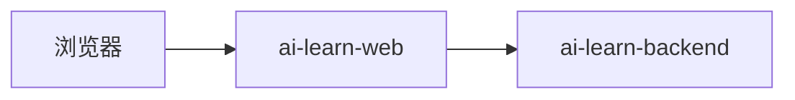

# sprint202601 当期设计方案

版本：v1.1
日期：2026-05-16
迭代定位：工程底座与公开首页  
对应需求：`doc/3.迭代文档/sprint202601/1.当期需求文档.md`

## 1. 技术方案

本期采用前后端分离，但只实现最小可运行骨架。



- 前端负责顶部横向导航布局、路由和学习路线 Markdown 静态渲染。
- 后端提供统一响应、traceId 和健康检查；学习路线页面不依赖后端接口获取内容。
- 本期不连接数据库和其他中间件。

## 2. 前端设计

### 2.1 目录结构

```text
ai-learn-web/src/
├── api/
│   └── http.ts
├── components/common/
├── content/learning-roadmap/
│   ├── AI应用开发学习路线和资料集.md
│   └── AI应用开发学习路线和资料集.assets/
├── layout/AppLayout.vue
├── pages/
│   ├── learning-roadmap/LearningRoadmapPage.vue
│   └── placeholder/PlaceholderPage.vue
├── router/index.ts
├── styles/global.scss
└── utils/
```

### 2.2 路由

| 路由 | 页面 | 说明 |
| --- | --- | --- |
| `/` | 重定向 | 重定向到 `/learning-roadmap` |
| `/learning-roadmap` | 学习路线 | 公开首页 |
| `/suggestions-comments` | 占位页 | sprint202603 实现 |
| `/interview-questions` | 占位页 | sprint202604 实现 |
| `/practice-agent` | 占位页 | sprint202605 实现 |

### 2.3 HTTP 封装

- 前端 API 地址写入 `ai-learn-web/.env`，示例：`VITE_API_BASE_URL=http://localhost:8080/api/v1`。
- HTTP 封装保留给后续真实接口使用。
- 学习路线页面不通过 HTTP 获取内容。

### 2.4 Markdown 静态渲染

- 将 `doc/学习路线页面/AI应用开发学习路线和资料集.md` 原文复制到前端项目 `src/content/learning-roadmap/`。
- 将同名 `.assets` 目录同步复制到前端项目，保证 Markdown 图片可被 Vite 打包。
- `LearningRoadmapPage.vue` 通过 `?raw` 导入 Markdown 原文，再用 Markdown 渲染器转换成 HTML。
- 渲染阶段只处理资源路径、标题锚点和链接打开方式，不修改 Markdown 文件内容。
- 页面左侧“目录”由 Markdown 标题解析生成，目录仅作为用户阅读导航，不展示内部维护提示，并根据滚动位置高亮当前章节。
- 本地图片路径需要兼容原始相对路径、URL 编码路径和文件名兜底匹配，确保路线图图片正常展示。
- 后续维护时直接修改前端项目中的 Markdown 文件，开发环境保存后页面自动更新。

## 3. 后端设计

### 3.1 包结构

```text
com.earth.online.player.ailearn
├── common/
│   ├── exception/
│   ├── response/
│   └── trace/
└── learning/
    ├── interfaces/
    └── application/
```

### 3.2 统一响应

```json
{
  "code": "SUCCESS",
  "message": "操作成功",
  "data": {},
  "traceId": "trace-id占位符"
}
```

### 3.3 学习路线内容来源

学习路线页面内容由前端 Markdown 文件静态渲染，后端不作为页面内容来源。后端可保留已实现的学习路线接口作为兼容能力，但前端首页不得依赖该接口。

## 4. 配置

### 4.1 前端 `.env`

```text
VITE_API_BASE_URL=http://localhost:8080/api/v1
```

说明：`ai-learn-web/.env` 只用于本地启动，由 Vite 自动读取，不提交仓库。

### 4.2 后端配置

只保留服务端口、应用名和日志级别，不配置数据库。

```yaml
server:
  port: 8080
spring:
  application:
    name: ai-learn-backend
```

## 5. 验证要求

本项目当前要求禁止新增单元测试代码，本期只整理接口联调、启动验证和人工验收清单。

- 接口验证：健康检查接口返回 `SUCCESS`。
- 前端验证：菜单切换正常，学习路线 Markdown 原文渲染正常，占位页不报错。
- 构建验证：前端 `build` 成功，后端可启动并通过健康检查验证。

## 6. 开发顺序

1. 创建前端和后端工程。
2. 后端实现统一响应、traceId 和健康检查。
3. 前端实现顶部横向导航布局、路由和 HTTP 封装。
4. 前端复制学习路线 Markdown 与资源目录，并实现 Markdown 静态渲染页面和占位页。
5. 补充启动说明和基础验证清单。
