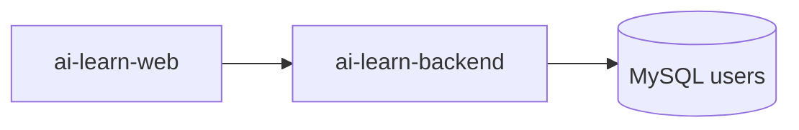

# sprint202602 当期设计方案

版本：v1.0  
日期：2026-05-14  
迭代定位：用户注册登录与权限基础  
对应需求：`doc/3.迭代文档/sprint202602/1.当期需求文档.md`

## 1. 架构调整

本期开始接入 MySQL，后端通过 Flyway 管理用户表。



Redis 暂不接入，退出登录采用无状态 JWT 模式。

## 2. 后端设计

### 2.1 新增包结构

```text
com.earth.online.player.ailearn
├── auth/
│   ├── interfaces/
│   ├── application/
│   ├── domain/
│   └── infrastructure/
├── user/
│   ├── interfaces/
│   ├── application/
│   ├── domain/
│   └── infrastructure/
└── common/security/
```

### 2.2 数据库迁移

文件：`V1__init_user_tables.sql`。

```sql
CREATE TABLE users (
    id BIGINT UNSIGNED NOT NULL AUTO_INCREMENT COMMENT '用户ID',
    username VARCHAR(32) NOT NULL COMMENT '用户名',
    nickname VARCHAR(64) NULL COMMENT '昵称',
    avatar VARCHAR(255) NULL COMMENT '头像地址',
    email VARCHAR(128) NULL COMMENT '邮箱',
    password_hash VARCHAR(100) NOT NULL COMMENT '密码哈希',
    experience INT NOT NULL DEFAULT 0 COMMENT '经验值',
    level_code VARCHAR(16) NOT NULL DEFAULT 'LV1' COMMENT '等级编码',
    rank_code VARCHAR(16) NOT NULL DEFAULT 'BRONZE' COMMENT '段位编码',
    created_at DATETIME NOT NULL DEFAULT CURRENT_TIMESTAMP COMMENT '创建时间',
    updated_at DATETIME NOT NULL DEFAULT CURRENT_TIMESTAMP ON UPDATE CURRENT_TIMESTAMP COMMENT '更新时间',
    deleted TINYINT NOT NULL DEFAULT 0 COMMENT '逻辑删除标识',
    PRIMARY KEY (id),
    UNIQUE KEY uk_users_username (username),
    UNIQUE KEY uk_users_email (email)
) ENGINE=InnoDB DEFAULT CHARSET=utf8mb4 COMMENT='用户表';
```

### 2.3 认证流程

1. 注册：校验参数和唯一性，生成密码哈希，创建用户，签发 JWT。
2. 登录：按用户名查询用户，校验密码，签发 JWT。
3. 当前用户：JWT 过滤器解析用户 ID，查询用户摘要。
4. 退出：返回成功，由前端删除 token。

### 2.4 JWT 设计

- 请求头：`Authorization: Bearer <token>`。
- token claims 至少包含用户 ID、用户名、过期时间。
- 默认过期时间：7200 秒。
- `JWT_SECRET` 不得写死在代码中。

## 3. 前端设计

### 3.1 新增模块

```text
src/api/auth.ts
src/api/user.ts
src/components/auth/LoginDialog.vue
src/components/auth/RegisterDialog.vue
src/components/common/LoginGuideDialog.vue
src/pages/profile/ProfilePage.vue
src/stores/auth.ts
```

### 3.2 登录态

Pinia 状态：

```text
token: string | null
user: CurrentUser | null
initialized: boolean
```

本地存储 key：`ai_learn_access_token`。

### 3.3 路由守卫

- `requiresAuth = true` 且无 token：阻止进入，打开登录引导。
- 有 token 但无用户信息：调用 `/users/me`。
- `/users/me` 失败：清理 token，打开登录引导。

## 4. 配置

### 4.1 后端示例配置

```yaml
spring:
  datasource:
    url: ${DATABASE_URL:jdbc:mysql://127.0.0.1:3306/ai_learn?useUnicode=true&characterEncoding=utf8&serverTimezone=Asia/Shanghai}
    username: ${DATABASE_USERNAME:用户名占位符}
    password: ${DATABASE_PASSWORD:密码占位符}
  flyway:
    enabled: true
app:
  jwt:
    secret: ${JWT_SECRET:JWT_SECRET占位符}
    expires-in-seconds: ${JWT_EXPIRES_IN_SECONDS:7200}
```

### 4.2 文档要求

本期开始使用 MySQL，应复用并核对 `doc/中间件/MySQL.md`。如新增配置名与文档不一致，必须同步更新该文档。

## 5. 验证要求

本项目当前要求禁止新增单元测试代码，本期只整理接口联调、启动验证和人工验收清单。

- 验证注册成功流程。
- 验证重复用户名会返回明确错误。
- 验证登录成功和密码错误两类流程。
- `/users/me` 未登录返回 `AUTH_UNAUTHORIZED`。
- `/users/me` 登录后不返回密码哈希。
- 前端手工验证刷新恢复登录态。

## 6. 开发顺序

1. 接入 MySQL、Flyway、MyBatis 和 Security。
2. 创建用户表迁移脚本。
3. 实现用户仓储、认证应用服务和 JWT 过滤器。
4. 实现认证接口和当前用户接口。
5. 前端实现登录注册弹窗、authStore、路由守卫和个人中心。
6. 补充启动说明和人工验收清单。
