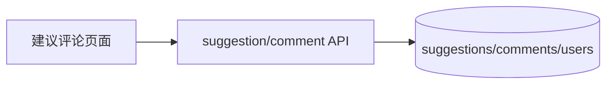

# sprint202603 当期设计方案

版本：v1.0  
日期：2026-05-14  
迭代定位：建议与评论最小闭环  
对应需求：`doc/3.迭代文档/sprint202603/1.当期需求文档.md`

## 1. 架构说明

本期复用 sprint202602 的 MySQL、用户和 JWT 能力，新增 interaction 相关模块。



## 2. 后端设计

### 2.1 包结构

```text
com.earth.online.player.ailearn
├── suggestion/
│   ├── interfaces/
│   ├── application/
│   ├── domain/
│   └── infrastructure/
└── comment/
    ├── interfaces/
    ├── application/
    ├── domain/
    └── infrastructure/
```

### 2.2 数据库迁移

文件：`V2__init_interaction_tables.sql`。

```sql
CREATE TABLE suggestions (
    id BIGINT UNSIGNED NOT NULL AUTO_INCREMENT COMMENT '建议ID',
    user_id BIGINT UNSIGNED NOT NULL COMMENT '提交用户ID',
    title VARCHAR(80) NOT NULL COMMENT '建议标题',
    content VARCHAR(2000) NOT NULL COMMENT '建议内容',
    type VARCHAR(32) NOT NULL COMMENT '建议类型',
    status VARCHAR(32) NOT NULL DEFAULT 'PENDING' COMMENT '处理状态',
    created_at DATETIME NOT NULL DEFAULT CURRENT_TIMESTAMP COMMENT '创建时间',
    updated_at DATETIME NOT NULL DEFAULT CURRENT_TIMESTAMP ON UPDATE CURRENT_TIMESTAMP COMMENT '更新时间',
    deleted TINYINT NOT NULL DEFAULT 0 COMMENT '逻辑删除标识',
    PRIMARY KEY (id),
    KEY idx_suggestions_user_id (user_id),
    KEY idx_suggestions_status_created_at (status, created_at),
    CONSTRAINT fk_suggestions_user_id FOREIGN KEY (user_id) REFERENCES users (id)
) ENGINE=InnoDB DEFAULT CHARSET=utf8mb4 COMMENT='用户建议表';

CREATE TABLE comments (
    id BIGINT UNSIGNED NOT NULL AUTO_INCREMENT COMMENT '评论ID',
    user_id BIGINT UNSIGNED NOT NULL COMMENT '评论用户ID',
    content VARCHAR(1000) NOT NULL COMMENT '评论内容',
    parent_id BIGINT UNSIGNED NULL COMMENT '父评论ID',
    like_count INT NOT NULL DEFAULT 0 COMMENT '点赞数',
    created_at DATETIME NOT NULL DEFAULT CURRENT_TIMESTAMP COMMENT '创建时间',
    updated_at DATETIME NOT NULL DEFAULT CURRENT_TIMESTAMP ON UPDATE CURRENT_TIMESTAMP COMMENT '更新时间',
    deleted TINYINT NOT NULL DEFAULT 0 COMMENT '逻辑删除标识',
    PRIMARY KEY (id),
    KEY idx_comments_user_id (user_id),
    KEY idx_comments_created_at (created_at),
    CONSTRAINT fk_comments_user_id FOREIGN KEY (user_id) REFERENCES users (id)
) ENGINE=InnoDB DEFAULT CHARSET=utf8mb4 COMMENT='评论表';
```

### 2.3 领域规则

建议类型：`FEATURE`、`EXPERIENCE`、`CONTENT`、`BUG`、`OTHER`。  
建议状态：`PENDING`、`ACCEPTED`、`REJECTED`、`DONE`，本期只创建 `PENDING`。

应用层规则：

- 创建建议和评论时，用户 ID 从当前登录上下文获取。
- 列表查询过滤 `deleted = 0`。
- 默认按 `created_at desc` 排序。
- `pageSize` 最大 100。

## 3. 前端设计

### 3.1 新增文件

```text
src/api/suggestions.ts
src/api/comments.ts
src/pages/suggestions-comments/SuggestionsCommentsPage.vue
src/types/suggestion.ts
src/types/comment.ts
```

### 3.2 页面结构

- 使用 `el-tabs` 分为建议区和评论区。
- 建议区：列表卡片、分页器、提交表单或登录引导按钮。
- 评论区：评论列表、分页器、评论输入框或登录引导按钮。
- 发布成功后重置表单并刷新第一页。

### 3.3 表单交互

- 提交按钮 loading 防重复点击。
- 前端做长度和必填校验。
- 后端错误消息直接展示中文提示。
- 未登录时调用统一 `requireLogin()`。

## 4. API 响应设计

建议响应包含：`id`、`title`、`content`、`type`、`typeText`、`status`、`statusText`、`author`、`createdAt`。  
评论响应包含：`id`、`content`、`parentId`、`likeCount`、`author`、`createdAt`。

作者摘要：

```json
{
  "id": "用户ID占位符",
  "username": "demo_user",
  "nickname": "演示用户",
  "avatar": null
}
```

## 5. 验证要求

本项目当前要求禁止新增单元测试代码，本期只整理接口联调、启动验证和人工验收清单。

- 未登录提交建议返回 `AUTH_UNAUTHORIZED`。
- 登录后提交建议成功。
- 建议分页查询按时间倒序。
- 未登录发表评论返回 `AUTH_UNAUTHORIZED`。
- 登录后发表评论成功。
- 评论分页查询按时间倒序。

## 6. 开发顺序

1. 编写 Flyway 迁移脚本。
2. 实现建议领域对象、仓储、应用服务和接口。
3. 实现评论领域对象、仓储、应用服务和接口。
4. 前端替换建议与评论占位页为真实 Tab 页面。
5. 补充接口联调验证和前端手工验收。
