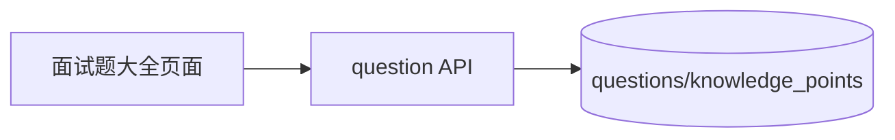

# sprint202604 当期设计方案

版本：v1.0  
日期：2026-05-14  
迭代定位：面试题大全与默认题库基础  
对应需求：`doc/3.迭代文档/sprint202604/1.当期需求文档.md`

## 1. 架构说明

本期新增 question 上下文，继续使用 MySQL，不引入 AI 服务。



## 2. 后端设计

### 2.1 包结构

```text
com.earth.online.player.ailearn
└── question/
    ├── interfaces/
    ├── application/
    ├── domain/
    └── infrastructure/
```

### 2.2 数据库迁移

文件：`V3__init_question_tables.sql`。

核心表：

```sql
CREATE TABLE questions (
    id BIGINT UNSIGNED NOT NULL AUTO_INCREMENT COMMENT '题目ID',
    owner_user_id BIGINT UNSIGNED NULL COMMENT '所属用户ID，空表示默认题库',
    title VARCHAR(120) NOT NULL COMMENT '题目标题',
    content TEXT NOT NULL COMMENT '题目内容',
    question_type VARCHAR(32) NOT NULL COMMENT '题型',
    difficulty VARCHAR(32) NOT NULL COMMENT '难度',
    tags JSON NULL COMMENT '标签数组',
    standard_answer TEXT NOT NULL COMMENT '参考答案',
    analysis TEXT NULL COMMENT '解析',
    source_type VARCHAR(32) NOT NULL DEFAULT 'DEFAULT' COMMENT '来源类型',
    created_at DATETIME NOT NULL DEFAULT CURRENT_TIMESTAMP COMMENT '创建时间',
    updated_at DATETIME NOT NULL DEFAULT CURRENT_TIMESTAMP ON UPDATE CURRENT_TIMESTAMP COMMENT '更新时间',
    deleted TINYINT NOT NULL DEFAULT 0 COMMENT '逻辑删除标识',
    PRIMARY KEY (id),
    KEY idx_questions_owner_user_id (owner_user_id),
    KEY idx_questions_difficulty (difficulty),
    KEY idx_questions_question_type (question_type),
    KEY idx_questions_created_at (created_at)
) ENGINE=InnoDB DEFAULT CHARSET=utf8mb4 COMMENT='题目表';

CREATE TABLE knowledge_points (
    id BIGINT UNSIGNED NOT NULL AUTO_INCREMENT COMMENT '知识点ID',
    name VARCHAR(80) NOT NULL COMMENT '知识点名称',
    description VARCHAR(500) NULL COMMENT '知识点说明',
    created_at DATETIME NOT NULL DEFAULT CURRENT_TIMESTAMP COMMENT '创建时间',
    updated_at DATETIME NOT NULL DEFAULT CURRENT_TIMESTAMP ON UPDATE CURRENT_TIMESTAMP COMMENT '更新时间',
    deleted TINYINT NOT NULL DEFAULT 0 COMMENT '逻辑删除标识',
    PRIMARY KEY (id),
    UNIQUE KEY uk_knowledge_points_name (name)
) ENGINE=InnoDB DEFAULT CHARSET=utf8mb4 COMMENT='知识点表';

CREATE TABLE question_knowledge_points (
    question_id BIGINT UNSIGNED NOT NULL COMMENT '题目ID',
    knowledge_point_id BIGINT UNSIGNED NOT NULL COMMENT '知识点ID',
    PRIMARY KEY (question_id, knowledge_point_id)
) ENGINE=InnoDB DEFAULT CHARSET=utf8mb4 COMMENT='题目知识点关系表';
```

迁移脚本中插入 5 - 10 道默认示例题，覆盖 RAG、Embedding、LangChain、Agent、向量数据库等知识点。

### 2.3 查询规则

- 只返回 `deleted = 0` 的题目。
- 本期只展示 `source_type = DEFAULT` 的题目。
- 关键词匹配标题和内容。
- 知识点筛选通过关系表过滤。
- 题目详情不存在时返回 `RESOURCE_NOT_FOUND`。

## 3. API 设计

### 3.1 题目列表

```text
GET /api/v1/questions?pageNo=1&pageSize=10&keyword=RAG&difficulty=MEDIUM
```

列表项：

```json
{
  "id": "题目ID占位符",
  "title": "什么是 RAG？",
  "questionType": "SHORT_ANSWER",
  "difficulty": "MEDIUM",
  "tags": ["RAG", "大模型应用"],
  "knowledgePoints": ["RAG", "向量检索"],
  "createdAt": "2026-05-14T00:00:00+08:00"
}
```

### 3.2 题目详情

```text
GET /api/v1/questions/{id}
```

详情比列表多返回 `content`、`standardAnswer`、`analysis`。

### 3.3 知识点列表

```text
GET /api/v1/knowledge-points
```

用于前端筛选下拉框。

## 4. 前端设计

新增文件：

```text
src/api/questions.ts
src/pages/interview-questions/InterviewQuestionsPage.vue
src/types/question.ts
```

页面组件：

- `QuestionFilterBar`：关键词、难度、题型、知识点。
- `QuestionList`：展示题目卡片和分页。
- `QuestionDetailDialog`：展示题目详情。

交互：

- 页面进入时加载知识点和第一页题目。
- 筛选条件变化后重置到第一页。
- 点击题目打开详情。
- 未登录由 sprint202602 路由守卫拦截。

## 5. 验证要求

本项目当前要求禁止新增单元测试代码，本期只整理接口联调、启动验证和人工验收清单。

- 未登录访问 `/questions` 返回 `AUTH_UNAUTHORIZED`。
- 登录后题目列表返回分页数据。
- 知识点筛选生效。
- 题目详情不存在返回 `RESOURCE_NOT_FOUND`。
- 前端手工验证筛选、分页、详情。

## 6. 开发顺序

1. 编写题库迁移脚本和默认数据。
2. 实现 question 领域、仓储和查询服务。
3. 实现题目列表、详情、知识点接口。
4. 前端替换面试题占位页为真实列表页。
5. 补充接口联调验证和人工验收。
