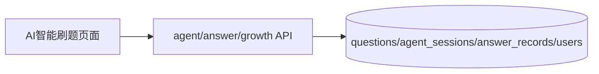

# sprint202605 当期设计方案

版本：v1.0  
日期：2026-05-14  
迭代定位：AI智能刷题基础闭环  
对应需求：`doc/3.迭代文档/sprint202605/1.当期需求文档.md`

## 1. 架构说明

本期实现本地基础刷题闭环，不引入 AI 服务。



AI 服务、Qdrant 和 RAG 作为后续扩展点，当前不启动、不配置。

## 2. 后端设计

### 2.1 包结构

```text
com.earth.online.player.ailearn
├── agent/
│   ├── interfaces/
│   ├── application/
│   ├── domain/
│   └── infrastructure/
├── answer/
│   ├── interfaces/
│   ├── application/
│   ├── domain/
│   └── infrastructure/
└── growth/
    ├── interfaces/
    ├── application/
    └── domain/
```

### 2.2 数据库迁移

文件：`V4__init_practice_tables.sql`。

```sql
CREATE TABLE agent_sessions (
    id BIGINT UNSIGNED NOT NULL AUTO_INCREMENT COMMENT '刷题会话ID',
    user_id BIGINT UNSIGNED NOT NULL COMMENT '用户ID',
    question_id BIGINT UNSIGNED NOT NULL COMMENT '题目ID',
    status VARCHAR(32) NOT NULL DEFAULT 'STARTED' COMMENT '会话状态',
    started_at DATETIME NOT NULL DEFAULT CURRENT_TIMESTAMP COMMENT '开始时间',
    submitted_at DATETIME NULL COMMENT '提交时间',
    created_at DATETIME NOT NULL DEFAULT CURRENT_TIMESTAMP COMMENT '创建时间',
    updated_at DATETIME NOT NULL DEFAULT CURRENT_TIMESTAMP ON UPDATE CURRENT_TIMESTAMP COMMENT '更新时间',
    PRIMARY KEY (id),
    KEY idx_agent_sessions_user_id (user_id),
    KEY idx_agent_sessions_question_id (question_id)
) ENGINE=InnoDB DEFAULT CHARSET=utf8mb4 COMMENT='刷题会话表';

CREATE TABLE answer_records (
    id BIGINT UNSIGNED NOT NULL AUTO_INCREMENT COMMENT '答题记录ID',
    user_id BIGINT UNSIGNED NOT NULL COMMENT '用户ID',
    question_id BIGINT UNSIGNED NOT NULL COMMENT '题目ID',
    session_id BIGINT UNSIGNED NOT NULL COMMENT '刷题会话ID',
    user_answer TEXT NOT NULL COMMENT '用户答案',
    score INT NOT NULL COMMENT '得分',
    is_correct TINYINT NOT NULL DEFAULT 0 COMMENT '是否基本正确',
    ai_feedback JSON NULL COMMENT '结构化反馈，本期保存规则评分结果',
    improvement_advice VARCHAR(1000) NULL COMMENT '改进建议',
    duration_seconds INT NULL COMMENT '答题耗时',
    first_attempt TINYINT NOT NULL DEFAULT 1 COMMENT '是否首次作答',
    created_at DATETIME NOT NULL DEFAULT CURRENT_TIMESTAMP COMMENT '创建时间',
    updated_at DATETIME NOT NULL DEFAULT CURRENT_TIMESTAMP ON UPDATE CURRENT_TIMESTAMP COMMENT '更新时间',
    PRIMARY KEY (id),
    KEY idx_answer_records_user_id_created_at (user_id, created_at),
    KEY idx_answer_records_question_id (question_id)
) ENGINE=InnoDB DEFAULT CHARSET=utf8mb4 COMMENT='答题记录表';
```

### 2.3 推荐规则

本期采用简单可解释规则：

```text
优先级 = 未刷过题目 > 低分题目 > 指定筛选条件题目 > 普通默认题
```

实现要求：

- 只从 `source_type = DEFAULT` 且未删除题目中选择。
- 如果传入难度、题型、知识点，优先在筛选范围内选题。
- 如果没有匹配题目，返回 `RESOURCE_NOT_FOUND` 或清晰提示。

### 2.4 基础评分规则

本期不调用 AI，使用规则评分：

- 从标准答案和知识点中生成关键词集合。
- 根据用户答案命中关键词比例计算基础分。
- 命中关键词生成 `hitPoints`。
- 未命中关键词生成 `missingPoints`。
- 答案过短时加入 `problems`。
- 分数限制在 0 - 100。

该规则集中在 `AnswerGradingDomainService`，后续可替换为 AI 评分适配器。

### 2.5 成长规则

基础经验：

```text
earnedExperience = 5 + floor(score / 20) * 2
```

等级展示：

| 等级 | 经验范围 |
| --- | --- |
| Lv1 | 0 - 99 |
| Lv2 | 100 - 299 |
| Lv3 | 300 - 699 |
| Lv4 | 700 - 1499 |
| Lv5 | 1500 以上 |

本期段位固定根据经验粗略展示，完整规则后续再拆。

## 3. API 设计

### 3.1 开始刷题

```text
POST /api/v1/agent/practice/start
```

响应：

```json
{
  "sessionId": "会话ID占位符",
  "questionId": "题目ID占位符",
  "title": "题目标题占位符",
  "content": "题目内容占位符",
  "questionType": "SHORT_ANSWER",
  "difficulty": "MEDIUM",
  "knowledgePoints": ["RAG", "向量检索"]
}
```

### 3.2 提交答案

```text
POST /api/v1/agent/practice/submit
```

处理步骤：

1. 校验 session 属于当前用户。
2. 校验 session 状态可提交。
3. 查询题目标准答案和知识点。
4. 执行基础评分。
5. 保存答题记录。
6. 更新用户经验和等级字段。
7. 返回评分和成长反馈。

### 3.3 我的答题记录

```text
GET /api/v1/answer-records/me?pageNo=1&pageSize=10
```

只查询当前登录用户自己的记录。

### 3.4 我的成长信息

```text
GET /api/v1/growth/me
```

返回经验、等级、段位和累计答题数。

## 4. 前端设计

新增文件：

```text
src/api/practice.ts
src/api/answerRecords.ts
src/api/growth.ts
src/pages/practice-agent/PracticeAgentPage.vue
src/pages/profile/AnswerRecordsPanel.vue
src/types/practice.ts
```

页面状态：

- `idle`：未开始，展示开始按钮和能力说明。
- `answering`：展示题目和答案输入框。
- `grading`：提交中 loading。
- `result`：展示评分结果和参考答案。

交互要求：

- 答案为空不能提交。
- 提交按钮 loading 防重复提交。
- 评分结果展示“仅供学习参考”。
- 提交成功后提供“再来一题”按钮。

## 5. 验证要求

本项目当前要求禁止新增单元测试代码，本期只整理接口联调、启动验证和人工验收清单。

- 未登录开始刷题返回 `AUTH_UNAUTHORIZED`。
- 登录后开始刷题成功。
- 会话不属于当前用户时提交失败。
- 提交空答案返回 `PARAM_INVALID`。
- 提交答案后生成答题记录。
- 分数始终在 0 - 100。
- 用户只能查看自己的答题记录。

## 6. 开发顺序

1. 编写刷题会话和答题记录迁移脚本。
2. 实现推荐领域服务和评分领域服务。
3. 实现开始刷题、提交答案、答题记录、成长接口。
4. 前端替换AI智能刷题占位页为真实流程页。
5. 在个人中心或独立面板展示答题记录与成长信息。
6. 补充接口联调验证和人工验收。


