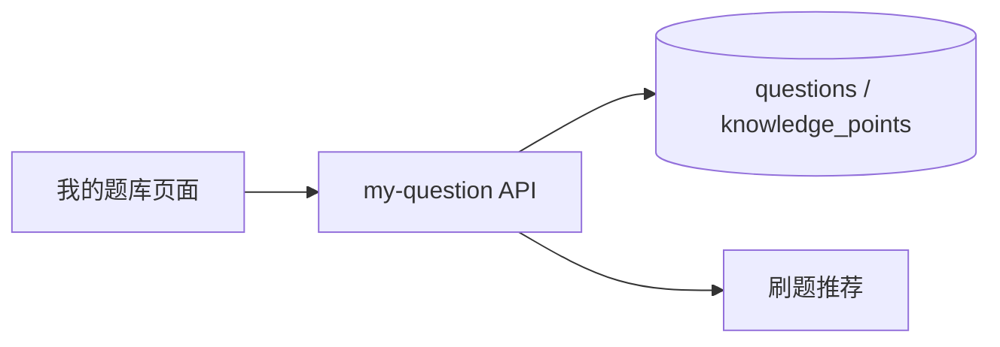

# sprint202606 当期设计方案

版本：v1.0  
日期：2026-05-14  
迭代定位：个人题库导入与我的题库  
对应需求：`doc/3.迭代文档/sprint202606/1.当期需求文档.md`

## 1. 架构说明

本期复用 `questions`、`knowledge_points`、`question_knowledge_points` 表，不新增中间件。个人题库通过 `questions.owner_user_id` 区分归属。



## 2. 后端设计

### 2.1 包结构

```text
com.earth.online.player.ailearn
└── question/
    ├── interfaces/
    ├── application/
    ├── domain/
    └── infrastructure/
```

### 2.2 数据库设计

- 复用 `questions.owner_user_id`：非空表示个人题目。
- 复用 `source_type = USER_UPLOAD`：表示用户导入或手工新增。
- 如现有索引不足，新增迁移：`idx_questions_owner_source_deleted(owner_user_id, source_type, deleted)`。

### 2.3 事务边界

- 单题新增：应用层开启事务，先补齐知识点，再写题目和关系。
- 批量导入：应用层开启事务，任意一题校验失败则整体回滚。
- 全量替换：同一事务内逻辑删除旧题，再插入新题。

## 3. 前端设计

新增文件：

```text
src/api/myQuestions.ts
src/pages/my-questions/MyQuestionsPage.vue
src/types/my-question.ts
```

页面模块：

- 筛选区：关键词、难度、题型。
- 列表区：个人题目卡片、删除按钮。
- 新增弹窗：单题录入。
- 导入弹窗：JSON 输入框、模式选择和格式示例。

## 4. 验证要求

本项目当前要求禁止新增单元测试代码，本期只整理接口联调、构建验证和人工验收清单。

- 登录用户新增、导入、删除个人题目。
- 用户A无法查看或删除用户B的个人题目。
- 刷题 sourceScope 在 DEFAULT、MINE、MIXED 下推荐范围正确。
- `mvn -DskipTests package` 和 `npm run build` 成功。
