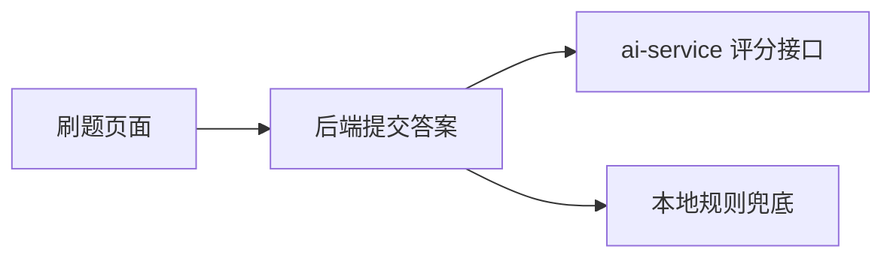

# sprint202607 当期设计方案

版本：v1.0  
日期：2026-05-14  
迭代定位：AI 服务骨架与内部评分适配  
对应需求：`doc/3.迭代文档/sprint202607/1.当期需求文档.md`

## 1. 架构说明



## 2. AI 服务设计

目录结构：

```text
ai-service/
├── app/
│   ├── api/
│   ├── answer_grading/
│   ├── schemas/
│   └── config/
├── .env.example
└── requirements.txt
```

评分接口先可使用可解释规则或模型适配占位，必须返回 `score`、`hitPoints`、`missingPoints`、`referenceAnswer`、`improvementAdvice` 等结构。

## 3. 后端设计

- 在 `agent.infrastructure` 增加 `AiGradingClient`。
- 在 `answer.domain` 增加 `AnswerGradingPort`，本地规则和 AI 客户端都适配该端口。
- `PracticeService` 优先调用 AI 评分，捕获超时、解析失败后降级到本地规则评分。
- 日志只记录 traceId、错误类型和耗时，不记录 Token、完整用户答案和密钥。

## 4. 文档同步

本期新增 AI 服务配置项，但不新增中间件；需要更新 README 或 ai-service 启动说明。若模型供应商需要 Key，只能在示例中使用占位符。

## 5. 验证要求

- AI 服务健康检查通过。
- 内部接口缺少 Token 时拒绝访问。
- 后端 AI 服务开关开启时评分链路正常。
- AI 服务关闭时后端仍可完成答题评分。
