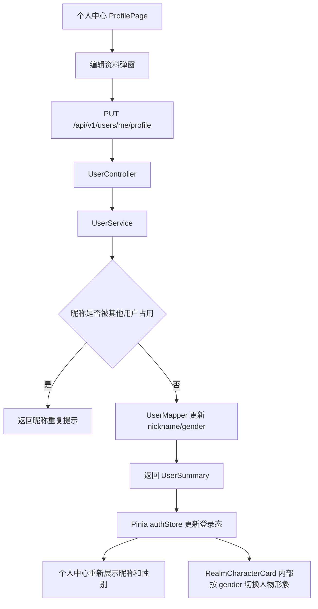

# sprint2623 当期设计方案

版本：v1.1  
日期：2026-05-22  
迭代定位：个人中心支持昵称和性别编辑，系统内部按性别切换人物形象

## 1. 总体设计



## 2. 数据库设计

在 `users` 表新增字段：

| 字段 | 类型 | 默认值 | 说明 |
| --- | --- | --- | --- |
| `gender` | `VARCHAR(16)` | `NULL` | 用户性别编码，支持 `MALE`、`FEMALE`，为空表示未设置。 |

迁移策略：

1. 新增 Flyway migration，不修改已执行库的历史记录。
2. 新字段允许为空，避免影响已有用户和注册流程。
3. 不新增索引，当前仅用于本人资料展示和系统内部形象切换，不参与高频查询条件。

## 3. 后端设计

### 3.1 数据模型

`User` 增加 `gender` 属性；`UserSummary` 增加 `gender` 响应字段。所有查询用户摘要的链路统一通过 `UserSummaryConverter` 输出，避免不同接口字段不一致。

### 3.2 接口设计

新增当前用户资料保存接口：

```text
PUT /api/v1/users/me/profile
```

请求体：

| 字段 | 类型 | 必填 | 说明 |
| --- | --- | --- | --- |
| `nickname` | string | 是 | 1 到 64 位，保存前去除首尾空格。 |
| `gender` | string | 否 | `MALE`、`FEMALE` 或空值；空值表示未设置。 |

响应体继续使用统一 `ApiResponse<UserSummary>`。

### 3.3 业务校验

1. 未登录用户调用接口返回登录提示。
2. 昵称为空或超过 64 位时返回参数错误。
3. 昵称命中其他用户时返回资源冲突，当前用户保持原昵称时允许保存。
4. 性别为空字符串时规整为 `NULL`；非 `MALE`、`FEMALE` 的值返回参数错误。
5. 保存成功后重新查询用户并刷新成长快照，保证响应中的等级和境界仍是最新值。

## 4. 前端设计

### 4.1 个人中心资料展示

个人中心基础资料卡只展示用户资料本身：

1. 用户名只读展示。
2. 昵称展示当前昵称，未取到昵称时沿用原有占位。
3. 性别展示男、女或 `-`，其中 `-` 表示未设置。
4. 编辑入口使用“编辑资料”按钮，不把系统内部形象逻辑暴露给用户。

### 4.2 编辑资料弹窗

编辑资料弹窗只包含用户可编辑字段：

1. 昵称使用输入框，展示 64 位长度上限。
2. 性别使用可清空下拉选择，仅提供“男”“女”两个选项。
3. 清空性别后保存，前端向后端提交空值，后端落库为 `NULL`。
4. 保存按钮展示加载态，保存成功后关闭弹窗并刷新全局用户状态。
5. 弹窗在移动端保持单列布局，按钮保持足够点击面积。

### 4.3 系统内部人物形象

`RealmCharacterCard` 增加 `gender` 入参，但该逻辑不在个人资料编辑 UI 中直接呈现：

1. `gender` 为 `MALE` 时，展示男性修仙人物形象。
2. `gender` 为 `FEMALE` 或空值时，继续展示现有女性 PNG 套图。
3. 男性形象按当前修仙境界映射表复用同一套境界编码，保证人物卡尺寸稳定。
4. 刷题页和个人中心成长概览都从 `authStore.user.gender` 传入，保存资料后可立即切换。

## 5. 风险与控制

| 风险 | 控制措施 |
| --- | --- |
| 用户误以为性别必须填写 | 性别下拉支持清空，空值展示为 `-`。 |
| 昵称编辑误覆盖其他用户昵称 | 后端按 `findByNicknameAny` 校验，命中非本人即拒绝保存。 |
| 前端保存后页面状态不同步 | 保存接口返回最新 `UserSummary`，Pinia 登录态直接替换。 |
| 人物形象逻辑污染用户资料编辑 | 个人中心只展示昵称和性别，形象切换留在 `RealmCharacterCard` 内部。 |
| 数据库生产发布遗漏 | MySQL 文档补充 `users.gender` 字段、Flyway 验证和部署注意事项。 |

## 6. 验证方案

1. 执行后端编译：`mvn -DskipTests package`。
2. 执行前端构建：`npm run build`。
3. 人工验证注册新用户后 `gender` 为空，个人中心性别展示为 `-`。
4. 人工验证编辑资料弹窗可保存昵称、男、女和空性别。
5. 人工验证修改昵称为重复值时提示昵称已被使用。
6. 人工验证性别保存后，系统内部人物形象按性别切换，但编辑 UI 不出现“默认形象”“人物形象”等文案。
