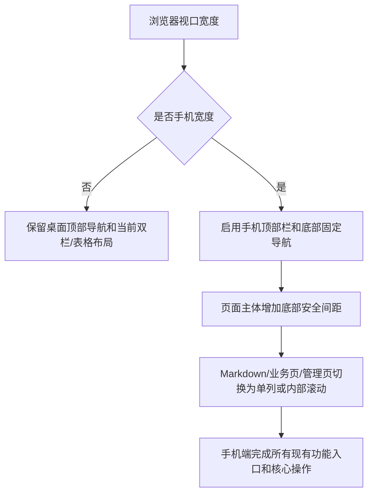

# sprint202626 当期设计方案

版本：v1.0  
日期：2026-05-23  
迭代定位：现有 Web 前端完整支持手机端浏览器访问

## 1. 总体设计

本迭代采用纯前端响应式改造，不新增后端接口、不新增数据库字段、不新增中间件。实现侧优先复用当前 Vue、Element Plus、SCSS 和视觉令牌，避免引入新的 UI 依赖。

## 2. 响应式断点

| 断点 | 目标设备 | 设计策略 |
| --- | --- | --- |
| `> 1180px` | 桌面浏览器 | 保持当前桌面顶部导航和内容宽度。 |
| `769px - 1180px` | 平板或窄桌面 | 压缩顶部品牌和导航间距，业务区逐步单列。 |
| `<= 768px` | 手机浏览器 | 启用手机顶部栏、底部主导航、单列页面和更大的触控面积。 |
| `<= 480px` | 小屏手机 | 进一步收紧卡片内边距、标题字号、按钮排列和弹窗宽度。 |

## 3. 全局布局设计

### 3.1 桌面端

桌面端继续使用 `AppLayout.vue` 当前结构：

1. 顶部展示品牌、主导航和登录/用户操作。
2. 页面内容保留当前 `layout-content` 的桌面内边距。
3. 不改变现有路由和 KeepAlive 行为。

### 3.2 手机端

手机端在 `AppLayout.vue` 增加独立底部主导航：

1. 顶部栏只展示品牌标识、平台名称和登录/用户入口。
2. 桌面横向菜单在手机端隐藏，避免导航项压缩导致溢出。
3. 底部固定导航展示五个主要业务入口：首页、路线、刷题、面试题、互动。
4. `layout-content` 追加底部内边距，避免最后一屏内容被底部导航遮挡。
5. 用户菜单继续承载个人中心和管理者中心入口，保证登录后功能完整。

## 4. 页面适配设计

### 4.1 Markdown 内容页

首页、路线和资料页共用 Markdown 布局：

1. 桌面端保留左侧目录和右侧正文。
2. 手机端切换为单列，目录卡片位于正文上方。
3. 目录列表在手机端允许在目录卡片内部滚动，不触发页面级横向滚动。
4. 正文卡片减少内边距，标题字号按层级缩小，图片宽度限制在容器内。
5. 表格和代码块仅在自身容器内横向滚动。

### 4.2 AI 智能刷题页

AI 智能刷题页在手机端改为单列：

1. 成长信息卡位于对话区上方，并降低角色卡高度。
2. 分类选择、开始下一题、重答本题纵向排列，按钮宽度铺满。
3. 消息面板高度改为基于动态视口的最小高度，避免输入栏把对话内容挤压过小。
4. 输入栏改为单列，发送按钮铺满，保持清晰的触控面积。
5. 消息气泡最大宽度放宽到容器宽度，长文本按词或字符换行。

### 4.3 互动区与面试题页

建议评论区：

1. 页签、排序和发布按钮在手机端纵向排列或自动换行。
2. 发布框和回复框铺满宽度，头像缩小或让位给正文。
3. 评论子列表减少内边距，点赞和回复按钮保持可点击面积。
4. 分页组件在手机端居中并允许内部紧凑展示。

热门面试题：

1. 分类导航从左侧栏变为顶部筛选卡片。
2. 题目卡片减少内边距，题目标题和元信息纵向展示。
3. 参考答案 Markdown 继续使用安全渲染链路。

### 4.4 个人中心与管理者中心

个人中心：

1. 使用视口监听控制 `el-descriptions` 列数，手机端改为 1 列。
2. 编辑资料弹窗宽度在手机端使用 `calc(100vw - 32px)`。
3. 成长概览和徽章墙继续单列化，角色卡使用较小高度。

管理者中心：

1. 手机端管理侧栏改为顶部管理导航，取消固定大高度。
2. 筛选表单、容量限制卡、题库操作按钮全部单列或自动换行。
3. Element Plus 表格保留内部横向滚动，避免页面整体横向滚动。
4. 新增/编辑/导入预检弹窗宽度适配手机屏幕。

## 5. 样式实现策略

1. 全局响应式规则集中放在 `responsive.scss`，页面特有细节保留在对应组件或业务样式文件内。
2. 继续复用 `tokens.scss` 中的颜色、圆角、阴影、字体和间距令牌。
3. 新增手机端类名只围绕布局语义命名，如 `mobile-bottom-nav`，避免引入与业务无关的抽象。
4. 优先通过 CSS Grid、Flex Wrap、`minmax(0, 1fr)`、`max-width: 100%` 防止内容撑破容器。
5. 弹窗、表格、分页等 Element Plus 组件通过外层类和 `:deep` 做必要响应式覆盖。

## 6. 风险与控制

| 风险 | 控制措施 |
| --- | --- |
| 手机端底部导航遮挡内容 | 页面主体统一增加底部安全间距，并兼容 `safe-area-inset-bottom`。 |
| 桌面端布局被手机样式误伤 | 手机端样式限定在 `max-width: 768px` 或更小断点内。 |
| 表格列较多导致页面横向滚动 | 表格卡片内部设置滚动边界，页面根元素禁止横向溢出。 |
| 个人中心资料表在手机端仍按两列渲染 | 组件内监听视口宽度，手机端将 `el-descriptions` 列数切换为 1。 |
| 弹窗宽度超过手机屏幕 | 统一覆盖业务弹窗宽度为 `calc(100vw - 32px)`。 |

## 7. 验证方案

1. 执行前端构建：`npm run build`。
2. 使用 1440px 桌面宽度检查顶部导航和主要页面视觉不回退。
3. 使用 375px 手机宽度检查底部导航、页面滚动和主要功能入口。
4. 使用 768px 平板竖屏宽度检查单列切换和控件触控面积。
5. 人工验证首页、路线资料、热门面试题、AI 智能刷题、建议评论区、个人中心和管理者中心均可访问并完成核心操作。
