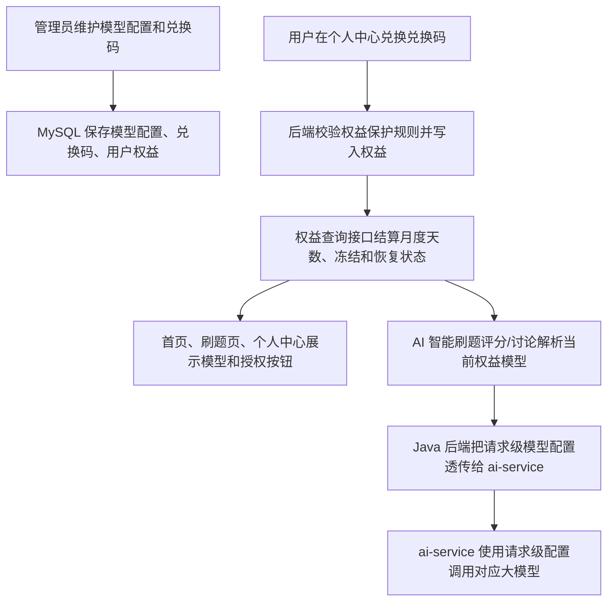

# sprint202627 当期设计方案

版本：v1.0  
日期：2026-05-24  
迭代定位：高级模型授权、兑换码权益和管理员模型配置闭环

## 1. 总体设计



本迭代以 MySQL 为唯一新增持久化依赖，不新增定时任务和新中间件。月度权益剩余天数采用“懒结算”：用户查询权益、兑换权益或发起 AI 调用时，根据 `last_consumed_at` 和当前时间计算已消耗整天数，并同步刷新权益状态。

## 2. 数据设计

### 2.1 表结构

| 表 | 用途 | 关键字段 |
| --- | --- | --- |
| `model_configs` | 管理员维护三档模型配置 | `model_level`、`model_name`、`base_url`、`api_key` |
| `redemption_codes` | 保存兑换码生命周期 | `code`、`code_type`、`status`、`used_by_user_id`、`used_at`、`deleted` |
| `user_model_entitlements` | 保存用户模型权益 | `user_id`、`model_level`、`entitlement_kind`、`status`、`remaining_days`、`last_consumed_at` |

表结构不设计数据库外键，通过业务逻辑、唯一索引和查询索引保证数据一致性，符合本项目当前“不新增外键设计”的要求。

### 2.2 编码设计

| 枚举 | 值 | 说明 |
| --- | --- | --- |
| 模型等级 | `BASIC`、`PRO`、`SUPER` | 初级、高级、超级 |
| 权益类型 | `MONTHLY`、`PERMANENT` | 月度、永久 |
| 权益状态 | `ACTIVE`、`FROZEN`、`COVERED`、`UPGRADED`、`EXPIRED` | 生效、冻结、被覆盖、已升级、已过期 |
| 兑换码类型 | `PRO_MONTHLY`、`SUPER_MONTHLY`、`PRO_PERMANENT`、`SUPER_PERMANENT`、`PRO_PERMANENT_TO_SUPER` | 五种兑换码 |
| 兑换码状态 | `UNUSED`、`USED` | 未使用、已使用 |

## 3. 权益结算设计

### 3.1 当前权益优先级

用户当前生效权益按以下顺序判断：

1. 超级模型永久。
2. 超级模型月度且剩余天数大于 0。
3. 高级模型永久。
4. 高级模型月度且剩余天数大于 0。
5. 初级默认模型。

### 3.2 月度消耗和冻结

1. 月度权益兑换成功后 `remaining_days` 增加 30。
2. 月度权益处于 `ACTIVE` 时，按 `last_consumed_at` 到当前时间的完整 24 小时数扣减剩余天数。
3. 月度权益处于 `FROZEN` 时不扣减天数。
4. 超级模型月度生效期间，高级模型月度统一冻结。
5. 超级模型月度过期后，如果存在冻结的高级模型月度，则恢复为 `ACTIVE` 并从恢复时间继续扣减。
6. 月度权益被同等级或更高等级永久权益覆盖时，标记为 `COVERED`，后续不恢复。

### 3.3 兑换保护

1. 超级模型永久用户兑换低于超级模型永久的兑换码时拒绝兑换，兑换码保持未使用。
2. 高级模型永久用户兑换高级模型月度或高级模型永久时拒绝兑换，兑换码保持未使用。
3. 高级模型永久升超兑换码仅允许高级模型永久用户兑换。
4. 高级模型永久用户兑换超级模型月度或超级模型永久允许成功，且超级模型权益优先生效。
5. 低等级月度或永久权益可以作为未来兜底权益存在，但不能覆盖当前更高等级权益展示。

## 4. 后端接口设计

### 4.1 用户权益接口

| 方法 | 路径 | 用途 |
| --- | --- | --- |
| `GET` | `/api/v1/model-entitlements/status` | 查询当前访问者模型权益展示信息，游客返回初级默认权益 |
| `POST` | `/api/v1/model-entitlements/redeem` | 登录用户兑换兑换码 |

权益状态接口返回当前展示模型、剩余天数文案、统一授权按钮文案、授权地址是否已配置、冻结提示和是否隐藏按钮。用户接口不返回模型 `apiKey`。

### 4.2 管理端兑换码接口

| 方法 | 路径 | 用途 |
| --- | --- | --- |
| `GET` | `/api/v1/admin/redemption-codes` | 分页查询兑换码 |
| `POST` | `/api/v1/admin/redemption-codes/generate` | 批量生成兑换码 |
| `PUT` | `/api/v1/admin/redemption-codes/{id}` | 编辑未使用兑换码类型 |
| `DELETE` | `/api/v1/admin/redemption-codes/{id}` | 删除未使用兑换码 |
| `GET` | `/api/v1/admin/redemption-codes/export` | 导出兑换码 CSV |

导出接口直接返回 UTF-8 BOM CSV 文件流，不包装统一 JSON。

### 4.3 管理端模型配置接口

| 方法 | 路径 | 用途 |
| --- | --- | --- |
| `GET` | `/api/v1/admin/model-configs` | 查询三档模型配置 |
| `PUT` | `/api/v1/admin/model-configs/{level}` | 保存指定等级模型配置 |

超级管理员接口可以返回和保存 `apiKey` 明文；普通用户权益接口只读取 `model_name` 用于展示。

## 5. AI 服务调用设计

Java 后端在评分和讨论前通过权益服务解析当前用户模型配置，构造请求级 `modelConfig` 后传给 `ai-service`：

```json
{
  "modelConfig": {
    "model": "deepseek-v4-pro",
    "baseUrl": "https://模型服务地址占位符/v1",
    "apiKey": "AI_GRADING_API_KEY占位符"
  }
}
```

`ai-service` 优先使用请求体中的 `modelConfig` 初始化 LangChain 模型；如果请求未携带完整配置，则回退到 `.env` 中的全局 `AI_GRADING_*` 配置。日志只允许输出模型名、是否配置 baseUrl 和 traceId，不输出真实 `apiKey`。

## 6. 前端设计

### 6.1 首页

首页 Markdown 中的 `高级模型授权` 链接统一使用 `#model-auth` 锚点。`HomePage.vue` 识别该链接后渲染为醒目的授权入口样式，点击时调用权益状态接口并按授权地址配置打开新标签页或展示提示。

### 6.2 AI 智能刷题页

刷题页头部布局从“分类 + 下一题 + 重答”调整为“分类 + 权益条 + 下一题 + 重答”：

1. 权益条展示模型名和剩余天数。
2. 授权按钮不再根据当前权益切换文案，非超级模型永久用户统一展示“高级模型授权”。
3. 超级模型永久用户隐藏按钮。
4. 存在冻结高级模型月度时，在剩余天数旁展示浅色低强调小感叹号，悬浮显示冻结提示。

### 6.3 个人中心

个人中心基础资料卡下方新增模型权益卡：

1. 展示当前刷题模型、剩余天数和统一“高级模型授权”按钮。
2. 展示兑换码输入框和兑换按钮。
3. 兑换成功后刷新权益状态并提示获得的权益。
4. 授权地址未配置时统一提示“授权入口暂未开放”。

### 6.4 管理者中心

管理者中心新增两个菜单：

1. 兑换码管理：批量生成、筛选、列表、编辑未使用类型、删除未使用、导出。
2. 模型配置：三档模型配置表单，维护 model、baseUrl、apiKey。

页面沿用现有管理端卡片、筛选表单和表格风格，手机端继续使用管理导航横向滚动和表格卡片内部横向滚动。

## 7. 配置和文档

新增后端配置：

```yaml
app:
  model-authorization:
    url: ${MODEL_AUTHORIZATION_URL:}
```

`MODEL_AUTHORIZATION_URL` 只保存授权入口地址，不包含密码、Token 或密钥。真实生产地址只能通过服务器私有环境变量注入，仓库文档只使用占位符。

本迭代会更新：

1. `doc/中间件/MySQL.md`：补充模型配置、兑换码和用户模型权益表说明。
2. `doc/中间件/AI模型服务.md`：补充请求级模型配置和授权入口配置说明。

## 8. 验证方案

1. 执行后端构建：`mvn -DskipTests package`。
2. 执行前端构建：`npm run build`。
3. 人工验证首页授权入口未配置时提示、已配置时新标签打开。
4. 人工验证管理员生成、编辑、删除、导出兑换码。
5. 人工验证用户兑换五类兑换码和拒绝兑换场景。
6. 人工验证 AI 智能刷题页和个人中心的模型、剩余天数、浅色冻结提示和统一授权按钮。
7. 查看 Java 到 Python AI 服务请求体，确认评分和讨论携带当前权益模型配置。
