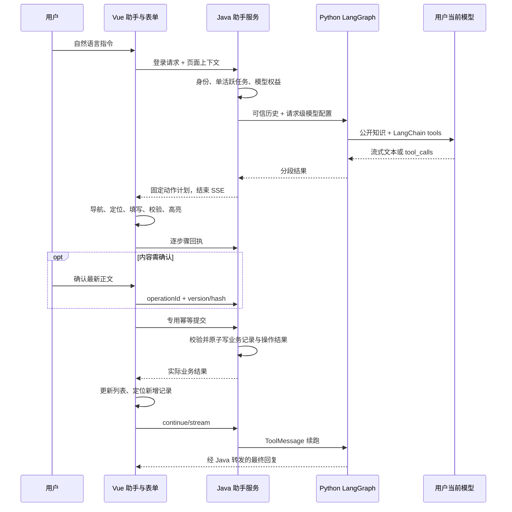

# sprint202631 当期设计方案：站内 AI 智能助手

版本：v2.0  
日期：2026-10-03  
状态：已获用户编码授权并实现；以本文件记录实际实现，开发验证与待人工验收项见 [3.当期验收文档.md](3.当期验收文档.md)。

## 1. 目标与边界

登录用户通过常驻助手进行项目问答、站内导航、公开社区查询、个人权益/成长/刷题统计查询，以及评论、一级回复和建议的真实表单填写与发布。沿用 Vue 3、Pinia、Element Plus、Spring Boot、FastAPI、LangChain 和 LangGraph。

助手操作的是本站注册的页面能力。模型不能提供任意 URL、CSS selector、JavaScript 或坐标，也不能调用管理写入、兑换、答题、点赞、跨站操作。它不安装浏览器扩展，不持有浏览器模型密钥，不直接访问 MySQL。

[InterfaceMode](https://github.com/2019-02-18/InterfaceMode) 的能力分离和视觉反馈思路用于设计参考，实际由本站 Vue 适配器实现。Python 图采用分段执行，Java 持久化等待和恢复状态，没有混用 LangGraph 原生 interrupt/checkpointer。

## 2. 架构与职责



- **Vue**：入口、会话展示、POST SSE、当前页能力注册、串行真实表单动作、视觉反馈、暂停/停止/接管。
- **Java**：登录身份、模型权益、业务校验、授权确认、租约与版本、工具读取、提交事务、MySQL 持久化和状态恢复。
- **Python**：同一共享模型工厂、知识检索、LangChain schema 与 tool calling、LangGraph `model → knowledge → model`；外部工具交回 Java，下一段以 ToolMessage 继续。

## 3. 模型与知识复用

Java 每轮调用既有 `ModelEntitlementService.resolveForAiCall`，使用当前用户有效档位；内部传入 `modelConfig`，Python 刷题与助手共同调用 `app/models.py` 单例模型工厂及供应商适配器。管理端缓存失效接口作用于共享缓存。

每轮保存模型配置指纹，不保存密钥。每次续跑重新解析有效配置并与指纹比较；权益或配置改变时终止旧任务，要求重新发送，避免悄悄换模型。模型名、供应商、base URL 与凭据来源沿用刷题；助手采用独立提示词和工具列表。

真实模型未配置、LOCAL_RULE、内部鉴权或网络失败时提示不可用。仅在供应商明确报告 tools 不支持时，尝试同一模型的文本问答并提示动作不可用；不解析普通 JSON 文本为工具调用，不切换供应商。

公开知识来自根 README、前端公开路线 Markdown 和三份人工维护的公开功能说明。构建脚本按标题分段，最长片段约 1200 字；运行时使用中文双字词组、英文词及标题加权匹配，初始取 3 条，图内检索最多 2 轮，合并最多 6 条。来源由服务端映射到固定站内路由。`public-index.json` 随服务发布，索引更新方式见配置文档；不读取内部迭代文档或密钥，不新增向量数据库。

## 4. 工具范围与授权

| 工具 | 实际执行者 | 行为 |
| --- | --- | --- |
| `search_site_knowledge` | Python | 检索公开知识 |
| `navigate_page` | Vue | 固定六个站内页面，可选择建议/评论页签 |
| `list_comments`、`list_suggestions` | Java 既有业务服务 | 最热/最新分页读取，最多 20 条 |
| `get_my_model_entitlement`、`get_my_growth`、`get_my_practice_stats` | Java 既有业务服务 | 只查询当前登录用户 |
| `prepare_community_draft` | Vue | 填写评论、回复或建议，不提交 |
| `create_comment`、`create_suggestion` | Vue + Java | 真实表单填写，经授权后通过专用幂等提交接口发布 |

每次最多处理一个外部业务工具。模型同时返回多个时，Java 为它们保存失败 ToolMessage，要求模型改为串行，不并发执行写入。

直接发布授权由 Java 判断当前用户消息：要求明确发布语句、精确引用归一化正文，建议还需明确类型，回复还需与当前选中父评论一致；否定、草稿或生成类指令不能直接发布。无法可靠判断的表达先填表，再等待确认。模型返回 approved 等自造字段没有效力。

确认绑定 operationId、payloadVersion 和 payloadHash。正文修改生成新版本并撤销授权；旧确认拒绝。更换建议类型或回复目标时停止后重新发起明确任务。回复只支持既有一级父子关系。

## 5. 运行状态与恢复

```text
READY → RUNNING → WAITING_CLIENT / WAITING_CONFIRMATION
页面步骤或确认完成 → READY → RUNNING
用户暂停 → PAUSED；继续 → READY（executionEpoch + 1）
完成/失败/取消/超时 → COMPLETED / FAILED / CANCELLED / EXPIRED
```

每个用户最多一个活跃任务，通过短事务锁用户行校验，涵盖多个会话和标签页。任务绑定 clientInstanceId 和 executionEpoch，旧标签页/旧执行回执拒绝；显式恢复可以转移执行客户端。模型执行租约过期时转暂停。

等待浏览器或用户时结束 SSE，释放共享线程池线程。页面步骤由普通 POST 回执推进；结束后另开 continue/stream。恢复先查询持久化状态和真实控件，已成功操作不重放。客户端以本地任务代数和账号代数阻止暂停、账号切换后的迟到回调。

默认外部工具预算 8 次、图递归上限 24、模型单次超时 60 秒、每段活动执行预算 120 秒。任务整体从创建起 10 分钟有效；等待不占活动执行预算，但不会延长任务有效期。页面能力最多等待 10 秒，助手状态/提交请求 15 秒超时，助手流最多等待 180 秒；超时只中断等待并查询结果，不自动重发。普通页面原请求行为保持不变。

## 6. 公共与内部接口

所有公共接口前缀为 `/api/v1/assistant`，必须登录并验证归属：

| 方法与路径 | 用途 |
| --- | --- |
| `POST /sessions` | 建会话 |
| `GET /sessions/{id}` | 恢复消息和任务 |
| `GET /runs/{id}` | 查状态与实际结果 |
| `POST /sessions/{id}/messages/stream` | 新指令，携 clientRequestId、clientInstanceId 和受限 pageContext |
| `POST /runs/{id}/continue/stream` | 已确认步骤/业务结果后续跑 |
| `POST /runs/{id}/resume/stream` | 显式恢复并更新执行代数 |
| `POST /runs/{id}/pause`、`/cancel` | 暂停或停止 |
| `POST /runs/{id}/client-results` | 当前步骤完成回执；不能凭回执宣告提交成功 |
| `POST /runs/{id}/confirm` | 对最新版本确认或取消；确认后再调用 continue/stream |
| `POST /runs/{id}/draft` | 暂停或待确认时更新正文，版本递增并撤销旧授权 |
| `POST /runs/{id}/operations/{operationId}/submit` | 发布评论/建议，校验步骤、版本、执行代数及授权 |

Python 内部接口为 `POST /internal/v1/assistant/steps/stream`，沿用 `X-Internal-Token` 和 `X-Trace-Id`，固定 HTTP/1.1。浏览器不访问此接口。

SSE 使用 `meta`、`text_delta`、`model_result`、`tool_started`、`tool_result`、`client_action`、`error` 和 `done`。真实模型文本片段直接转发；最终协议消息替换临时文本，避免重复显示。恢复依赖 clientRequestId、状态/步骤和操作版本，不依赖虚构的事件序号。

## 7. 数据库与幂等事务

新增 V11，仅创建四张表，不修改历史迁移、不新增外键：

| 表 | 关键状态 |
| --- | --- |
| `assistant_session` | user_id、created_at、updated_at、expires_at |
| `assistant_message` | session_id、run_id、message_json，按递增 id 排序 |
| `assistant_run` | 指令与 request_hash、page_context_json、状态、model_fingerprint、client_instance_id、execution_epoch、tool_count、lease_expires_at、expires_at |
| `assistant_operation` | tool_call_id、固定 payload、hash/version、authorized、action_plan_json、next_step、result_json、expires_at |

`(user_id, client_request_id)` 唯一；相同 ID 不同指令拒绝。`(run_id, tool_call_id)` 唯一；提交锁 run 和 operation，既有业务服务通过 REQUIRED 加入同一事务，写入业务记录及结果原子完成。已完成操作重放返回同一结果；成功不依赖前端动画或模型表述。

模型请求和页面等待不持有数据库事务。暂停/停止使旧执行代数失效；已提交结果可查询，未授权步骤不能继续发布。7 天清理会话/消息，30 天清理终态任务/操作，不删除已发布业务内容。清理调度由 Java 执行，不额外部署任务服务。

## 8. 前端表单操作与可视化反馈

`actionRegistry.ts` 注册当前建议评论页面适配器，组件卸载撤销注册。能力包括加载就绪、固定目标定位、读取草稿、打开父评论回复框、设置响应式正文、选择建议类型、校验、提交和定位新记录。模型只能传业务参数。

固定动作计划：

```text
navigate → wait_ready → [open_reply] → reveal → focus
→ [select_option] → fill → validate → [submit]
```

逐步骤校验路由、组件连接与可见目标。正文分四段写入真实响应式字段，提交前比较正文、类型和父评论；按钮提交函数与手工操作共用验证、加载和列表更新，仅助手上下文调用专用幂等接口。成功只清空仍与提交内容一致的草稿。

| 阶段 | 用户可见反馈 |
| --- | --- |
| 导航/就绪 | 步骤条显示正在打开页面、等待表单 |
| 定位/聚焦/填写 | 自动滚动，真实目标描边和 AI 光标，逐段内容变化 |
| 类型选择 | 真实选项激活，控件高亮和点击波纹 |
| 确认/暂停 | 静态高亮、明确状态、查看对话/继续/停止/接管入口 |
| 提交 | 高亮实际按钮、提交状态、原表单 loading |
| 成功/失败 | 列表新增记录定位或错误提示，保留失败草稿 |

动作期间面板折叠为左下步骤条，避免遮住表单。手机不自动聚焦弹出键盘；用户接管后自行聚焦。高亮层 pointer-events 为 none，不阻挡页面操作。ResizeObserver、滚动和视口变化同步真实目标位置。

已有非空草稿时先暂停，用户选择保留原稿并填写新内容、追加或接管。原稿只保存在当前账号页面内存恢复槽；刷新不保证恢复未提交原稿。采用编辑正文通过 draft 接口保存新版本，重新执行校验。输入、切换页签/排序/类型、用户导航和页面隐藏使操作暂停，自动导航有独立标识避免误暂停。

## 9. 布局、可访问性与安全

入口仅登录可见，圆形直径 56px。桌面面板默认宽 40vw、高 62.5dvh，约四分之一面积，另有最小/最大边界；窄桌面与手机采用更大面板及安全区布局。复用本站主题变量。层级低于既有模态对话框。

提供语义按钮、对话框、Escape 收起、打开聚焦、关闭焦点返回、手机 Tab 焦点循环。减弱动画偏好关闭光标移动、波纹和逐段填写，保留即时填写、静态描边和状态文字。

消息通过既有 safeMarkdown 渲染。账号改变立即清空助手状态、原稿及输入，并取消流。私人查询使用认证上下文，客户端 userId/modelConfig 无效；公开页面、引用和评论不能授予发布权限。Java 使用已有限流、线程池和认证上下文 finally 清理；日志不打印完整消息、凭据或请求正文。

## 10. 文件与配置交付

- Vue：`types/assistant.ts`、`api/assistant.ts`、`stores/assistant.ts`、`assistant/`、`components/assistant/`；全局布局挂载，社区页面注册真实表单能力。
- Java：`assistant/` 状态与协议服务、鉴权/限流接入、V11 迁移；评论增加按父评论 ID 查询线程接口。
- Python：`app/assistant/`、内部 API、共享 `app/models.py` 和公开知识索引；沿用既有依赖。
- 配置：5 个 Java 助手变量和 2 个 Python 变量，全有默认值。
- 文档：更新 MySQL、AI模型服务及中间件索引；未启用 Redis 或 Qdrant。

手动操作、配置默认值、代理片段与数据库验证详见 [4.数据库与配置变更.md](4.数据库与配置变更.md)。本期未编写单元测试，采用构建、导入、独立数据库 HTTP 联调和浏览器实际操作验证；真实模型、所有权益档位与生产环境仍按验收表执行。
