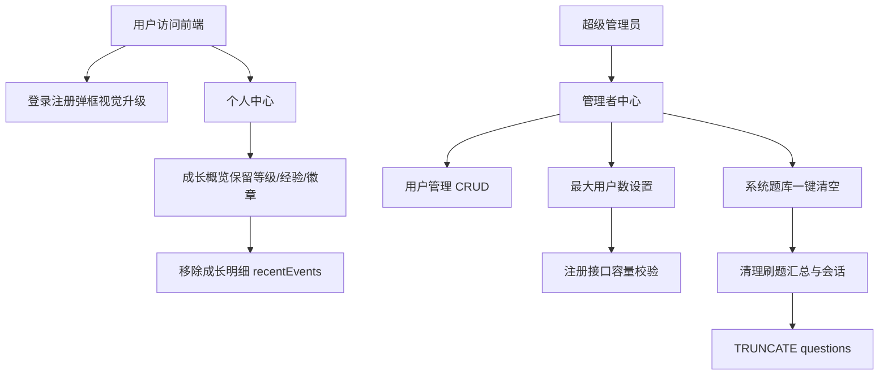

# sprint2621 当期设计方案

版本：v1.0  
日期：2026-05-18  
迭代定位：个人中心瘦身、认证弹框视觉升级、管理员用户与题库高危操作补齐、平台品牌升级

## 1. 总体设计

本迭代采用“最少必要变更 + 清理本次需求产生的旧链路”的方式实现：



## 2. 后端设计

### 2.1 成长明细下线

| 模块 | 调整 |
| --- | --- |
| `GrowthResponse` | 删除 `recentEvents` 字段。 |
| `GrowthMapper` | 删除 `growth_events` 插入和查询方法，学习天数改由 `user_question_stats` 计算。 |
| `GrowthAwardService` | 刷题和徽章发放不再写成长流水，只保留徽章发放。 |
| Flyway V18 | 新增后续迁移 `DROP TABLE IF EXISTS growth_events`，避免修改已落库的 V9/V12 历史迁移。 |

设计说明：徽章功能仍依赖 `badges`、`user_badges`、`user_question_stats` 和 `user_practice_sessions`，因此仅移除成长明细流水，不触碰徽章定义和发放表。

### 2.2 管理员用户管理

新增后端接口前缀：`/api/v1/admin/users`。

| 方法 | 路径 | 说明 |
| --- | --- | --- |
| GET | `/api/v1/admin/users` | 分页查询用户，支持关键词搜索。 |
| POST | `/api/v1/admin/users` | 新增用户。 |
| PUT | `/api/v1/admin/users/{id}` | 编辑用户。 |
| DELETE | `/api/v1/admin/users/{id}` | 逻辑删除用户。 |
| GET | `/api/v1/admin/users/limit` | 查询当前用户数和最大用户数。 |
| PUT | `/api/v1/admin/users/limit` | 更新最大用户数。 |

关键规则：

1. 所有接口通过 `AuthContext` 获取当前用户，并查询 `users.super_admin` 校验权限。
2. 删除用户使用逻辑删除：`users.deleted = 1`。
3. 禁止删除当前登录管理员，禁止取消当前登录管理员自己的超级管理员权限。
4. 用户名、昵称、邮箱必须唯一，包含已删除用户也不允许复用，避免唯一索引冲突。
5. 新增用户必须传密码；编辑用户密码为空时不修改密码。

### 2.3 最大用户数限制

新增表：`system_settings`。

| 字段 | 类型 | 说明 |
| --- | --- | --- |
| `id` | BIGINT | 主键。 |
| `setting_key` | VARCHAR(64) | 设置键，唯一。 |
| `setting_value` | VARCHAR(255) | 设置值。 |
| `created_at` | DATETIME | 创建时间。 |
| `updated_at` | DATETIME | 更新时间。 |

默认数据：

```sql
INSERT INTO system_settings(setting_key, setting_value)
VALUES('MAX_USERS', '10000')
ON DUPLICATE KEY UPDATE setting_value = VALUES(setting_value);
```

注册流程调整：

1. 先校验用户名、昵称、邮箱冲突。
2. 再读取 `system_settings.MAX_USERS`。
3. 统计 `users.deleted = 0` 的当前用户数。
4. 若当前用户数大于等于最大用户数，抛出业务异常，提示：`当前系统用户数量已达上限，等待管理员升级服务器并扩容`。
5. 未达上限时继续创建普通用户。

### 2.4 系统题库一键清空

新增后端接口：`DELETE /api/v1/admin/system-questions/clear`。

执行顺序：

1. 校验超级管理员权限。
2. `DELETE FROM user_question_stats` 清理旧题答题汇总。
3. 重置 `user_practice_sessions` 当前题、阶段、最近得分和时间。
4. 执行 `TRUNCATE TABLE questions` 真实清空题库主表并重置自增ID。

说明：`TRUNCATE` 在 MySQL 中属于 DDL，高危且通常隐式提交，因此仅暴露在超级管理员接口，并由前端二次确认。

## 3. 前端设计

### 3.1 个人中心

`GrowthOverviewPanel.vue` 删除成长明细区块，只保留：

- 角色卡；
- 当前总经验；
- 累计答题；
- 平均得分；
- 学习天数；
- 等级进度；
- 徽章墙。

### 3.2 登录注册弹框

登录、注册弹框统一使用：

1. 顶部浅蓝渐变头图区。
2. 品牌徽标。
3. 圆角大输入框。
4. 圆角主按钮。
5. 窄屏时注册双列表单自动变单列。

### 3.3 管理员中心用户管理

新增页面：`src/pages/admin/UserManagePage.vue`。

页面结构：

1. 顶部说明区和“新增用户”按钮。
2. 最大用户数限制卡片，展示 `当前用户数 / 最大用户数`。
3. 关键词搜索区。
4. 用户表格。
5. 新增/编辑弹框。

新增前端接口文件：`src/api/adminUsers.ts`。  
新增类型文件：`src/types/admin-user.ts`。

### 3.4 系统题库管理

在系统题库管理页操作区新增“一键清除当前题库”按钮。点击后弹出确认框，确认后调用 `DELETE /api/v1/admin/system-questions/clear`，成功后刷新分类和列表。

### 3.5 品牌升级

| 位置 | 调整 |
| --- | --- |
| `AppLayout.vue` | 顶部标题改为“AI AGENT学习平台”，标题下展示 `Author:地球OL初级玩家`。 |
| `index.html` | 浏览器标题改为“AI AGENT学习平台”。 |

## 4. 数据库与中间件文档

本迭代继续使用既有 MySQL 中间件，无新增中间件类型。由于新增 `system_settings` 表、注册容量限制以及题库清空场景，需要同步更新：

- `doc/中间件/MySQL.md`

更新内容包括：

1. Flyway V17、V18 说明。
2. `system_settings.MAX_USERS` 用途。
3. 管理员用户接口和最大用户数接口联调方式。
4. 一键清空题库的部署注意事项。
5. 成长明细流水下线后，徽章仍由 `badges` 和 `user_badges` 支持。

## 5. 风险与控制

| 风险 | 控制措施 |
| --- | --- |
| 误删徽章功能 | 仅删除 `growth_events` 和 `recentEvents`，保留 `badges`、`user_badges` 和徽章发放逻辑。 |
| 管理员误删自己 | 后端禁止删除当前登录管理员。 |
| 管理员误取消自身权限 | 后端禁止当前管理员取消自己的超级管理员权限。 |
| 题库清空不可恢复 | 前端二次确认，后端仅超级管理员可调用，部署文档提示生产审批和备份。 |
| 用户上限配置过小 | 允许保存小于当前用户数的限制，用于立即关闭开放注册；页面展示当前用户数辅助判断。 |

## 6. 验证方案

1. 后端执行 `mvn -DskipTests package`。
2. 前端执行 `npm run build`。
3. 人工验证超级管理员用户管理 CRUD。
4. 人工验证设置最大用户数后注册上限提示。
5. 人工验证个人中心无成长明细且徽章墙可展示。
6. 人工验证题库一键清空后列表为空，重新导入 CSV 后可恢复使用。
