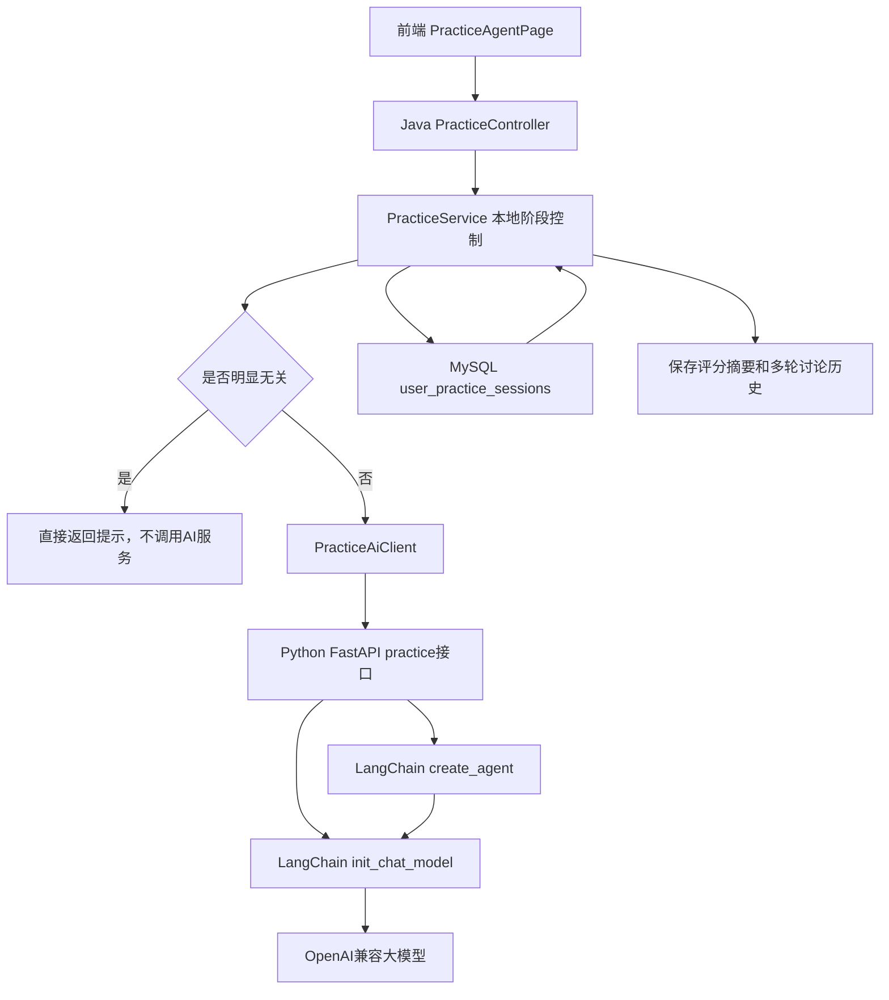
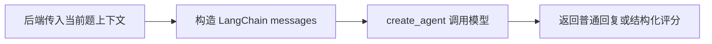

# sprint2622 当期设计方案

版本：v1.0  
日期：2026-05-18  
迭代定位：AI智能刷题服务 LangChain/LangGraph 化、多轮上下文记忆增强、无关问题本地拦截提速

## 1. 官方文档依据

本迭代参考 LangChain / LangGraph 官方文档与当前包版本完成设计：

1. `langchain==1.3.1` 为当前可用版本，使用 LangChain v1 系列推荐的模型抽象和消息对象。
2. LangChain v1 推荐通过 `init_chat_model` 初始化聊天模型，可通过可选 `model_provider`、`model`、`base_url`、`api_key`、`temperature` 和 `timeout` 切换底层供应商；默认不传 `model_provider`，优先让 LangChain 自动推断。
3. LangChain `create_agent` 支持 `response_format` 结构化输出，适合答案评分场景。
4. LangChain v1 的 `create_agent` 基于 LangGraph 构建，适合创建可扩展 Agent，并统一承载消息历史、工具和结构化输出能力。

## 2. 总体设计



## 3. 数据库设计

在 `user_practice_sessions` 表追加两个字段：

| 字段 | 类型 | 说明 |
| --- | --- | --- |
| `last_grading_summary` | TEXT | 当前题最近一次 AI/本地评分摘要，供本题讨论追问使用。 |
| `discussion_history_json` | TEXT | 当前题讨论历史 JSON，保存用户问题和 AI 回复的短历史。 |

迁移策略：新增 Flyway 后续迁移，不修改历史迁移文件。

历史控制策略：

1. 最多保留最近 6 轮讨论。
2. 单条用户问题和 AI 回复分别截断，避免上下文过长。
3. 下一题和重答本题时清空讨论历史，防止旧回答污染新作答。
4. 提交新答案后刷新评分摘要，并清空旧讨论历史。

## 4. 后端设计

### 4.1 无关问题本地拦截

`PracticeService.isUnrelatedToPractice` 改为只使用 Java 本地关键词：

```text
天气、新闻、股票、旅游、做饭、写诗、翻译、笑话、帅、好看、星座
```

这样答题或讨论阶段命中明显无关词时，后端直接返回提示，不再经过 Python AI 服务和大模型。

### 4.2 多轮上下文维护

`PracticeMapper` 增加：

1. 查询会话时读取 `last_grading_summary` 和 `discussion_history_json`。
2. 评分完成时更新 `last_grading_summary`，清空 `discussion_history_json`。
3. 讨论完成后把“用户疑问 + AI 回复”追加到 `discussion_history_json`。
4. 新题和重答时清空两个字段。

`PracticeService` 增加：

1. 根据 `PracticeGradingResponse` 构造中文评分摘要。
2. 从 JSON 中读取历史，异常时清空并降级为空历史。
3. 调用 AI 服务讨论接口时传入 `gradingSummary` 和 `conversationHistory`。
4. AI 回复成功后再追加历史。

## 5. AI 服务设计

### 5.1 依赖调整

`requirements.txt` 新增：

```text
langchain==1.3.1
langchain-openai==1.2.1
langgraph==1.2.0
```

### 5.2 模型调用封装

新增/调整模型初始化逻辑：

1. 使用 `init_chat_model(model, api_key=..., base_url=..., temperature=0.2, timeout=...)`；仅在配置 `AI_GRADING_MODEL_PROVIDER` 时追加 `model_provider`。
2. 若配置为 `LOCAL_RULE`、密钥为空或仍为占位符，则不初始化真实模型。
3. 评分使用 `create_agent(..., response_format=PracticeGradeResponse)` 获取结构化结果。
4. 讨论使用 `create_agent(system_prompt=...)` 注入系统提示，并使用 `HumanMessage`、`AIMessage` 承载用户/AI 历史。
5. 流式讨论使用 `create_agent(...).stream(..., stream_mode="messages")`，读取消息片段转换为内部 SSE。

### 5.3 create_agent 与 LangGraph Agent

本题讨论使用 LangChain `create_agent` 创建 Agent。`create_agent` 底层基于 LangGraph，当前不再手写 `StateGraph` 节点，避免过度样板代码：



Agent 输入输出字段：

| 字段 | 说明 |
| --- | --- |
| `messages` | 发送给 Agent 的消息列表，包含当前题上下文、历史追问和当前疑问。 |
| `structured_response` | 评分 Agent 的结构化评分结果。 |

非流式讨论通过 `create_agent(...).invoke(...)` 执行；流式讨论通过 `create_agent(...).stream(..., stream_mode="messages")` 执行，并复用同一套消息构造函数，保证上下文一致。

## 6. 前端设计

前端保持现有交互和接口调用方式不变：

1. 继续只发送当前输入 `content` 和分类 `questionTypes`。
2. 聊天展示仍由当前页面状态和本地快照负责。
3. 多轮记忆改由后端持久化维护，避免依赖浏览器本地历史。

## 7. 风险与控制

| 风险 | 控制措施 |
| --- | --- |
| LangChain 结构化输出解析失败 | 捕获异常并回退本地评分。 |
| 历史 JSON 损坏 | 读取失败时清空历史并继续当前追问。 |
| 上下文过长 | 限制历史轮数和单条长度。 |
| 流式接口无输出 | 回落非流式讨论或本地兜底提示。 |
| 移除 AI 相关性判断后误放行 | 先保留明显无关词本地拦截，后续单独优化轻量分类器。 |

## 8. 验证方案

1. 执行 AI 服务 Python 编译检查：`python -m compileall ai-service/app`。
2. 执行后端编译：`mvn -DskipTests package`。
3. 执行前端构建：`npm run build`。
4. 人工验证刷题、评分、追问、流式回复、重答、下一题。
5. 人工验证第三轮追问上下文不丢失。
6. 人工验证无关问题本地拦截不再访问 AI 服务相关性接口。
