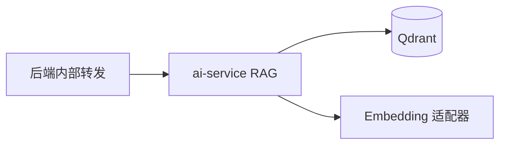

# sprint202608 当期设计方案

> 当前状态补充：截至 2026-05-19，Qdrant/RAG 相关内容属于历史规划或预留能力；当前前端和 Java 后端主业务未调用 `/internal/v1/rag/*`，默认无需部署 Qdrant。


版本：v1.0  
日期：2026-05-14  
迭代定位：RAG 入库与 Qdrant 检索  
对应需求：`doc/3.迭代文档/sprint202608/1.当期需求文档.md`

## 1. 架构说明



## 2. AI 服务设计

新增模块：

```text
app/rag/chunker.py
app/rag/index_task_service.py
app/rag/qdrant_repository.py
app/rag/search_service.py
app/schemas/rag.py
```

数据结构：

- collection：`ai_learn_knowledge`。
- payload：`sourceType`、`sourceId`、`title`、`knowledgePoints`、`difficulty`、`chunkText`。
- 入库任务状态：PENDING、RUNNING、SUCCESS、FAILED。

## 3. 后端设计

- 新增 `rag_index_tasks` 表保存任务摘要和状态。
- 后端仅暴露受保护的管理或手工触发接口，浏览器不直接访问 `/internal/**`。
- AI 服务任务失败时保存错误摘要，禁止保存完整密钥和连接串。

## 4. 文档同步

本期新增或实质启用 Qdrant，必须核对并更新 `doc/中间件/Qdrant.md`：用途、版本、本地启动、配置、验证和部署注意事项。

## 5. 验证要求

- Qdrant、ai-service、后端按顺序启动。
- 入库默认题库后，Qdrant collection 中有向量点位。
- RAG 检索接口返回片段、来源和相似度。
