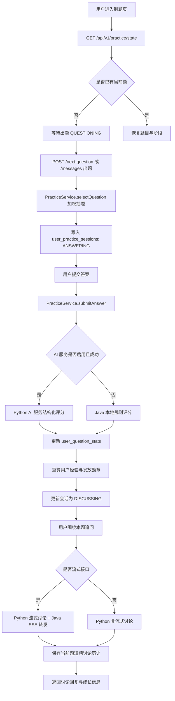
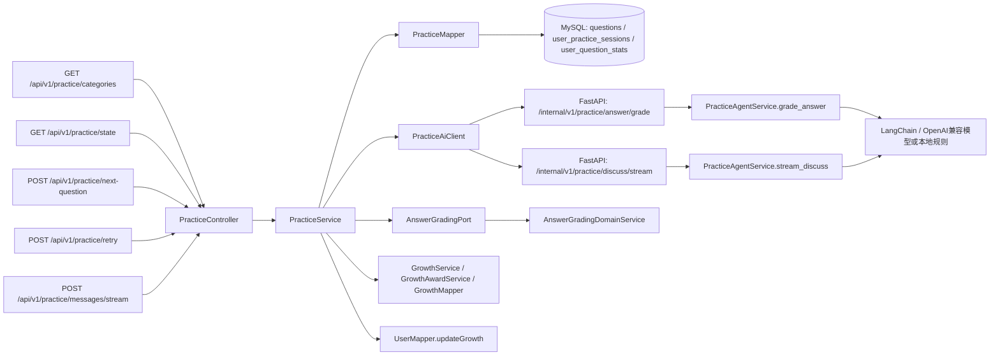

# 【AI智能刷题】功能及代码梳理

## 1. 功能概览

AI 智能刷题功能面向 AI 学习平台用户，提供题目分类查询、智能抽题、提交答案评分、重新作答、围绕当前题继续追问讨论、SSE 流式讨论、成长经验和勋章联动等能力。后端主入口位于 Java Spring Boot 模块 `ai-learn-backend` 的 `PracticeController`，核心业务由 `PracticeService` 编排；题目、当前刷题会话、答题汇总等数据通过 MyBatis `PracticeMapper` 读写 MySQL。评分和讨论优先调用 Python FastAPI 模块 `ai-service` 的内部 AI 接口，未启用或调用异常时，评分会回退到 Java 本地规则；讨论能力异常时返回明确兜底提示，不伪造模型回答。

检索范围：本次梳理重点扫描 `ai-learn-backend/src/main/java/com/earth/online/player/ailearn/practice`、`answer`、`ai`、相关 `growth/user` 调用、`application.yml`、Flyway 迁移脚本，以及 `ai-service/app/api/practice.py`、`ai-service/app/practice/agent_service.py`、`ai-service/app/schemas/practice.py`、`ai-service/app/config`。不分析前端。

## 2. 功能使用场景

| 场景 | 触发入口 | 主要结果 |
| --- | --- | --- |
| 查询可选题目分类 | `GET /api/v1/practice/categories` | 返回 `questions` 表中未删除题目的去重分类列表 |
| 恢复刷题页面状态 | `GET /api/v1/practice/state` | 返回当前阶段、当前题、最近得分、分类列表和成长概览 |
| 点击开始或下一题 | `POST /api/v1/practice/next-question` | 按分类和权重抽取题目，写入 `user_practice_sessions`，进入答题阶段 |
| 重新回答当前题 | `POST /api/v1/practice/retry` | 保留当前题，重置当前会话为答题阶段 |
| 流式聊天出题、答题或讨论 | `POST /api/v1/practice/messages/stream` | 根据当前阶段执行出题、评分或本题讨论；Java 后端通过 SSE 发送 `message` 分片，最终发送 `result` 事件 |
| 内部 AI 评分 | `POST /internal/v1/practice/answer/grade` | Python AI 服务返回结构化评分；需要 `X-Internal-Token` |
| 内部 AI 流式讨论 | `POST /internal/v1/practice/discuss/stream` | Python AI 服务返回内部 SSE，Java 后端读取后转发给前端 |

## 3. 功能逻辑流程图



## 4. 代码调用链路图



## 5. 关键文件清单

| 类型 | 文件路径 | 作用说明 |
| --- | --- | --- |
| 接口入口 | `ai-learn-backend/src/main/java/com/earth/online/player/ailearn/practice/interfaces/PracticeController.java` | 对外提供刷题分类、状态、出题、重答、消息处理和 SSE 流式接口 |
| 请求/响应 DTO | `ai-learn-backend/src/main/java/com/earth/online/player/ailearn/practice/interfaces/*.java` | 定义刷题动作、聊天请求、题目响应、评分响应、状态响应和消息响应 |
| 业务服务 | `ai-learn-backend/src/main/java/com/earth/online/player/ailearn/practice/application/PracticeService.java` | 编排阶段流转、抽题、评分、讨论、成长经验和勋章 |
| 数据访问 | `ai-learn-backend/src/main/java/com/earth/online/player/ailearn/practice/infrastructure/PracticeMapper.java` | 读写题库、用户当前会话、用户题目汇总 |
| AI 客户端 | `ai-learn-backend/src/main/java/com/earth/online/player/ailearn/practice/infrastructure/PracticeAiClient.java` | 调用 Python AI 服务，支持 JSON 和内部 SSE 响应读取 |
| 本地评分端口 | `ai-learn-backend/src/main/java/com/earth/online/player/ailearn/answer/domain/AnswerGradingPort.java` | Java 本地评分抽象接口 |
| 本地评分实现 | `ai-learn-backend/src/main/java/com/earth/online/player/ailearn/answer/domain/AnswerGradingDomainService.java` | 基于关键词、领域术语、同义词和答案长度计算本地评分 |
| AI 服务配置 | `ai-learn-backend/src/main/java/com/earth/online/player/ailearn/ai/AiServiceProperties.java` | 绑定 `app.ai-service` 配置：启用开关、地址、Token、超时时间 |
| AI 服务常量 | `ai-learn-backend/src/main/java/com/earth/online/player/ailearn/ai/AiServiceConstants.java` | 维护内部 Header、内容类型和 Python 内部接口路径 |
| Java 配置文件 | `ai-learn-backend/src/main/resources/application.yml` | 配置 MySQL、Flyway、JWT、AI 服务调用参数 |
| 数据库迁移 | `ai-learn-backend/src/main/resources/db/migration/V4__init_question_tables.sql` | 创建并初始化题库基础表，后续迁移中题库数据被刷新 |
| 数据库迁移 | `ai-learn-backend/src/main/resources/db/migration/V11__system_question_bank_and_practice_summary.sql` | 创建 `user_question_stats` 和 `user_practice_sessions` |
| 数据库迁移 | `ai-learn-backend/src/main/resources/db/migration/V16__refresh_practice_badges.sql` | 增加追问次数并刷新刷题勋章规则 |
| 数据库迁移 | `ai-learn-backend/src/main/resources/db/migration/V19__add_practice_discussion_memory.sql` | 增加评分摘要和讨论历史字段，支撑本题短期多轮记忆 |
| Python 内部接口 | `ai-service/app/api/practice.py` | 暴露内部评分、讨论、流式讨论接口 |
| Python Agent 服务 | `ai-service/app/practice/agent_service.py` | 使用 LangChain 调用真实模型，失败时执行本地规则评分或讨论兜底 |
| Python Schema | `ai-service/app/schemas/practice.py` | 定义内部评分、讨论请求和响应模型 |
| Python 配置 | `ai-service/app/config/settings.py` | 读取 `.env` 中内部 Token、模型地址、Key、模型名、超时等配置 |
| Python 鉴权 | `ai-service/app/api/dependencies.py` | 校验 `X-Internal-Token`，防止外部直接访问内部 AI 能力 |

## 6. 使用到的技术栈

| 类别 | 技术/依赖 | 在本功能中的用途 |
| --- | --- | --- |
| 后端框架 | Spring Boot 3.3.6 / Java 17 | 提供外部 REST API、SSE、事务和配置绑定 |
| Web 通信 | Spring MVC `SseEmitter` / Java `HttpClient` | 前端流式输出、Java 调用 Python 内部 HTTP/SSE 接口 |
| 数据访问 | MyBatis 3.0.4 | 通过注解 SQL 读写题库、会话和答题汇总 |
| 数据存储 | MySQL | 保存用户、题库、当前刷题状态、答题统计、成长经验、徽章 |
| 数据迁移 | Flyway | 管理 MySQL 表结构与初始化题库、勋章数据 |
| 认证上下文 | 项目自定义 `AuthContext` / `AuthSupport` | 获取当前登录用户，并在异步 SSE 线程中恢复用户上下文 |
| AI 内部服务 | FastAPI / Uvicorn | 承接 Java 后端内部 AI 评分和讨论请求 |
| AI 编排 | LangChain / LangGraph | 调用 OpenAI 兼容聊天模型，支持结构化评分、Agent 讨论和流式输出 |
| 外部模型 | OpenAI 兼容模型或 DeepSeek | 代码中通过 `ai_grading_base_url`、`ai_grading_api_key`、`ai_grading_model` 配置，真实值不在仓库内体现 |
| 配置安全 | 环境变量和占位符 | `DATABASE_PASSWORD`、`AI_SERVICE_TOKEN`、`AI_GRADING_API_KEY` 等均使用占位符或环境变量 |

说明：本功能链路未直接使用 Redis 或 Qdrant。结合前端、Java 后端和 Python AI 服务当前调用链路看，Qdrant/RAG 仅为后续能力预留，当前系统主业务未触发 Qdrant 连接，默认无需部署。

## 7. 核心代码介绍

### 7.1 `PracticeController.java`

**核心职责：** 作为 Java 后端对外接口层，接收前端请求并委派 `PracticeService`。流式接口使用 `SseEmitter`，异步执行时手动恢复 `AuthContext`。

**关键方法：**

- `findQuestionTypes()`：查询题目分类。
- `getState()`：查询当前用户刷题状态。
- `nextQuestion(PracticeActionRequest request)`：抽取下一题。
- `retryCurrentQuestion()`：重新回答当前题。
- `handleMessageStream(PracticeMessageRequest request)`：SSE 流式消息入口。
- `emitMessageStream(...)`：异步输出 `message`、`result` 或 `error` 事件。

**核心片段：**

```java
@PostMapping(value = "/messages/stream", produces = MediaType.TEXT_EVENT_STREAM_VALUE)
public ResponseEntity<SseEmitter> handleMessageStream(@RequestBody PracticeMessageRequest request) {
    SseEmitter emitter = new SseEmitter((long) SSE_TIMEOUT_MILLIS);
    AuthenticatedUser authenticatedUser = AuthContext.getUser();
    CompletableFuture.runAsync(() -> emitMessageStream(request, emitter, authenticatedUser));
    return ResponseEntity.ok().contentType(MediaType.TEXT_EVENT_STREAM).body(emitter);
}
```

**说明：**

- Controller 不直接操作数据库，所有业务逻辑集中在 `PracticeService`。
- SSE 超时时间为 120 秒；如果 Python 没有输出真实流式片段，Java 会把最终消息拆成小块模拟可感知输出。
- 日志只记录分片长度和耗时，不记录用户答案或模型正文。

### 7.2 `PracticeService.java`

**核心职责：** 负责 AI 智能刷题完整状态机和业务编排，包括 QUESTIONING、ANSWERING、DISCUSSING 三个阶段。

**关键方法：**

- `findQuestionTypes()`：读取题目分类，先校验当前用户。
- `getState()`：读取当前会话、当前题、成长信息。
- `nextQuestion(...)`：按分类抽题并进入答题阶段。
- `handleMessageStream(...)`：根据当前阶段路由到出题、答题或讨论处理，并统一通过 SSE 返回。
- `submitAnswer(...)`：优先调用 Python AI 评分，失败后调用 Java 本地评分，之后更新统计、成长和会话。
- `recordSummaryAndBuildResponse(...)`：更新答题汇总、重算总经验、发放勋章并构造评分响应。
- `selectQuestion(...)`：基于重要性、答题次数、历史最高分、出现次数和随机因子做加权抽题。
- `saveDiscussionHistory(...)`：保存当前题短期讨论历史，用于后续追问上下文。

**核心片段：**

```java
Optional<PracticeAiGradingResult> aiGradingResult = practiceAiClient.grade(userId, question, userAnswer);
boolean fallbackUsed = aiGradingResult.map(PracticeAiGradingResult::fallbackUsed).orElse(true);
GradingResult gradingResult = aiGradingResult.map(PracticeAiGradingResult::gradingResult)
        .orElseGet(() -> answerGradingPort.grade(userId, question.getId(), question.getQuestion(),
                question.getStandardAnswer(), List.of(question.getQuestionType()), userAnswer));
```

**说明：**

- 出题阶段只接受明确的出题意图，避免刷题入口变成通用聊天。
- 答题阶段会过滤明显偏离刷题的内容；提交答案后进入讨论阶段。
- 讨论阶段支持“重新回答”和“下一题”意图，也支持围绕当前题追问。
- 经验值按所有题目的最高分总和重新计算，避免重复答题导致经验累计偏差。

### 7.3 `PracticeMapper.java`

**核心职责：** 使用 MyBatis 注解 SQL 访问 AI 智能刷题相关表。

**关键方法：**

- `findQuestionTypes()`：从 `questions` 查询可用分类。
- `findCandidates(userId, questionTypes)`：查询候选题目，并关联当前用户答题统计。
- `findQuestionByCode(userId, questionCode)`：按题目编码查询当前题。
- `findSession(userId)`：查询用户当前刷题会话。
- `upsertQuestionSession(...)`：插入或重置当前题会话。
- `updateSessionPhase(...)`：评分后写入阶段、最近得分、最近答案和评分摘要。
- `updateDiscussionHistory(...)` / `incrementDiscussionFollowUpCount(...)`：维护讨论历史和追问次数。
- `findStat(...)` / `upsertStat(...)`：读写用户题目答题汇总。

**核心片段：**

```sql
SELECT q.id, q.code, q.question, q.question_type, q.standard_answer,
       q.importance_score, q.occurrence_count,
       COALESCE(stats.answer_count, 0) AS answered_count,
       COALESCE(stats.best_score, 0) AS best_score
FROM questions q
LEFT JOIN user_question_stats stats
  ON stats.question_code = q.code AND stats.user_id = #{userId}
WHERE q.deleted = 0
ORDER BY q.importance_score DESC, q.occurrence_count DESC, q.id DESC
LIMIT 500
```

**说明：**

- 当前实现不使用 XML Mapper。
- `user_practice_sessions` 通过用户维度唯一索引保证一个用户只有一个当前刷题状态。
- `user_question_stats` 通过 `(user_id, question_code)` 唯一键汇总每题作答次数、最高分和最近得分。

### 7.4 `PracticeAiClient.java`

**核心职责：** Java 后端调用 Python AI 服务的基础设施组件，封装 JSON 请求、内部 SSE 请求、鉴权 Header、超时和兜底处理。

**关键方法：**

- `grade(...)`：请求 `/internal/v1/practice/answer/grade` 获取结构化评分。
- `discussStream(...)`：请求 `/internal/v1/practice/discuss/stream` 并读取内部 SSE。
- `postJson(...)`：统一发送 JSON 请求并校验 `ApiResponse.code == SUCCESS`。
- `postEventStream(...)` / `readEventStream(...)`：读取 Python SSE 的 `message` 和 `done` 事件。
- `buildDiscussPayload(...)`：组装题目、最近答案、评分摘要、讨论历史和用户追问。

**核心片段：**

```java
.header(AiServiceConstants.INTERNAL_TOKEN_HEADER, properties.getToken())
.POST(HttpRequest.BodyPublishers.ofString(objectMapper.writeValueAsString(payload), StandardCharsets.UTF_8))
```

**说明：**

- `HttpClient` 固定为 HTTP/1.1，代码注释说明是为了兼容 Uvicorn。
- 任何网络异常、非 2xx 状态、业务响应失败或结果转换失败都会返回 `Optional.empty()`，由上层兜底。
- 内部 Token 来自 `app.ai-service.token`，真实 Token 不应提交仓库。

### 7.5 `AnswerGradingDomainService.java`

**核心职责：** Java 本地规则评分实现，在 Python AI 服务关闭或异常时保障评分可用。

**关键方法：**

- `grade(...)`：对用户答案评分并返回 `GradingResult`。
- `buildKeywords(...)`：从参考答案提取英文技术词、领域术语和短关键词。
- `isKeywordHit(...)`：判断答案是否命中关键词或同义表达。
- `calculateScore(...)`：按关键词覆盖度和答案长度计算百分制分数。
- `buildProblems(...)` / `buildAdvice(...)`：生成问题点和改进建议。

**核心片段：**

```java
int keywordScore = Math.round((hitCount * KEYWORD_SCORE_WEIGHT) / (float) totalCount);
int contentScore = answerLength >= SHORT_ANSWER_LENGTH ? CONTENT_BASE_SCORE : answerLength;
return Math.max(0, Math.min(MAX_SCORE, keywordScore + contentScore));
```

**说明：**

- 本地评分主要面向 RAG、Embedding、Chunk、BM25、Rerank、Prompt、Fine-tuning 等 AI 学习题库关键词。
- 分类名会被排除为扣分项，避免用户不复述分类名导致误扣分。
- Java 本地评分和 Python 本地评分规则相似，但分别独立实现。

### 7.6 `PracticeAgentService`（Python）

**核心职责：** Python AI 服务中的智能评分和本题讨论服务，优先调用真实大模型，失败或未配置时使用兜底逻辑。

**关键方法：**

- `grade_answer(request)`：结构化评分主入口。
- `discuss(request)`：非流式本题讨论入口。
- `stream_discuss(request)`：流式本题讨论入口。
- `_grade_answer_by_llm(...)`：使用 LangChain 结构化输出获取 `PracticeGradeResponse`。
- `_generate_discuss_reply_by_llm(...)`：在流式链路没有可见片段时，使用 LangChain Agent 生成完整回复作为兜底。
- `_stream_discuss_by_llm(...)`：优先使用模型原生流式，再尝试 Agent 流式，最后回退完整回复兜底或本地提示。
- `_is_llm_enabled()`：判断模型地址、API Key、模型名是否满足真实模型调用条件。

**核心片段：**

```python
return (
    bool(settings.ai_grading_base_url.strip())
    and bool(api_key)
    and model.upper() != LOCAL_RULE_MODEL
    and api_key != AI_GRADING_API_KEY_PLACEHOLDER
)
```

**说明：**

- 默认 `ai_grading_model` 为 `LOCAL_RULE`，不会发起外部模型调用。
- 对 DeepSeek 供应商做了识别，调用时会附加关闭 thinking 的配置。
- 流式日志只记录片段数量、长度和耗时，避免正文刷屏。
/
### 7.7 `app/api/practice.py` 与 `dependencies.py`（Python）

**核心职责：** 提供 Java 后端内部调用的 FastAPI 路由，并统一校验内部 Token。

**关键方法：**

- `grade_answer(...)`：内部答案评分接口。
- `discuss(...)`：内部本题讨论接口。
- `discuss_stream(...)`：内部本题流式讨论接口。
- `verify_internal_token(...)`：校验 `X-Internal-Token`。

**核心片段：**

```python
@router.post("/answer/grade", response_model=ApiResponse[PracticeGradeResponse], dependencies=[Depends(verify_internal_token)])
def grade_answer(request: PracticeGradeRequest) -> ApiResponse[PracticeGradeResponse]:
    return ApiResponse(data=practice_agent_service.grade_answer(request))
```

**说明：**

- Python 内部接口路径前缀为 `/internal/v1/practice`。
- 鉴权失败返回 HTTP 401，日志只记录是否携带 Token，不打印 Token 原文。

### 7.8 配置与中间件依赖

**核心职责：** 通过环境变量和占位符完成本地和部署环境配置。

**关键配置：**

| 配置项 | 位置 | 说明 |
| --- | --- | --- |
| `DATABASE_URL` | `application.yml` | Java 后端 MySQL 连接地址 |
| `DATABASE_USERNAME` | `application.yml` | MySQL 用户名 |
| `DATABASE_PASSWORD` | `application.yml` | MySQL 密码，占位符提示本地环境变量填写 |
| `AI_SERVICE_ENABLED` | `application.yml` | 是否启用 Java 调用 Python AI 服务 |
| `AI_SERVICE_BASE_URL` | `application.yml` | Python AI 服务地址，默认 `http://127.0.0.1:8000` |
| `AI_SERVICE_TOKEN` | `application.yml` / `settings.py` | Java 与 Python 内部鉴权共享 Token |
| `AI_SERVICE_TIMEOUT_SECONDS` | `application.yml` | Java 调用 Python 超时时间 |
| `AI_GRADING_BASE_URL` | `ai-service/.env` | OpenAI 兼容模型基础地址 |
| `AI_GRADING_API_KEY` | `ai-service/.env` | 模型 API Key，仓库中只能使用占位符 |
| `AI_GRADING_MODEL` | `ai-service/.env` | 模型名，默认 `LOCAL_RULE` |
| `AI_GRADING_MODEL_PROVIDER` | `ai-service/.env` | LangChain 模型供应商，可用于 DeepSeek 等配置 |
| `AI_GRADING_TIMEOUT_SECONDS` | `ai-service/.env` | Python 调用模型超时时间 |

**示例占位符配置：**

```properties
# Java 后端本地环境变量示例，真实值请只保存在本机或服务器私有配置中
DATABASE_URL=jdbc:mysql://127.0.0.1:3306/ai_learn?useUnicode=true&characterEncoding=utf8&serverTimezone=Asia/Shanghai&allowPublicKeyRetrieval=true&useSSL=false
DATABASE_USERNAME=ai_learn_user
DATABASE_PASSWORD=请填写本地MySQL真实密码
AI_SERVICE_ENABLED=true
AI_SERVICE_BASE_URL=http://127.0.0.1:8000
AI_SERVICE_TOKEN=请填写本地内部服务Token

# Python AI 服务 .env 示例，真实 Key 禁止提交仓库
AI_SERVICE_TOKEN=请与Java后端保持一致
AI_GRADING_BASE_URL=https://模型服务地址占位符/v1
AI_GRADING_API_KEY=请填写真实模型Key
AI_GRADING_MODEL=模型名占位符
AI_GRADING_MODEL_PROVIDER=模型供应商占位符
AI_GRADING_TIMEOUT_SECONDS=20
```

## 8. 可优化点与维护建议

| 优先级 | 建议 | 原因 | 涉及位置 |
| --- | --- | --- | --- |
| 高 | 为 `handleMessageStream` 使用受控线程池 | 当前使用 `CompletableFuture.runAsync` 默认公共线程池，流式请求量上来后不易隔离和限流 | `PracticeController.handleMessageStream` |
| 高 | 为 AI 服务调用增加熔断、重试退避或限流 | 目前失败会兜底，但缺少连续失败保护和模型成本控制 | `PracticeAiClient`、`PracticeAgentService` |
| 中 | 将 Java 与 Python 本地评分规则抽象为共享配置或版本说明 | 两端各自实现关键词和同义词规则，长期可能出现评分口径不一致 | `AnswerGradingDomainService`、`agent_service.py` |
| 中 | 增加刷题阶段枚举封装 | 当前阶段字符串集中在常量类，使用枚举可降低拼写错误风险 | `PracticeConstants`、`PracticeService` |
| 中 | 限制和审计讨论历史内容 | 当前已做条数和长度限制，后续可补充敏感词脱敏和更细粒度日志审计 | `PracticeService.saveDiscussionHistory` |
| 中 | 对题目抽取权重参数做配置化 | 重要性、答题次数、历史得分、出现次数权重写死在代码中，后续运营调参需要发版 | `PracticeService.calculateWeight` |
| 低 | Python README 补充最新内部接口路径 | `ai-service/README.md` 中答案评分路径仍写为 `/internal/v1/agent/answer/grade`，代码实际为 `/internal/v1/practice/answer/grade` | `ai-service/README.md` |
| 低 | 补充接口级请求/响应示例文档 | 便于测试、产品和联调人员快速理解阶段流转 | `doc/` 或接口规范文档 |

## 9. 总结

1. AI 智能刷题以后端 `PracticeController` 为统一入口，核心业务集中在 `PracticeService`，已形成出题、答题、评分、讨论三段式闭环。
2. 数据主链路依赖 MySQL，核心表包括 `questions`、`user_practice_sessions`、`user_question_stats`，成长联动还会更新 `users`、`badges`、`user_badges` 等表。
3. AI 能力通过 Java `PracticeAiClient` 调用 Python FastAPI 内部接口实现，接口使用 `X-Internal-Token` 鉴权，并支持结构化评分和 SSE 流式讨论。
4. 可用性设计较完整：AI 服务未启用或异常时，评分会回退到本地规则；讨论异常时返回明确提示，避免伪造模型能力。
5. 后续维护重点建议放在线程池隔离、模型调用熔断限流、Java/Python 评分规则一致性、AI 服务 README 路径同步和接口示例补充上。
