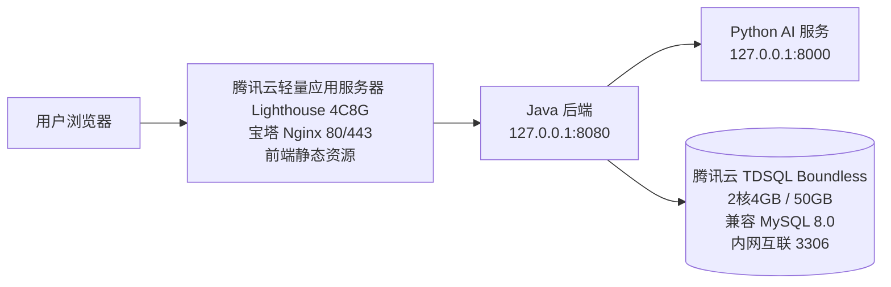

# 腾讯云轻量应用服务器 4C8G 宝塔面板上线部署文档（单机应用 + TDSQL Boundless）

> 私有安全说明：当前文件已经加入 `.gitignore`，并且仅安全保存在内网安全电脑中，不作为公开文档发布。因此后续检查优化点或编写部署教程时，可以直接基于本文中的真实内网地址、账号字段和密钥字段进行说明。
版本：v1.4  
更新日期：2026-05-21  
适用项目：`ai-learn-web`、`ai-learn-backend`、`ai-service`  
云厂商：腾讯云  
服务器现状：**已购买 1 台腾讯云轻量应用服务器 Lighthouse，4核8GB，60GB SSD 云硬盘，500GB/月流量包，公网带宽 5Mbps，镜像为“宝塔 Linux 面板 11.4.0 腾讯云专享版”，基于 OpenCloudOS 9；已通过腾讯云内部网络互联能力打通轻量应用服务器与 TDSQL 所在网络**  
数据库现状：已购买 **腾讯云 TDSQL Boundless，2核4GB，50GB 增强型 SSD 云硬盘，兼容 MySQL 8.0**，不在服务器自建 MySQL  

## 1. 上线目标

本方案上线后要达成以下结果：

1. 用户通过域名访问前端页面。
2. 前端静态资源由宝塔面板中的 Nginx 站点提供。
3. 前端统一通过 `/api/v1` 调用 Java 后端，浏览器不直接暴露后端端口。
4. Java 后端和 Python AI 服务部署在同一台 4C8G 轻量应用服务器上，仅监听本机 `127.0.0.1`。
5. Java 后端通过腾讯云内部网络互联后的 TDSQL 内网地址访问数据库，不使用 TDSQL 公网地址。
6. TDSQL 不开启公网访问，不允许 `0.0.0.0/0` 访问 3306；数据库侧仅允许已打通的内部网络来源访问。
7. 服务器对普通公网访问只开放 80、443；22 和宝塔面板端口仅允许管理员固定 IP 访问。
8. 首次启动 Java 后端时通过 Flyway 自动初始化数据库表结构和系统题库。

## 2. 最终部署架构



### 2.1 资源清单

| 资源 | 规格 | 部署内容 | 公网开放 |
| --- | --- | --- | --- |
| 腾讯云轻量应用服务器 Lighthouse | 4核8GB，60GB SSD 云硬盘，500GB/月流量包，公网带宽 5Mbps，宝塔 Linux 面板 11.4.0 腾讯云专享版，OpenCloudOS 9 | Nginx、前端静态资源、Java 后端、Python AI 服务 | 80/443；22 和宝塔端口限管理员 IP |
| 腾讯云 TDSQL Boundless | 2核4GB，50GB 增强型 SSD 云硬盘，兼容 MySQL 8.0，数据库内核版本以控制台为准 | 业务主库 `ai_learn` | 不开放公网，仅内部网络互联访问 |

### 2.2 端口规划

| 服务 | 端口 | 监听地址 | 访问方式 |
| --- | ---: | --- | --- |
| 宝塔面板 | 默认 8888 或镜像实际端口 | `0.0.0.0` | 仅管理员固定 IP 访问，完成配置后建议改安全入口和面板端口 |
| SSH | 22 | `0.0.0.0` | 仅管理员固定 IP 访问 |
| Nginx HTTP | 80 | `0.0.0.0` | 公网访问，备案和证书完成后跳转 HTTPS |
| Nginx HTTPS | 443 | `0.0.0.0` | 公网访问 |
| Java 后端 | 8080 | `127.0.0.1` | 仅 Nginx 本机反代访问 |
| Python AI 服务 | 8000 | `127.0.0.1` | 仅 Java 后端本机访问 |
| 腾讯云 TDSQL | 3306 | TDSQL 内网地址 | 仅允许轻量应用服务器通过腾讯云内部网络互联访问 |

### 2.3 服务器容量分配建议

当前 4C8G 单机承载前端、后端和 AI 服务，建议先按小流量正式上线配置：

| 组件 | 建议资源控制 | 说明 |
| --- | --- | --- |
| Nginx | 使用宝塔默认 Nginx 配置 | 静态资源和反向代理开销较小 |
| Java 后端 | `-Xms512m -Xmx2048m` | 给 Spring Boot 预留 2GB 上限，避免挤占 AI 服务内存 |
| Python AI 服务 | Uvicorn 1 个 worker 起步 | 小流量优先稳定；后续高并发再评估 2 个 worker |
| TDSQL Boundless | 使用腾讯云托管数据库实例 | 不消耗轻量应用服务器内存，降低单机压力 |

## 3. 腾讯云控制台准备

### 3.1 明确当前网络事实

当前服务器是 **腾讯云轻量应用服务器 Lighthouse**，不是云服务器 CVM；但你已经通过腾讯云内部的网络互联能力打通了轻量应用服务器与 TDSQL 所在网络。因此本文档按以下最终方案部署：

1. 轻量应用服务器仍通过实例“防火墙”管理入站端口，操作入口不同于 CVM 安全组。
2. Java 后端通过 **TDSQL 内网地址**访问数据库，不使用 TDSQL 公网地址。
3. TDSQL 不开启公网访问；即使控制台存在公网开关，也保持关闭。
4. 数据库 3306 只允许已打通的内部网络来源访问，禁止 `0.0.0.0/0` 开放 3306。
5. 如果后续网络互联关系发生变化，需要先重新验证轻量应用服务器到 TDSQL 内网地址的连通性，再调整 `DATABASE_URL`。

> 安全重点：本方案不需要 TDSQL 公网地址，也不需要把轻量应用服务器公网 IP 加入数据库公网白名单。数据库访问应走腾讯云内部网络互联链路。

### 3.2 记录轻量应用服务器信息

登录腾讯云控制台，进入“轻量应用服务器”实例详情，记录以下信息：

| 项目 | 当前示例 | 用途 |
| --- | --- | --- |
| 实例类型 | 轻量应用服务器 Lighthouse | 区分于 CVM，避免误按 CVM 安全组操作 |
| 地域 / 可用区 | 广州 / 广州七区 | 与备案、延迟、数据库地域选择有关 |
| 公网 IPv4 | `159.75.111.145` | 域名 A 记录、SSH 登录、宝塔面板访问 |
| 内部互联网络 | `<腾讯云内部网络互联配置占位符>` | 用于确认轻量应用服务器可以访问 TDSQL 内网地址 |
| 规格 | 4核8GB，60GB SSD，5Mbps，500GB/月流量包 | 用于容量评估和上线验收 |
| 镜像 | 宝塔 Linux 面板，OpenCloudOS 9 | 用于确定系统命令和面板入口 |
| 到期时间 | 以控制台为准 | 用于续费提醒，避免服务中断 |

当前截图里显示的真实公网 IP、实例 ID、密钥名、TDSQL 内网地址等信息不要写入公开仓库文档；本文统一使用占位符。

### 3.3 配置轻量应用服务器防火墙

在轻量应用服务器控制台进入当前实例，打开“防火墙”页签，配置入站规则：

| 协议端口 | 来源 | 策略 | 用途 |
| --- | --- | --- | --- |
| TCP:80 | `0.0.0.0/0`、`::/0` | 允许 | HTTP 访问，备案和证书完成后可跳转 HTTPS |
| TCP:443 | `0.0.0.0/0`、`::/0` | 允许 | HTTPS 访问 |
| TCP:22 | `<管理员公网IP>/32` | 允许 | SSH 运维；如控制台不支持来源限制，至少不要泄露密码并优先使用密钥登录 |
| TCP:8888 或实际宝塔面板端口 | `<管理员公网IP>/32` | 允许 | 宝塔面板管理；如控制台不支持来源限制，需同时在宝塔面板安全入口和系统防火墙中限制 |

不建议开放：

- `8080`：Java 后端端口只走 Nginx 本机反代。
- `8000`：Python AI 服务只给 Java 后端本机调用。
- `3306`：数据库不部署在轻量应用服务器上，本机不需要开放 MySQL 端口。

> 腾讯云轻量应用服务器“防火墙”的安全防护作用等同于 CVM 安全组，但入口和配置项不同；不要再去 CVM 安全组页面查找当前实例。

### 3.4 配置 TDSQL 内网访问控制

由于轻量应用服务器与 TDSQL 所在网络已经通过腾讯云内部网络互联打通，本方案使用 TDSQL 内网地址连接数据库。请在 TDSQL 控制台完成：

1. 确认 TDSQL 内网地址和端口，记录为 `172.16.16.11:3306`。
2. 保持 TDSQL 公网访问关闭；如此前开启过公网访问，上线前应关闭。
3. 在 TDSQL 访问控制、白名单或安全组中，只允许已打通的内部网络来源访问 `TCP:3306`。
4. 禁止放行 `0.0.0.0/0` 到 3306。
5. 不要把个人电脑公网 IP 长期加入生产数据库白名单；临时排障后要及时删除。
6. 业务账号只授权 `ai_learn` 数据库，不使用高权限账号跑应用。

建议额外记录：

| 项目 | 保存位置 | 说明 |
| --- | --- | --- |
| TDSQL 内网地址 | 仅服务器 `/etc/ai-learn/backend.env` | 禁止提交仓库 |
| TDSQL 端口 | 文档可写占位符，实际值以控制台为准 | 默认通常为 3306 |
| 业务账号 | 服务器私有配置和密码管理器 | 不使用 root 或管理员账号 |
| 内部网络互联关系 | 腾讯云控制台 | 用于确认轻量应用服务器可以访问 TDSQL 内网地址 |
## 4. 首次进入宝塔面板

### 4.1 SSH 登录服务器

在本地终端执行：

```bash
ssh root@159.75.111.145
```

如果购买时没有设置密码，先在腾讯云 轻量应用服务器 控制台重置实例密码，再登录。

### 4.2 获取宝塔默认入口

进入服务器后执行：

```bash
bt default
```

如果提示没有 `bt` 命令，可尝试：

```bash
/etc/init.d/bt default
```

记录输出中的：

- 外网面板地址。
- 用户名。
- 初始密码。

首次登录宝塔后立刻完成：

1. 修改面板管理员密码。
2. 修改默认安全入口。
3. 如条件允许，修改默认面板端口。
4. 绑定管理员账号或启用面板二次验证。
5. 在宝塔“安全”页面确认只开放 80、443、22 和面板管理端口。
6. 在腾讯云轻量应用服务器“防火墙”中限制 22 和面板端口；若控制台不支持来源 IP 限制，则在宝塔安全入口、系统防火墙和 SSH 密钥登录策略中同步收敛风险。

## 5. 宝塔软件安装建议

进入宝塔“软件商店”，安装或确认以下组件：

| 软件 | 建议 | 说明 |
| --- | --- | --- |
| Nginx | 安装稳定版，例如 1.24+ | 用于前端静态站点和后端反向代理 |
| MySQL / MariaDB | **不要在本机安装数据库服务** | 本方案使用腾讯云 TDSQL；服务器只需要 MySQL 客户端用于连通性验证 |
| Redis | 当前不安装 | 当前项目运行代码未接入 Redis |
| PHP | 当前不需要 | 本项目不是 PHP 项目 |
| PM2 / Node 管理器 | 可不安装 | 推荐本地构建前端后上传 dist |
| Python 项目管理器 | 可选 | 本文默认使用系统 Python + systemd 管理 AI 服务 |

> 宝塔面板负责 Nginx、站点、SSL 和基础防火墙；Java 后端与 Python AI 服务使用 systemd 托管，避免依赖面板插件状态。

## 6. 服务器基础环境准备

### 6.1 安装基础命令

OpenCloudOS 9 使用 `dnf` 包管理器：

```bash
sudo dnf makecache
sudo dnf install -y git tar unzip curl wget vim lsof net-tools procps-ng cronie rsync
```

### 6.2 安装 JDK 17

```bash
sudo dnf install -y java-17-openjdk java-17-openjdk-devel
java -version
```

确认输出包含 Java 17。

### 6.3 安装 Python 3.11+

优先尝试：

```bash
sudo dnf install -y python3.11 python3.11-pip python3.11-devel
python3.11 --version
```

如果系统源暂时没有 Python 3.11，可在宝塔“软件商店”安装 Python 项目管理器，并安装 Python 3.11 或 3.12。后续命令中的 `python3.11` 替换为实际 Python 路径。

### 6.4 安装 MySQL 客户端

用于从 轻量应用服务器 验证 TDSQL 内网连通性：

```bash
sudo dnf install -y mysql
```

如果当前源没有 `mysql` 客户端，可使用兼容客户端：

```bash
sudo dnf install -y mariadb
```

### 6.5 创建运行用户和目录

```bash
sudo useradd --system --create-home --shell /sbin/nologin ai-learn || true
sudo mkdir -p /opt/ai-learn/backend
sudo mkdir -p /opt/ai-learn/ai-service
sudo mkdir -p /opt/ai-learn/log-platform
sudo mkdir -p /opt/ai-learn/releases
sudo mkdir -p /etc/ai-learn
sudo mkdir -p /var/log/ai-learn
sudo mkdir -p /www/wwwroot/ai-learn-web
sudo chown -R ai-learn:ai-learn /opt/ai-learn /var/log/ai-learn
sudo chmod 750 /etc/ai-learn
```

目录说明：

| 路径 | 用途 |
| --- | --- |
| `/www/wwwroot/ai-learn-web` | 前端静态资源目录，交给宝塔 Nginx 站点使用 |
| `/opt/ai-learn/backend` | Java 后端 JAR 目录 |
| `/opt/ai-learn/ai-service` | Python AI 服务源码和虚拟环境目录 |
| `/etc/ai-learn` | 生产环境变量目录，保存敏感配置 |
| `/var/log/ai-learn` | 应用日志目录 |

## 7. 配置腾讯云 TDSQL Boundless

### 7.1 确认已购 TDSQL 实例信息

根据当前项目规划，生产主库使用腾讯云 **TDSQL Boundless**，关键配置如下：

| 项目 | 当前值 | 文档处理方式 |
| --- | --- | --- |
| 产品类型 | TDSQL Boundless | 作为生产 MySQL 兼容主库使用 |
| 地域 / 可用区 | 以 TDSQL 控制台为准 | 建议与轻量应用服务器同地域或已完成内部网络互联 |
| 配置 | 2核4GB，50GB 增强型 SSD 云硬盘 | 符合当前小流量正式上线目标 |
| 兼容数据库 | MySQL 8.0 | 后端仍使用 MySQL Connector/J 连接 |
| 端口 | 3306 或控制台实际端口 | 写入 `DATABASE_URL` |
| 网络方式 | 腾讯云内部网络互联 + TDSQL 内网地址 | 当前不使用 TDSQL 公网地址 |

注意：TDSQL 的真实连接地址、账号、密码都属于生产敏感信息，不要写入仓库文档；请只保存在服务器 `/etc/ai-learn/backend.env` 等私有配置中。

### 7.2 创建业务库和账号

在腾讯云“TDSQL”控制台中完成：

1. 进入左侧“TDSQL” -> “实例列表”。
2. 找到已购买的 TDSQL Boundless 实例。
3. 点击“管理”进入实例详情。
4. 在数据库管理或 SQL 操作入口中创建数据库：`ai_learn`。
5. 字符集建议选择：`utf8mb4`；如果控制台只展示 `UTF8`，创建后需确认是否满足中文、Emoji 和特殊字符存储要求。
6. 在账号管理中创建业务账号：`ai_learn_user`。
7. 给 `ai_learn_user` 授权 `ai_learn` 数据库读写权限。
8. 确认 TDSQL 公网访问保持关闭。
9. 记录 TDSQL 内网地址和端口，后续写入 `DATABASE_URL`。

如果控制台没有可视化创建数据库入口，可先用 TDSQL 控制台“登录”能力，或从轻量应用服务器使用 MySQL 客户端连接内网地址后执行：

```sql
CREATE DATABASE IF NOT EXISTS ai_learn DEFAULT CHARACTER SET utf8mb4 COLLATE utf8mb4_0900_ai_ci;
```

### 7.3 从轻量应用服务器验证内网互联连接

在服务器执行：

```bash
mysql -h 172.16.16.11 -P 3306 -u admin -p ai_learn
```

登录后执行：

```sql
SELECT VERSION();
SHOW DATABASES;
SHOW VARIABLES LIKE 'character_set_database';
```

能返回版本号并看到 `ai_learn`，说明腾讯云内部网络互联、TDSQL 访问控制、账号权限和密码均正确。

如果连接失败，优先检查：

1. 腾讯云内部网络互联关系是否仍然有效。
2. TDSQL 内网地址和端口是否填写正确。
3. TDSQL 访问控制、白名单或安全组是否允许轻量应用服务器所在内部网络访问 3306。
4. `DATABASE_URL` 是否误填成 TDSQL 公网地址。
5. 账号是否已授权 `ai_learn` 数据库。
## 8. 准备生产环境变量

### 8.1 Java 后端环境变量

创建 `/etc/ai-learn/backend.env`：

```bash
sudo tee /etc/ai-learn/backend.env >/dev/null <<'EOF'
DATABASE_URL=jdbc:mysql://172.16.16.11:3306/ai_learn?useUnicode=true&characterEncoding=utf8&serverTimezone=Asia/Shanghai&allowPublicKeyRetrieval=true&sslMode=PREFERRED
DATABASE_USERNAME=admin
DATABASE_PASSWORD=13113986571Aa.
SPRING_FLYWAY_ENABLED=true
JWT_SECRET=hUM2OwJMXIlgZYrKd9nC2tfTyojbTio9aUJHNvCpCoVzzUqUuABN68EP9BaQ/yJm
JWT_EXPIRES_IN_SECONDS=7200
AI_SERVICE_ENABLED=true
AI_SERVICE_BASE_URL=http://127.0.0.1:8000
AI_SERVICE_TOKEN=ailocal_He0GHwrbtgMt9p4eeZRwwGuMLWWg8vMyJ7n9qfYo
AI_SERVICE_TIMEOUT_SECONDS=20
EOF
sudo chown root:ai-learn /etc/ai-learn/backend.env
sudo chmod 640 /etc/ai-learn/backend.env
```

字段说明：

| 字段 | 当前值 | 说明 |
| --- | --- | --- |
| TDSQL 内网地址 | `172.16.16.11` | TDSQL 控制台展示的内网地址；当前已通过腾讯云内部网络互联打通，Java 后端应通过该地址访问数据库，不使用 TDSQL 公网地址 |
| TDSQL 业务账号和密码 | `admin/13113986571Aa.` | 当前用于连接 `ai_learn` 数据库的账号和密码；生产长期运行建议后续改为最小权限业务账号 |
| JWT 生产密钥 | `hUM2OwJMXIlgZYrKd9nC2tfTyojbTio9aUJHNvCpCoVzzUqUuABN68EP9BaQ/yJm` | 用于 Java 后端签发和校验 JWT，必须保持高强度并只保存在私有部署配置中 |
| AI 内部调用 Token | `ailocal_He0GHwrbtgMt9p4eeZRwwGuMLWWg8vMyJ7n9qfYo` | Java 后端和 Python AI 服务之间的内部鉴权 Token，两边配置必须完全一致 |

数据库连接参数说明：内网互联访问数据库时可保留 `sslMode=PREFERRED`；如果 TDSQL 控制台要求强制 SSL 或提供 CA 证书，再按控制台要求升级为更严格的 SSL 配置。

### 8.2 Python AI 服务环境变量

创建 `/etc/ai-learn/ai-service.env`：

```bash
sudo tee /etc/ai-learn/ai-service.env >/dev/null <<'EOF'
AI_SERVICE_TOKEN=ailocal_He0GHwrbtgMt9p4eeZRwwGuMLWWg8vMyJ7n9qfYo
AI_GRADING_BASE_URL=https://ykym-cpa.zeabur.app/v1
AI_GRADING_API_KEY=sk-zhanzhijie
AI_GRADING_MODEL=gpt-5.5
AI_GRADING_MODEL_PROVIDER=
AI_GRADING_TIMEOUT_SECONDS=20
EOF
sudo chown root:ai-learn /etc/ai-learn/ai-service.env
sudo chmod 640 /etc/ai-learn/ai-service.env
```

说明：

1. 如果暂时不接入真实大模型，保持 `AI_GRADING_MODEL=LOCAL_RULE` 即可。
2. 如果接入 OpenAI 兼容模型服务，`AI_GRADING_BASE_URL` 通常填写到 `/v1`，并把 `AI_GRADING_MODEL` 改为真实模型名称。
3. `AI_GRADING_API_KEY` 只能放在服务器私有配置中，禁止提交仓库。

## 9. 本地构建发布包

> 推荐方式：本地或 CI 构建，服务器只保留运行环境。这样服务器不需要安装 Maven 和 Node.js，也减少生产机临时构建风险。

### 9.1 构建 Java 后端

在本地项目根目录执行：

```bash
cd ai-learn-backend
mvn -DskipTests clean package
```

产物：

```text
ai-learn-backend/target/ai-learn-backend-0.0.1-SNAPSHOT.jar
```

### 9.2 构建前端

在本地项目根目录执行：

```bash
cd ai-learn-web
npm ci
VITE_API_BASE_URL=/api/v1 npm run build
```

Windows PowerShell 可使用：

```powershell
cd ai-learn-web
npm ci
$env:VITE_API_BASE_URL='/api/v1'
npm run build
```

产物：

```text
ai-learn-web/dist
```

### 9.3 准备 AI 服务源码

AI 服务需要上传源码和 `requirements.txt`，不要上传本地 `.venv`、`__pycache__`、真实 `.env`。

推荐使用 Git Bash：

```bash
rsync -avz --delete \
  --exclude '.venv' \
  --exclude '__pycache__' \
  --exclude '.env' \
  ai-service/ root@159.75.111.145:/tmp/ai-service/
```


## 10. 上传并部署应用文件

### 10.1 上传后端 JAR

本地执行：

```bash
scp ai-learn-backend/target/ai-learn-backend-0.0.1-SNAPSHOT.jar root@159.75.111.145:/tmp/ai-learn-backend.jar
```

服务器执行：

```bash
sudo cp /tmp/ai-learn-backend.jar /opt/ai-learn/backend/ai-learn-backend.jar
sudo chown ai-learn:ai-learn /opt/ai-learn/backend/ai-learn-backend.jar
```

### 10.2 上传前端 dist

先在服务器执行：

```bash
mkdir -p /tmp/ai-learn-web
```

再在本地执行：

```bash
scp -r ai-learn-web/dist/* root@159.75.111.145:/tmp/ai-learn-web/
```

服务器执行：

```bash
sudo rsync -av --delete /tmp/ai-learn-web/ /www/wwwroot/ai-learn-web/
sudo chown -R www:www /www/wwwroot/ai-learn-web 2>/dev/null || sudo chown -R nginx:nginx /www/wwwroot/ai-learn-web 2>/dev/null || true
```

### 10.3 部署 AI 服务源码

服务器执行：

```bash
sudo rsync -av --delete /tmp/ai-service/ /opt/ai-learn/ai-service/
sudo chown -R ai-learn:ai-learn /opt/ai-learn/ai-service
```

安装 Python 依赖：

```bash
cd /opt/ai-learn/ai-service
sudo -u ai-learn python3.11 -m venv .venv
sudo -u ai-learn /opt/ai-learn/ai-service/.venv/bin/pip install --upgrade pip
sudo -u ai-learn /opt/ai-learn/ai-service/.venv/bin/pip install -r requirements.txt
```

如果实际 Python 命令不是 `python3.11`，替换为服务器实际路径。

## 11. 创建 systemd 服务

### 11.1 Python AI 服务

创建 `/etc/systemd/system/ai-learn-ai.service`：

```bash
sudo tee /etc/systemd/system/ai-learn-ai.service >/dev/null <<'EOF'
[Unit]
Description=AI Learn Python AI Service
After=network-online.target
Wants=network-online.target

[Service]
Type=simple
User=ai-learn
Group=ai-learn
WorkingDirectory=/opt/ai-learn/ai-service
EnvironmentFile=/etc/ai-learn/ai-service.env
ExecStart=/opt/ai-learn/ai-service/.venv/bin/uvicorn app.main:app --host 127.0.0.1 --port 8000 --workers 1 --no-access-log
Restart=always
RestartSec=5

[Install]
WantedBy=multi-user.target
EOF
```

启动服务：

```bash
sudo systemctl daemon-reload
sudo systemctl enable --now ai-learn-ai
sudo systemctl status ai-learn-ai --no-pager
```

本机健康检查：

```bash
curl -s http://127.0.0.1:8000/health
```

预期返回：

```json
{"status":"UP"}
```

### 11.2 Java 后端服务

创建 `/etc/systemd/system/ai-learn-backend.service`：

```bash
sudo tee /etc/systemd/system/ai-learn-backend.service >/dev/null <<'EOF'
[Unit]
Description=AI Learn Java Backend Service
After=network-online.target ai-learn-ai.service
Wants=network-online.target

[Service]
Type=simple
User=ai-learn
Group=ai-learn
WorkingDirectory=/opt/ai-learn/backend
EnvironmentFile=/etc/ai-learn/backend.env
ExecStart=/usr/bin/java -Xms512m -Xmx2048m -XX:+UseG1GC -jar /opt/ai-learn/backend/ai-learn-backend.jar --server.address=127.0.0.1
Restart=always
RestartSec=5
SuccessExitStatus=143

[Install]
WantedBy=multi-user.target
EOF
```

启动服务：

```bash
sudo systemctl daemon-reload
sudo systemctl enable --now ai-learn-backend
sudo systemctl status ai-learn-backend --no-pager
```

本机健康检查：

```bash
curl -s http://127.0.0.1:8080/api/v1/health
```

预期返回中包含：

```json
"status":"UP"
```

首次启动重点观察 Flyway：

```bash
sudo journalctl -u ai-learn-backend -n 200 --no-pager
```

确认没有数据库连接失败、权限不足或 migration 失败。

## 12. 配置宝塔 Nginx 站点

### 12.1 创建站点

在宝塔面板中操作：

1. 进入“网站”。
2. 保持在“PHP项目”页签中，不要选择“Java项目”“Python项目”“Node项目”或“Go项目”。
3. 点击“添加站点”。
4. 域名填写：`www.ai-studyhub.cn`；如果暂时没有域名，可先使用公网 IP 做临时验证。
5. 根目录选择：`/www/wwwroot/ai-learn-web`。
6. PHP 版本选择“纯静态”。
7. 数据库选择“不创建”。
8. 创建站点。

> 说明：宝塔面板中的“PHP项目”在这里仅作为 Nginx 静态站点入口使用，并不代表本项目需要 PHP。Java 后端和 Python AI 服务仍然按本文方案使用 `systemd` 托管，宝塔只负责前端静态资源、Nginx 反向代理和 HTTPS 证书。

### 12.2 配置完整优化版 Nginx

进入站点设置，打开 Nginx 配置文件，使用以下完整配置覆盖当前站点配置。该配置保留宝塔证书校验、扩展 include、PHP 引用、伪静态 include、SSE 流式接口、普通 API 反代、Vue Router 兜底和敏感文件拦截，同时补充静态资源强缓存、gzip 和 upstream keepalive。

以公网 IP 临时站点为例，配置文件通常为：

```text
/www/server/panel/vhost/nginx/159.75.111.145.conf
```

如果后续站点切换为正式域名，配置文件名通常会变为对应域名，例如：

```text
/www/server/panel/vhost/nginx/www.ai-studyhub.cn.conf
```

注意：`upstream ai_learn_java_backend` 需要和 `server` 同级，不能放进 `server {}` 内部。

```nginx
upstream ai_learn_java_backend {
    server 127.0.0.1:8080;
    keepalive 32;
}

server
{
    listen 80;
    listen [::]:80;
    server_name 159.75.111.145 www.ai-studyhub.cn;
    index index.php index.html index.htm default.php default.htm default.html;
    root /www/wwwroot/ai-learn-web;

    #CERT-APPLY-CHECK--START
    # 用于SSL证书申请时的文件验证相关配置 -- 请勿删除
    include /www/server/panel/vhost/nginx/well-known/159.75.111.145.conf;
    #CERT-APPLY-CHECK--END

    include /www/server/panel/vhost/nginx/extension/159.75.111.145/*.conf;

    #SSL-START SSL相关配置，请勿删除或修改下一行带注释的404规则
    #error_page 404/404.html;
    #SSL-END

    #ERROR-PAGE-START  错误页配置，可以注释、删除或修改
    error_page 404 /404.html;
    #error_page 502 /502.html;
    #ERROR-PAGE-END

    #PHP-INFO-START  PHP引用配置，可以注释或修改
    include enable-php-00.conf;
    #PHP-INFO-END

    #REWRITE-START URL重写规则引用,修改后将导致面板设置的伪静态规则失效
    include /www/server/panel/vhost/rewrite/159.75.111.145.conf;
    #REWRITE-END

    # 开启文本类资源 gzip，图片和 WebP/JPEG/PNG 不重复压缩。
    gzip on;
    gzip_vary on;
    gzip_min_length 1024;
    gzip_comp_level 5;
    gzip_proxied any;
    gzip_buffers 16 8k;
    gzip_http_version 1.1;
    gzip_types
        text/plain
        text/css
        text/xml
        text/javascript
        application/javascript
        application/x-javascript
        application/json
        application/xml
        application/rss+xml
        application/wasm
        image/svg+xml;

    # AI 讨论流式接口需要关闭代理缓冲，避免前端长时间看不到流式响应。
    location ^~ /api/v1/practice/messages/stream {
        proxy_pass http://ai_learn_java_backend;
        proxy_http_version 1.1;
        proxy_set_header Connection "";
        proxy_set_header Host $host;
        proxy_set_header X-Real-IP $remote_addr;
        proxy_set_header X-Forwarded-For $proxy_add_x_forwarded_for;
        proxy_set_header X-Forwarded-Proto $scheme;
        proxy_buffering off;
        proxy_cache off;
        proxy_read_timeout 300s;
        proxy_send_timeout 300s;
        add_header X-Accel-Buffering no always;
    }

    # 其他后端接口统一反向代理到本机 Java 后端。
    location ^~ /api/ {
        proxy_pass http://ai_learn_java_backend;
        proxy_http_version 1.1;
        proxy_set_header Connection "";
        proxy_set_header Host $host;
        proxy_set_header X-Real-IP $remote_addr;
        proxy_set_header X-Forwarded-For $proxy_add_x_forwarded_for;
        proxy_set_header X-Forwarded-Proto $scheme;
        proxy_read_timeout 120s;
        proxy_send_timeout 120s;
    }

    # 首页入口不强缓存，避免发布后用户继续拿旧入口文件。
    location = / {
        add_header Cache-Control "no-cache, no-store, must-revalidate" always;
        add_header Pragma "no-cache" always;
        add_header Expires "0" always;
        try_files /index.html =404;
    }

    # index.html 不强缓存，保证每次发布能拿到新的 Vite 资源入口。
    location = /index.html {
        add_header Cache-Control "no-cache, no-store, must-revalidate" always;
        add_header Pragma "no-cache" always;
        add_header Expires "0" always;
        try_files $uri =404;
    }

    # Vite 构建后的 hash 静态资源可以长期强缓存。
    location ^~ /assets/ {
        expires 365d;
        add_header Cache-Control "public, max-age=31536000, immutable" always;
        access_log off;
        error_log /dev/null;
        try_files $uri =404;
    }

    # 段位角色图当前已改为 WebP，单独缓存并关闭访问日志。
    location ^~ /rank-characters/ {
        expires 30d;
        add_header Cache-Control "public, max-age=2592000" always;
        access_log off;
        error_log /dev/null;
        try_files $uri =404;
    }

    # 前端 Vue Router history 模式兜底，刷新页面不返回 404。
    location / {
        try_files $uri $uri/ /index.html;
    }

    # 禁止访问的文件或目录
    location ~ ^/(\.user.ini|\.htaccess|\.git|\.env|\.svn|\.project|LICENSE|README.md)
    {
        return 404;
    }

    # 一键申请SSL证书验证目录相关设置
    location ~ \.well-known{
        allow all;
    }

    # 禁止在证书验证目录放入敏感文件
    if ( $uri ~ "^/\.well-known/.*\.(php|jsp|py|js|css|lua|ts|go|zip|tar\.gz|rar|7z|sql|bak)$" ) {
        return 403;
    }

    # 普通图片资源缓存，补充 webp、avif、svg、ico。
    location ~* \.(gif|jpg|jpeg|png|webp|avif|bmp|ico|svg|swf)$
    {
        expires 30d;
        add_header Cache-Control "public, max-age=2592000" always;
        error_log /dev/null;
        access_log off;
        try_files $uri =404;
    }

    # 非 /assets/ 下的零散 js/css 保持较短缓存，避免无 hash 文件发布后更新不及时。
    location ~* \.(js|css|mjs)$
    {
        expires 12h;
        add_header Cache-Control "public, max-age=43200" always;
        error_log /dev/null;
        access_log off;
        try_files $uri =404;
    }

    access_log  /www/wwwlogs/159.75.111.145.log;
    error_log  /www/wwwlogs/159.75.111.145.error.log;
}
```

检查并重载 Nginx：

```bash
/www/server/nginx/sbin/nginx -t
/etc/init.d/nginx reload
```

如果宝塔界面提供“保存并重载”，也可以直接使用面板操作。

### 12.3 SELinux 兼容处理

OpenCloudOS 9 如果开启 SELinux，Nginx 反向代理本机端口可能被拒绝。若访问 `/api/v1/health` 出现 502，并且 Nginx 日志有权限拒绝信息，执行：

```bash
getenforce
sudo setsebool -P httpd_can_network_connect 1
```

## 13. 腾讯云ICP备案、解析和 HTTPS

### 13.1 备案通过后配置域名解析

备案通过后，在腾讯云 DNSPod 或域名解析控制台添加解析记录。当前正式访问域名为 `www.ai-studyhub.cn`，因此至少需要添加 `www` 主机记录：

| 记录类型 | 主机记录 | 记录值 | 说明 |
| --- | --- | --- | --- |
| A | `www` | `159.75.111.145` | 正式访问域名 `www.ai-studyhub.cn` |

如果后续也希望根域名 `ai-studyhub.cn` 可以访问，再额外添加：

| 记录类型 | 主机记录 | 记录值 | 说明 |
| --- | --- | --- | --- |
| A | `@` | `159.75.111.145` | 根域名 `ai-studyhub.cn` 访问 |

建议：

1. TTL 使用默认值即可。
2. 解析生效后使用 `ping www.ai-studyhub.cn` 或 DNS 检测工具确认解析到 轻量应用服务器 公网 IP。
3. 当前优先使用 `www.ai-studyhub.cn`，如果后续开放根域名 `ai-studyhub.cn`，建议通过 301 跳转统一到 `www.ai-studyhub.cn`。

### 13.2 配置宝塔站点域名

备案审核通过前，如果需要提前验证部署链路，可先在宝塔站点中使用轻量应用服务器公网 IP，例如 `159.75.111.145`。备案审核通过后，再把正式域名添加到同一个站点中。

备案通过后的推荐操作顺序：

1. 先在腾讯云 DNSPod 或域名解析控制台添加 A 记录：

| 记录类型 | 主机记录 | 记录值 | 说明 |
| --- | --- | --- | --- |
| A | `www` | `159.75.111.145` | 正式访问域名 `www.ai-studyhub.cn` |

2. 等待 DNS 解析生效，可使用 `ping www.ai-studyhub.cn` 或在线 DNS 检测工具确认解析到轻量应用服务器公网 IP。
3. 进入宝塔面板“网站”。
4. 找到当前项目站点。如果备案前已经使用公网 IP 创建临时站点，直接复用该站点即可，不需要新建第二个站点。
5. 打开站点“设置”。
6. 进入“域名管理”。
7. 在输入框中添加正式域名，每行一个，例如：

```text
www.ai-studyhub.cn
```

8. 点击“添加”保存。
9. 保存后访问 `http://www.ai-studyhub.cn`，确认能进入前端首页。

补充说明：

1. 正式域名备案通过前，不要将未备案域名解析到中国大陆服务器并公开访问。
2. 正式域名添加成功后，临时公网 IP 站点记录可以先保留，方便排障；等正式域名和 HTTPS 都验证无误后，再根据需要决定是否移除 IP 访问入口。
3. 如果不希望用户通过公网 IP 访问正式站点，后续可删除 IP 域名绑定，或单独配置默认站点返回 403。

如果已经备案通过，并且域名解析已生效，也可以按以下简化步骤在宝塔中操作：

1. 进入“网站”。
2. 找到当前项目站点。
3. 打开“域名管理”。
4. 添加：`www.ai-studyhub.cn`。
5. 保存后访问 `http://www.ai-studyhub.cn` 验证是否进入前端首页。

### 13.10 配置 HTTPS

备案和解析生效后，在宝塔站点设置中：

1. 打开“SSL”。
2. 选择 Let's Encrypt，或上传腾讯云 SSL 证书。
3. 申请证书时勾选 `www.ai-studyhub.cn`。
4. 证书签发后启用 SSL。
5. 勾选“强制 HTTPS”。
6. 保存后访问 `https://www.ai-studyhub.cn` 验证。

### 13.11 备案号展示和公安备案提醒

ICP备案通过后，建议在前端页面底部展示备案号，并链接到工信部备案管理系统。例如：

```text
ICP备案号：<你的ICP备案号占位符>
```

如果网站正式对公众提供服务，还需要根据属地要求办理公安联网备案，并在页面底部展示公安备案号。公安备案入口和要求以当地公安机关与全国互联网安全管理服务平台要求为准。

## 14. 上线验收

### 14.1 服务器本机验收

```bash
curl -s http://127.0.0.1:8000/health
curl -s http://127.0.0.1:8080/api/v1/health
```

### 14.2 Nginx 反代验收

```bash
curl -s http://127.0.0.1/api/v1/health
curl -I http://127.0.0.1/index.html
curl -I http://127.0.0.1/assets/index.js
curl -I http://127.0.0.1/rank-characters/realwoman/female_lv001-010_lianqi.webp
curl -H "Accept-Encoding: gzip" -I http://127.0.0.1/assets/index.css
```

预期结果：

1. `/api/v1/health` 能返回后端健康状态。
2. `/index.html` 返回 `Cache-Control: no-cache, no-store, must-revalidate`。
3. `/assets/` 静态资源返回长缓存，并包含 `immutable`。
4. `/rank-characters/` WebP 角色图返回缓存头。
5. CSS/JS 在支持 gzip 时返回 `Content-Encoding: gzip`。

### 14.3 公网访问验收

浏览器访问：

```text
https://www.ai-studyhub.cn
```

重点检查：

1. 首页能正常打开。
2. 注册、登录、退出登录可用。
3. 热门面经、系统题库、AI 智能刷题页面可打开。
4. 触发 AI 评分，确认 Java 后端能调用 Python AI 服务。
5. 触发本题讨论，确认流式响应正常。
6. 刷新任意前端路由页面，不出现 Nginx 404。

### 14.4 数据库初始化验收

连接腾讯云 TDSQL 后执行：

```sql
USE ai_learn;
SHOW TABLES;
SELECT COUNT(1) FROM questions WHERE deleted = 0;
SELECT setting_key, setting_value FROM system_settings;
```

预期：

1. 表结构已由 Flyway 自动创建。
2. `questions` 中已有系统题库初始化数据。
3. `system_settings` 中存在系统容量等默认配置。

## 15. 日志查看和日常运维

### 15.1 systemd 日志

```bash
sudo journalctl -u ai-learn-backend -f
sudo journalctl -u ai-learn-ai -f
```

### 15.2 Nginx 日志

常见路径：

```bash
sudo tail -f /www/wwwlogs/www.ai-studyhub.cn.log
sudo tail -f /www/wwwlogs/www.ai-studyhub.cn.error.log
```

如果站点名不同，以宝塔站点日志页面展示路径为准。

### 15.3 服务重启

```bash
sudo systemctl restart ai-learn-ai
sudo systemctl restart ai-learn-backend
/etc/init.d/nginx reload
```

建议顺序：

1. 先重启 AI 服务。
2. 再重启 Java 后端。
3. 最后重载 Nginx。

## 16. 发布更新流程

本章节用于后续日常发版，按“本地构建、上传到服务器临时目录、服务器可选备份旧版本、替换新版本、重启服务、执行验收”的顺序执行。

> 说明：本项目当前约定开发过程中不编写单元测试代码，因此发版构建命令统一使用 `-DskipTests`。如果某次发版不涉及 AI 服务源码变更，可以跳过 AI 服务上传和依赖安装步骤，但建议仍按本文顺序完成健康检查。
> 可选备份说明：备份步骤不参与上线主流程，跳过备份不会影响本次版本更新上线；但跳过后将无法直接使用服务器备份文件回滚，只能重新构建上一版本或通过补丁修复。

### 16.1 发布前确认

发布前先确认本次改动范围：

| 改动范围 | 是否需要执行 |
| --- | --- |
| 前端页面、路由、接口调用、静态资源变化 | 需要重新构建并上传 `ai-learn-web/dist` |
| Java 后端接口、业务逻辑、配置读取、Flyway migration 变化 | 需要重新构建并上传后端 JAR |
| Python AI 服务接口、提示词、评分逻辑、依赖变化 | 需要重新上传 `ai-service` |
| `requirements.txt` 变化 | 需要重新执行 AI 服务依赖安装 |
| 新增或修改 Flyway migration | 数据库手动备份可选但建议执行；跳过不影响上线，只会降低数据库回滚能力 |

### 16.2 本地拉取最新代码

在本地项目根目录执行。后续本地命令均从仓库根目录出发，使用相对路径，便于在不同电脑上复用：

```bash
git status
git pull
```

如果 `git status` 显示有未提交改动，先确认这些改动是否属于本次发布，避免把本地临时代码误发到服务器。

### 16.3 本地构建 Java 后端

在本地项目根目录执行：

```bash
mvn -f ai-learn-backend/pom.xml -DskipTests clean package
```

构建成功后确认 JAR 文件存在：

```bash
ls ai-learn-backend/target/ai-learn-backend-0.0.1-SNAPSHOT.jar
```


### 16.4 本地构建前端

在本地项目根目录执行：

```bash
npm --prefix ai-learn-web ci
VITE_API_BASE_URL=/api/v1 npm --prefix ai-learn-web run build
```

构建成功后确认 `dist` 目录存在：

```bash
ls ai-learn-web/dist
```

Windows PowerShell 可执行：

```powershell
npm --prefix .\ai-learn-web ci
$env:VITE_API_BASE_URL="/api/v1"
npm --prefix .\ai-learn-web run build
Remove-Item Env:\VITE_API_BASE_URL
Test-Path .\ai-learn-web\dist\index.html
```

### 16.5 上传发布文件到服务器临时目录

在本地项目根目录执行以下命令。

上传后端 JAR：

```bash
scp ai-learn-backend/target/ai-learn-backend-0.0.1-SNAPSHOT.jar root@159.75.111.145:/tmp/ai-learn-backend.jar
```

上传前端 `dist`：

```bash
ssh root@159.75.111.145 "mkdir -p /tmp/ai-learn-web"
scp -r ai-learn-web/dist/* root@159.75.111.145:/tmp/ai-learn-web/
```

上传 AI 服务源码（使用git bash）：

```bash
rsync -avz --delete \
  --exclude '.venv' \
  --exclude '__pycache__' \
  --exclude '.env' \
  ai-service/ root@159.75.111.145:/tmp/ai-service/
```


### 16.6 登录服务器并创建本次发布目录（备份可选）

登录服务器：

```bash
ssh root@159.75.111.145
```

创建本次发布版本号和发布目录：

```bash
export RELEASE_ID=$(date +%Y%m%d%H%M%S)
echo "当前发布版本：${RELEASE_ID}"
mkdir -p /opt/ai-learn/releases/${RELEASE_ID}
mkdir -p /opt/ai-learn/releases/${RELEASE_ID}/upload
```

可选：备份当前线上后端 JAR。跳过不会影响本次上线，只会影响后端按备份回滚：

```bash
# 可选备份：不备份不影响 16.7 及后续发布主流程。
mkdir -p /opt/ai-learn/releases/${RELEASE_ID}/backup
if [ -f /opt/ai-learn/backend/ai-learn-backend.jar ]; then
  cp /opt/ai-learn/backend/ai-learn-backend.jar /opt/ai-learn/releases/${RELEASE_ID}/backup/ai-learn-backend.jar
fi
```

可选：备份当前线上前端目录。跳过不会影响本次上线，只会影响前端按备份回滚：

```bash
# 可选备份：不备份不影响 16.8 及后续发布主流程。
mkdir -p /opt/ai-learn/releases/${RELEASE_ID}/backup
if [ -d /www/wwwroot/ai-learn-web ]; then
  tar -czf /opt/ai-learn/releases/${RELEASE_ID}/backup/ai-learn-web.tar.gz -C /www/wwwroot ai-learn-web
fi
```

可选：备份当前线上 AI 服务源码，但不备份 `.venv`。跳过不会影响本次上线，只会影响 AI 服务按备份回滚：

```bash
# 可选备份：不备份不影响 16.9 及后续发布主流程。
mkdir -p /opt/ai-learn/releases/${RELEASE_ID}/backup
if [ -d /opt/ai-learn/ai-service ]; then
  tar \
    --exclude='.venv' \
    --exclude='__pycache__' \
    -czf /opt/ai-learn/releases/${RELEASE_ID}/backup/ai-service.tar.gz \
    -C /opt/ai-learn ai-service
fi
```

可选：把本次上传文件归档一份，方便后续追溯。跳过不影响本次上线：

```bash
if [ -f /tmp/ai-learn-backend.jar ]; then
  cp /tmp/ai-learn-backend.jar /opt/ai-learn/releases/${RELEASE_ID}/upload/ai-learn-backend.jar
fi
if [ -d /tmp/ai-learn-web ]; then
  tar -czf /opt/ai-learn/releases/${RELEASE_ID}/upload/ai-learn-web.tar.gz -C /tmp ai-learn-web
fi
if [ -d /tmp/ai-service ]; then
  tar -czf /opt/ai-learn/releases/${RELEASE_ID}/upload/ai-service.tar.gz -C /tmp ai-service
fi
```

### 16.7 替换后端 JAR

在服务器执行：

```bash
cp /tmp/ai-learn-backend.jar /opt/ai-learn/backend/ai-learn-backend.jar
chown ai-learn:ai-learn /opt/ai-learn/backend/ai-learn-backend.jar
chmod 750 /opt/ai-learn/backend
chmod 640 /opt/ai-learn/backend/ai-learn-backend.jar
```

### 16.8 替换前端静态资源

在服务器执行：

```bash
mkdir -p /www/wwwroot/ai-learn-web
rsync -av --delete /tmp/ai-learn-web/ /www/wwwroot/ai-learn-web/
chown -R www:www /www/wwwroot/ai-learn-web
find /www/wwwroot/ai-learn-web -type d -exec chmod 755 {} \;
find /www/wwwroot/ai-learn-web -type f -exec chmod 644 {} \;
```

确认首页文件存在：

```bash
ls -l /www/wwwroot/ai-learn-web/index.html
```

### 16.9 替换 AI 服务源码

在服务器执行：

```bash
mkdir -p /opt/ai-learn/ai-service
rsync -av --delete \
  --exclude '.venv' \
  --exclude '__pycache__' \
  --exclude '.env' \
  /tmp/ai-service/ /opt/ai-learn/ai-service/
chown -R ai-learn:ai-learn /opt/ai-learn/ai-service
```

如果本次 `requirements.txt` 有变化，或不确定依赖是否完整，执行依赖安装：

```bash
cd /opt/ai-learn/ai-service
sudo -u ai-learn python3.11 -m venv .venv
sudo -u ai-learn /opt/ai-learn/ai-service/.venv/bin/pip install --upgrade pip \
  -i https://mirrors.cloud.tencent.com/pypi/simple \
  --trusted-host mirrors.cloud.tencent.com
sudo -u ai-learn /opt/ai-learn/ai-service/.venv/bin/pip install -r requirements.txt \
  -i https://mirrors.cloud.tencent.com/pypi/simple \
  --trusted-host mirrors.cloud.tencent.com \
  --prefer-binary
```

### 16.10 重启服务

按顺序重启 AI 服务、Java 后端、Nginx：

```bash
systemctl restart ai-learn-ai
systemctl status ai-learn-ai --no-pager
```

确认 AI 服务健康：

```bash
curl -s http://127.0.0.1:8000/health
```

重启 Java 后端：

```bash
systemctl restart ai-learn-backend
systemctl status ai-learn-backend --no-pager
```

观察 Java 后端启动日志，重点确认 Flyway、数据库连接和 AI 服务连接没有报错：

```bash
journalctl -u ai-learn-backend -n 200 --no-pager
```

检查并重载 Nginx：

```bash
/www/server/nginx/sbin/nginx -t
/etc/init.d/nginx reload
```

### 16.11 发布后验收

服务器本机验收：

```bash
curl -s http://127.0.0.1:8000/health
curl -s http://127.0.0.1:8080/api/v1/health
curl -s http://127.0.0.1/api/v1/health
```

公网 HTTP 验收：

```bash
curl -I http://159.75.111.145
curl -s http://159.75.111.145/api/v1/health
```

正式域名验收。备案和解析生效后执行：

```bash
curl -I http://www.ai-studyhub.cn
curl -s http://www.ai-studyhub.cn/api/v1/health
```

HTTPS 配置完成后执行：

```bash
curl -I https://www.ai-studyhub.cn
curl -s https://www.ai-studyhub.cn/api/v1/health
```

浏览器验收：

1. 打开 `http://159.75.111.145`，确认前端首页可访问。
2. 域名备案、解析和 HTTPS 完成后，打开 `https://www.ai-studyhub.cn`。
3. 验证注册、登录、退出登录。
4. 验证热门面经、系统题库、AI 智能刷题页面。
5. 触发 AI 评分，确认 Java 后端能正常调用 Python AI 服务。
6. 触发本题讨论，确认流式响应正常。
7. 刷新任意前端路由页面，确认不出现 Nginx 404。

数据库初始化或 migration 验收：

```bash
mysql -h 172.16.16.11 -P 3306 -u admin -p ai_learn
```

登录后执行：

```sql
SHOW TABLES;
SELECT COUNT(1) FROM questions WHERE deleted = 0;
SELECT setting_key, setting_value FROM system_settings;
```

## 17. 回滚方案

> 回滚依赖发布前备份。发布时跳过备份不会影响上线主流程，但会影响回滚：如果没有对应备份，只能重新检出上一版代码、重新构建并按第 16 章再次发布，或通过补丁修复。

### 17.1 后端回滚

如果第 16.6 节执行过可选备份，先确认可用的旧 JAR：

```bash
ls -lt /opt/ai-learn/releases/*/backup/ai-learn-backend.jar
```

回滚时复制上一版 JAR：

```bash
sudo cp /opt/ai-learn/releases/<发布版本号>/backup/ai-learn-backend.jar /opt/ai-learn/backend/ai-learn-backend.jar
sudo chown ai-learn:ai-learn /opt/ai-learn/backend/ai-learn-backend.jar
sudo systemctl restart ai-learn-backend
```

如果没有后端备份，回滚方式改为在本地检出上一版代码，重新构建 JAR 后按第 16 章重新发布。

### 17.2 前端回滚

如果第 16.6 节执行过可选备份，先确认可用的旧前端包：

```bash
ls -lt /opt/ai-learn/releases/*/backup/ai-learn-web.tar.gz
```

回滚时恢复：

```bash
sudo rm -rf /www/wwwroot/ai-learn-web/*
sudo tar -xzf /opt/ai-learn/releases/<发布版本号>/backup/ai-learn-web.tar.gz -C /www/wwwroot
/etc/init.d/nginx reload
```

如果没有前端备份，回滚方式改为在本地检出上一版代码，重新构建前端 `dist` 后按第 16 章重新发布。

### 17.3 数据库回滚

1. 数据库结构变更前的 TDSQL 手动备份是可选步骤；跳过不会阻断上线主流程，但会影响数据库级回滚能力。
2. 如果 Flyway migration 已执行并涉及不可逆 DDL，不要直接手工删表或改表。
3. 优先评估是否通过补丁 migration 修复；只有在提前创建了 TDSQL 手动备份且故障严重时，才使用腾讯云 TDSQL 回档或备份恢复能力。


