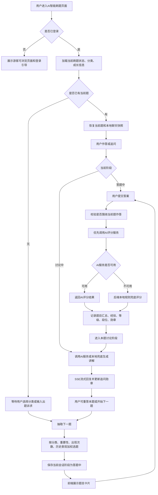
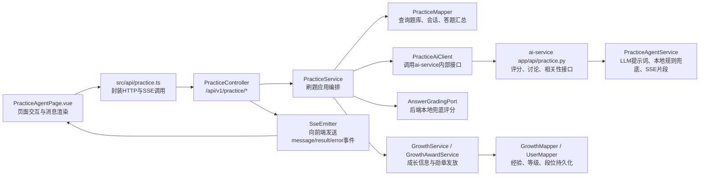

# AI智能刷题-临时功能介绍

## 1.功能介绍

AI智能刷题功能为学习者提供“选题分类、智能抽题、聊天式作答、AI评分、追问讲解、成长激励”的闭环练习体验。用户进入刷题页面后，可以选择题目分类并点击开始，也可以直接输入想练习的题型；系统会从系统题库中按题目重要性、真实面试出现次数、用户历史答题次数和历史最高分进行加权抽题，优先推荐更值得复习或尚未掌握的题目。用户提交答案后，后端优先调用独立AI服务完成评分，返回得分、命中点、缺失点、参考答案、优化建议和复习知识点；当AI服务不可用时，会自动切换本地兜底评分，保证核心刷题流程可用。评分完成后，用户进入本题讨论阶段，可以围绕答案细节继续追问，前端通过SSE流式展示AI回复。每次评分会更新用户题目汇总、经验值、等级、段位和勋章，让刷题结果沉淀为可持续的成长反馈。

## 2.功能逻辑流程图

## 3.代码调用链路图

## 4.使用到的技术栈

| 分类 | 技术栈 | 在本功能中的作用 |
| --- | --- | --- |
| 前端框架 | Vue 3、TypeScript、Vite | 构建AI智能刷题页面、状态管理和组件交互 |
| UI组件 | Element Plus、SCSS | 分类选择、按钮、消息卡片、评分详情、勋章弹窗等清新简约界面 |
| Markdown渲染 | markdown-it | 渲染AI讨论回复中的Markdown文本 |
| 前端通信 | Fetch、SSE | 普通接口请求与流式AI讨论消息接收 |
| 后端框架 | Spring Boot 3.3.6、Java 17 | 提供刷题REST接口、SSE接口和业务编排能力 |
| 数据访问 | MyBatis、MySQL、Flyway | 查询系统题库，维护用户刷题会话、题目汇总、成长数据和数据库迁移 |
| AI服务 | FastAPI、Uvicorn、Pydantic | 独立提供答案评分、本题讨论、上下文相关性判断内部接口 |
| 向量/AI基础能力 | qdrant-client、LLM配置 | AI服务工程基础依赖；刷题讨论和评分可对接大模型能力 |
| 安全与鉴权 | AuthFilter、AuthContext、X-Internal-Token | 校验登录用户和后端到AI服务的内部调用凭证 |

## 5.核心代码介绍

| 核心代码 | 说明 |
| --- | --- |
| `ai-learn-web/src/pages/practice-agent/PracticeAgentPage.vue` | AI智能刷题主页面。负责分类选择、开始/下一题、重答、聊天输入、流式消息展示、评分卡片、成长角色卡、勋章弹窗和本地聊天快照。 |
| `ai-learn-web/src/api/practice.ts` | 前端刷题API封装。提供分类查询、状态查询、抽题、重答、普通消息发送、SSE流式消息发送和成长信息查询方法。 |
| `ai-learn-backend/src/main/java/com/earth/online/player/ailearn/practice/interfaces/PracticeController.java` | 后端刷题接口入口。暴露 `/api/v1/practice/categories`、`/state`、`/next-question`、`/retry`、`/messages`、`/messages/stream`，其中流式接口通过 `SseEmitter` 输出AI回复片段和最终业务结果。 |
| `ai-learn-backend/src/main/java/com/earth/online/player/ailearn/practice/application/PracticeService.java` | 刷题核心应用服务。维护 `QUESTIONING`、`ANSWERING`、`DISCUSSING` 三个阶段，编排抽题、提交答案、评分、讨论、重答、下一题、经验更新和勋章发放。 |
| `ai-learn-backend/src/main/java/com/earth/online/player/ailearn/practice/infrastructure/PracticeMapper.java` | MyBatis仓储。负责读取题目分类、按用户历史表现查询候选题、保存当前刷题会话、更新当前阶段、累计追问次数、维护 `user_question_stats` 汇总表。 |
| `ai-learn-backend/src/main/java/com/earth/online/player/ailearn/practice/infrastructure/PracticeAiClient.java` | 后端调用AI服务的客户端。负责答案评分、讨论回复、流式讨论、相关性判断；当AI服务异常或返回失败时返回空结果，由后端本地规则兜底。 |
| `ai-service/app/api/practice.py` | AI服务内部接口层。提供 `/internal/v1/practice/answer/grade`、`/discuss`、`/discuss/stream`、`/relevance`，并通过内部Token保护调用。 |
| `ai-service/app/practice/agent_service.py` | AI刷题智能体服务。封装评分提示词、讨论提示词、相关性提示词、LLM调用、流式输出和本地规则兜底逻辑。 |
| `ai-learn-backend/src/main/resources/db/migration/V5__init_practice_tables.sql`、`V11__system_question_bank_and_practice_summary.sql`、`V13__add_practice_session_answer_memory.sql` | 与刷题相关的数据迁移脚本，初始化刷题记录/会话/题目汇总能力，并补充当前题答案记忆字段。 |

### 核心业务要点

- 抽题策略：候选题按分类过滤后，再结合重要性、真实面试出现次数、答题次数、历史最高分计算权重，并叠加随机因子，兼顾重点题与薄弱题。
- 阶段控制：出题阶段只处理出题诉求，答题阶段只接收当前题答案，讨论阶段允许追问、重答或切换下一题，避免刷题入口退化为通用聊天。
- AI兜底：评分、讨论、相关性判断均优先走AI服务；异常时后端使用本地评分或固定提示兜底，保障页面可继续使用。
- 成长闭环：评分后按“本次分数是否突破该题历史最高分”计算新增经验，并同步更新用户等级、段位和勋章。
- 前端体验：页面使用双栏布局，左侧展示成长角色卡，右侧展示聊天式刷题过程；讨论回复支持流式输出，评分详情支持折叠查看。
