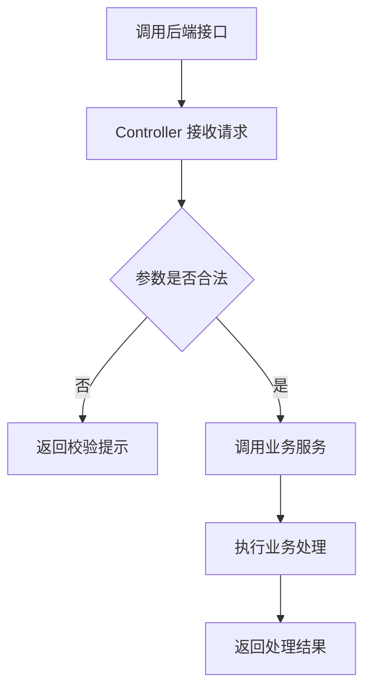
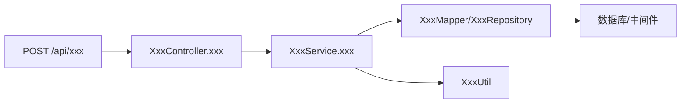

# 功能介绍与代码梳理文档生成模板

## 一、任务说明

请扫描当前项目中的 **【AI智能刷题】** 后端实现，生成一份功能介绍与代码梳理文档。

- 文档名称：`【AI智能刷题】功能及代码梳理`
- 输出路径：`【doc/4.功能梳理】`
- 梳理入口：从后端 `Controller/API` 开始，不需要分析前端
- 目标读者：后端开发、测试、产品、后续维护人员

## 二、核心要求

1. 必须基于真实代码分析，不要编造不存在的接口、类、方法、表或配置。
2. 代码链路从 `Controller/API` 开始，向下梳理到 `Service`、`Repository/Mapper`、工具类、数据库或中间件。
3. 涉及数据库、Redis、消息队列、对象存储、第三方接口等依赖时，说明用途和配置位置，但不要输出真实密码、Token、密钥或生产地址。
4. 如果未找到明确实现，请说明检索范围和结论。

## 三、文档结构

# 【AI智能刷题】功能及代码梳理

## 1. 功能概览

用 500 字以内说明该功能解决什么问题、适用场景、核心能力和主要后端入口。

## 2. 功能使用场景

| 场景 | 触发入口 | 主要结果 |
| --- | --- | --- |
| 示例：外部系统调用接口 | 示例：`POST /api/xxx` | 示例：生成记录并返回处理结果 |

## 3. 功能逻辑流程图

使用 Mermaid 描述业务处理流程。



## 4. 代码调用链路图

使用 Mermaid 描述从后端接口到核心代码的调用链路。



## 5. 关键文件清单

| 类型 | 文件路径 | 作用说明 |
| --- | --- | --- |
| 接口入口 | `示例路径` | 接收功能请求 |
| 业务服务 | `示例路径` | 处理核心业务逻辑 |
| 数据访问 | `示例路径` | 读写数据 |
| 配置文件 | `示例路径` | 保存功能相关配置 |

## 6. 使用到的技术栈

| 类别 | 技术/依赖 | 在本功能中的用途 |
| --- | --- | --- |
| 后端框架 | 示例：Spring Boot/FastAPI | 提供业务接口 |
| 数据存储 | 示例：MySQL/Redis | 保存或缓存业务数据 |
| 第三方服务 | 示例：OpenAI/Qdrant | 提供外部能力 |

## 7. 核心代码介绍

按核心文件逐个说明职责、关键方法、输入、处理过程、输出和上下游关系。

### 7.x `文件路径`

**核心职责：**  

**关键方法：**

- `方法名`：

**核心片段：**

```语言
// 只摘录关键代码片段
```

**说明：**

- 

## 8. 可优化点与维护建议

| 优先级 | 建议 | 原因 | 涉及位置 |
| --- | --- | --- | --- |
| 高 | 示例：补充参数校验 | 避免非法请求进入业务逻辑 | `示例路径` |

## 9. 总结

用 3～5 条要点总结功能价值、代码入口、核心链路、主要依赖和维护重点。

## 四、输出要求

1. 使用 Markdown 输出，Mermaid 图放在代码块中。
2. 语言简洁清晰，重点突出，避免大段堆砌。
3. 不确定的信息必须明确标注“代码中未明确体现”。
4. 最终文档使用 UTF-8 编码。
